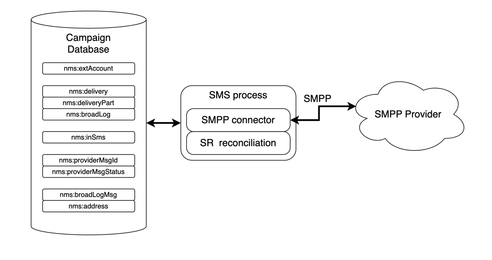

# SMPP 커넥터 설명 {#smpp-connector-desc}

>[!AVAILABILITY]
>
>이 기능은 모든 Campaign FDA 환경에서 사용할 수 있습니다. Campaign FFDA 배포에 **사용할 수 없음**. 이 설명서는 Adobe Campaign v8.7.2 이상에 적용됩니다. 기존 SMS 커넥터에서 새 SMS 커넥터로 전환하려면 이 [기술 정보](https://experienceleague.adobe.com/docs/campaign/technotes-ac/tn-new/sms-migration){target="_blank"}를 참조하세요.
>
>이전 버전의 경우 [Campaign Classic v7 설명서](https://experienceleague.adobe.com/en/docs/campaign-classic/using/sending-messages/sending-messages-on-mobiles/sms-set-up/sms-set-up){target="_blank"}를 참조하세요.

## SMS 커넥터 데이터 흐름 {#sms-data-flow}

이 섹션에서는 SMS 프로세스가 데이터를 처리하는 방법을 설명합니다.

다음은 SMS 프로세스가 해당 환경과 상호 작용하는 방법을 요약하는 높은 수준의 블록 다이어그램입니다.

{zoomable="yes"}

SMS 프로세스는 SMPP 공급자와의 통신을 처리하는 SMPP 커넥터 자체와 SR 조정을 위한 백그라운드 작업이라는 두 가지 중요한 구성 요소를 호스팅합니다.

### SMPP 계정의 데이터 흐름 {#sms-data-flow-smpp-accounts}

SMS 프로세스는 nms:extAccount을(를) 폴링하고 SMPP 커넥터에 새 연결을 생성하여 각 계정의 설정을 전달합니다. *configRefreshMillis* 설정의 serverConf에서 폴링 빈도를 조정할 수 있습니다.

각 활성 SMPP 계정에 대해 SMPP 커넥터는 항상 연결을 활성 상태로 유지하려고 합니다. 연결이 끊기면 다시 연결됩니다.

### 메시지를 보내는 동안 데이터 흐름 {#sms-data-flow-sending-msg}

* SMS 프로세스는 nms:delivery을(를) 스캔하여 활성 게재를 선택합니다. 다음의 경우 게재가 활성화됩니다.
   * 상태는 메시지를 보낼 수 있음을 의미합니다
   * 유효 기간이 만료되지 않았습니다.
   * 실제로 게재입니다(예: 템플릿이 아니라 삭제되지 않음).
   * SMPP 커넥터는 게재에 연결된 외부 계정에 대해 하나 이상의 연결을 열 수 있습니다
* 각 게재에 대해 SMS 프로세스는 게재 부분을 로드합니다. 게재 부분이 부분적으로 전송된 경우 SMS 프로세스는 광범위한 로그를 확인하여 이미 전송된 메시지를 확인합니다.
* SMS 프로세스는 게재 부분의 개인화 데이터로 템플릿을 확장합니다.
* SMPP 커넥터는 콘텐츠 및 기타 설정과 일치하는 MT(SUBMIT_SM PDU)를 생성합니다.
* SMPP 커넥터는 송신기(또는 송수신기) 연결을 통해 MT를 전송합니다.
* 공급자가 이 MT에 대한 ID를 반환합니다. nms:providerMsgId에 삽입됩니다.
* SMS 프로세스는 광범위한 로그를 전송됨 상태로 업데이트합니다.
* 최종 오류가 발생하면 SMS 프로세스가 이에 따라 브로드 로그를 업데이트하며 nms:broadLogMsg에 새로운 종류의 오류가 발생할 수 있습니다.

### SR 수신 중 데이터 흐름 {#sms-data-flow-sr}

* SMPP 커넥터는 SR(DELIVER_SM PDU)을 수신하고 디코딩합니다. 외부 계정에 정의된 정규 표현식을 사용하여 메시지 ID와 상태를 가져옵니다.
* 메시지 ID 및 상태가 nms:providerMsgStatus에 삽입되었습니다.
* 삽입된 SMPP 커넥터는 DELIVER_SM_RESP PDU로 응답합니다.
* 프로세스 중에 문제가 발생하면 SMPP 커넥터가 음수 DELIVER_SM_RESP PDU를 전송하고 메시지를 기록합니다.

### MO를 받는 동안 데이터 흐름 {#sms-data-flow-mo}

* SMPP 커넥터는 MO(DELIVER_SM PDU)를 수신하고 디코딩합니다.
* 키워드는 메시지에서 추출됩니다. 선언된 키워드와 일치하는 경우 해당 작업이 실행됩니다. 격리를 업데이트하기 위해 nms:address에 쓸 수 있습니다.
* 사용자 지정 TLV를 선언하면 해당 설정에 따라 디코딩됩니다.
* 완전히 디코딩되고 처리된 MO가 nms:inSms 테이블에 삽입됩니다.
* SMPP 커넥터가 DELIVER_SM_RESP PDU로 응답합니다. 오류가 감지되면 공급자에게 오류 코드가 반환됩니다.

### MT 및 SR 조정 중 데이터 흐름 {#sms-reconciling-mt-sr}

* SR 조정 구성 요소는 정기적으로 nms:providerMsgId 및 nms:providerMsgStatus을(를) 읽습니다. 두 테이블의 데이터가 결합됩니다.
* 두 테이블에 항목이 있는 모든 메시지의 경우 일치하는 nms:broadLog 항목이 업데이트됩니다.
* 새로운 종류의 오류가 검색되거나 수동으로 정규화되지 않은 오류에 대한 카운터를 업데이트하기 위해 nms:broadLogMsg 테이블을 프로세스에서 업데이트할 수 있습니다.

## 일치하는 MT, SR 및 broadlog 항목 {#sms-matching-entries}

다음은 전체 프로세스를 설명하는 다이어그램입니다.

{zoomable="yes"}

**단계 1**

* 메시지를 스캔하고 형식을 지정한 다음 SMPP 커넥터로 전송합니다.
* SMPP 커넥터는 SUBMIT_SM MT PDU로 형식을 지정합니다.
* MT는 SMPP 공급자에게 전송됩니다.
* 공급자가 SUBMIT_SM_RESP로 회신합니다. SUBMIT_SM 및 SUBMIT_SM_RESP는 sequence_number로 대응됩니다.
* SUBMIT_SM_RESP는 공급자에서 가져온 ID를 제공합니다. 이 ID는 광범위한 로그 ID와 함께 nms:providerMsgId 테이블에 삽입됩니다.

**단계 2**

* 공급자가 DELIVER_SM SR PDU를 보냅니다.
* SR을 구문 분석하여 공급자 ID, 상태 및 오류 코드를 추출합니다. 이 단계에서는 추출 정규 표현식을 사용합니다.
* 공급자 ID와 해당 상태가 nms:providerMsgStatus에 삽입됩니다.
* 모든 데이터가 데이터베이스에 안전하게 삽입되면 SMPP 커넥터가 DELIVER_SM_RESP로 응답합니다. DELIVER_SM 및 DELIVER_SM_RESP는 sequence_number로 대응됩니다.

**3단계**

* SMS 프로세스의 SR 조정 구성 요소는 nms:providerMsgId 및 nms:providerMsgStatus 테이블을 정기적으로 검사합니다.
* 두 테이블 모두에서 일치하는 공급자 ID가 있는 행이 있으면 두 항목이 함께 연결됩니다. 이를 통해 broad 로그 ID(providerMsgId에 저장됨)와 상태(providerMsgStatus에 저장됨)를 일치시킬 수 있습니다
* 브로드 로그가 해당 상태로 업데이트됩니다.

## 관심도 및 전용 프로세스 커넥터 {#sms-affinities}

관심도는 전용 프로세스 커넥터에서 무시되며 SMS 프로세스 내에서 실행됩니다.

## serverConf 옵션 {#sms-serverconf-options}

일부 설정은 serverConf.xml에서 조정할 수 있습니다. 이 파일의 다른 설정과 마찬가지로 config-instance.xml 파일에 지정해야 합니다. 모든 설정은 &lt; mta2 > 요소에 있습니다.

이 표에는 모든 설정이 요약되어 있습니다. 최소/최대 센스 값은 대부분의 경우 고려해야 하는 범위를 대략적으로 알려 줍니다. 디버깅 값은 성능과 관련이 없는 문제를 찾을 때 선택할 수 있는 값입니다.

| 설정 | 설명 | 기본 | 최소 감지 값 | 최대 감지 값 | 디버깅 값 |
|:-:|:-:|:-:|:-:|:-:|:-:|
| batch업데이트 크기 | 업데이트 마이크로배치 크기 | 5000 | 100: 매우 짧은 대기 시간 | maxWaitingMessages/updateThreads: maxWaitingMessages가 버퍼링을 제한하므로 이 값을 초과하는 작업은 사용할 수 없습니다 | 1: 마이크로 일괄 처리를 비활성화하고 메시지를 하나씩 업데이트 |
| configRefreshMillis | 구성을 다시 로드하는 기간 (밀리초 단위) | 10000 | pollPeriodMillis: 짧은 지연 시간 | 600000: 리소스를 저장하기 위해 너무 빠르게 다시 로드하지 않음 | 500: 대기 시간이 짧아 새로운 설정을 더 빨리 시도할 수 있음 |
| deliveryPartRetryCount | deliveryPart가 재시도되거나 연기되는 최대 횟수입니다. 주의: 전송 프로세스를 다시 시작하면 재시도로 계산되며, 충돌도 재시도로 계산됩니다. | 20 | 1: 다시 시도 비활성화 | 50: 불안정한 공급자를 위해 메시지를 보다 지속적으로 활용 | 1: 다시 시도를 비활성화합니다. 1000: 실패한 메시지를 플러시하지 마십시오. |
| deliveryPartRetryDelaySeconds | deliveryPart를 재시도하기 전의 최소 지연 시간입니다. 이는 크로스 프로세스 및 크로스 컨테이너입니다. 지연 시간은 초 단위입니다. | 60 | 0: 즉시 다시 시도 | 3600: 매우 느린 재시도(각 재시도 사이에 1시간) | 1: 사용 중인 로그에서 다시 시도를 쉽게 따라갈 수 있습니다. |
| logOutput | 메인 로그 출력에서 모니터링 및 프로파일링 데이터를 전송합니다. | 참 | false: 처리량을 약간 늘릴 수 있습니다. 낙담했어요 | true: 로깅을 활성화합니다. | 참 |
| maxWaitingMessages | 언제든지 처리할 수 있는 최대 메시지 수 | 50000 | 256: 단일 deliveryPart에 충분한 용량 | 200000: SQL 쿼리 길이로 제한(64k) | 1: 메시지를 하나씩 처리 |
| pollPeriodMillis | 새 메시지를 확인하기 위한 데이터베이스 폴링 빈도(밀리초) | 2000 | 500: 매우 짧은 대기 시간 | 10000: 더 큰 일괄 처리 | 500: 대기 시간이 짧아 디버그를 쉽게 할 수 있습니다. |
| prepareThreads | 메시지 준비 스레드 수 | 3 | 1: 단일 스레드 | CPU 수. RAM 사용에 주의하십시오. 6을 초과하면 maxSMSMemoryMb, maxProcessMemoryAlertMb 및 maxProcessMemoryWarningMb를 늘려야 할 수 있습니다. | 1: 스레드가 하나만 있으면 더 깨끗한 로그가 생성됩니다. |
| profDeliveryStat | SMS 프로세스 내부에 대한 다양한 집계 통계 기록 | 참 | false: 처리량을 약간 늘릴 수 있습니다. 낙담했어요 | true: 낮은 세부 기간 로그 | 참 |
| profLogPerMessage | 각 메시지에 대한 각 처리 단계 기록 | 거짓 | false: 로그 복잡성을 줄입니다. | true: 매우 높은 세부 표시 로그. **반드시 필요한 경우에만 사용**. 성능에 큰 영향을 미칩니다. **충분한 데이터가 수집되는 즉시 이 설정을 사용하지 않도록 설정하십시오**. | 참 |
| providerIdScanPeriod | 조정할 새 공급자 ID 검색 간격(초) | 10 | 1: 짧은 대기 시간 | 60: 더 많은 처리량을 위한 더 큰 일괄 처리 | 1: 짧은 대기 시간은 메시지 처리 디버깅에 도움이 됩니다. |
| providerIdThreads | 공급자 ID 조정을 위한 스레드 수입니다. 인스턴스당 1개의 스레드로 충분합니다. 이 컨테이너에서 비활성화하려면 0으로 설정하십시오. | 1 | 0: 이 컨테이너에서 비활성화 | 1 | 1 |
| sendingThread | 전송 스레드 수 | 1 | 1: 단일 스레드 | CPU 수. 스레드가 너무 많으면 성능이 저하됩니다. | 1: 스레드가 하나만 있으면 더 깨끗한 로그가 생성됩니다. |
| updateThread | 데이터베이스 업데이트를 위한 스레드 수 | 1 | 1: 단일 스레드 | CPU 수. 각 스레드는 자체 DB 연결을 만듭니다. | 1: 스레드가 하나만 있으면 더 깨끗한 로그가 생성됩니다. |
| verifymode | 메시지 전송을 시뮬레이션합니다. 메시지는 실제로 전송되지 않습니다. 디버깅에 유용함 | 거짓 | 거짓 | 참 | false: 시스템을 정상적으로 실행합니다. true: DB 액세스 및 메시지 준비만 테스트합니다. |
