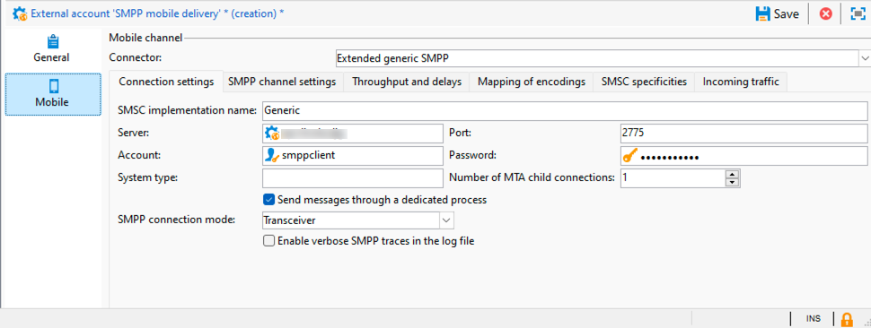

# SMPP 외부 계정 설정 {#smpp-external-account}

Adobe Campaign은 SMPP 프로토콜을 사용하여 서비스 공급자에게 SMS를 전송합니다.

Adobe Campaign의 SMS 커넥터는 공식 사양을 약간 벗어나는 경향이 있는 대부분의 SMPP 공급자와 호환되도록 동작을 조정할 수 있는 많은 옵션을 제공합니다.

>[!IMPORTANT]
>
>* Adobe Campaign은 SMPP 프로토콜 버전 3.4를 지원합니다.
>
>* 새 공급자에 대한 연결을 설정하려면 TCP, 이진, 16진수 표현 및 텍스트 인코딩에 대한 기술 지식 및 몇 가지 기술이 필요할 수 있습니다. 또한 제공자와의 적극적인 협력이 필요할 것이다.

SMS 서비스 공급자 측의 네트워크 장비는 종종 SMSC라고 합니다.

## 연결 설정 {#smpp-connection-settings}

{zoomable="yes"}

다음은 연결을 설정하는 데 필요한 매개 변수와 해당 역할입니다.

* **SMSC 구현 이름**: SMSC 구현의 이름을 설정합니다. 공급자 이름으로 설정해야 합니다. 이 필드의 역할은 SMPP 오류 관리 섹션에 설명되어 있습니다.
* **서버**: 연결할 서버의 DNS 이름 또는 IP 주소입니다.
* **포트**: 연결할 TCP 포트입니다.
* **계정**: 연결의 로그인입니다. BIND PDU의 system_id 필드에 전달됩니다.
* **암호**: SMPP 연결의 암호입니다. BIND PDU의 암호 필드에 전달됩니다.
* **시스템 형식**: BIND PDU의 system_type 필드에 전달된 값. 일부 공급자는 여기에서 특정 값이 필요합니다.
* **MTA 하위 연결 수**: 전송 스레드당 열려 있는 연결 수를 정의합니다.
다음 공식을 사용하여 총 연결 수를 계산할 수 있습니다.
  *총 연결 수 = SMS 프로세스 수 * 전송 스레드 수 * MTA 하위 연결 수*

   * SMS 프로세스 수는 일반적으로 1입니다. 성능이 매우 높은 일부 인스턴스에서는 여러 SMS 프로세스가 동시에 시작될 수 있습니다.
   * 전송 스레드 수는 serverConf(sendingThreads 설정)에서 설정됩니다. 기본값은 1입니다.
   * MTA 하위 연결 수는 외부 계정의 이 설정입니다.

  기본값을 사용하여 이 설정은 연결 수를 직접 설정합니다.

**송수신기 모드**&#x200B;에서 총 연결 수입니다.

**송신기+수신기 모드**에서 송신기+수신기 쌍의 수를 정의합니다(한 쌍 = 한 송신기+한 수신기).
송신기와 수신기 사이의 균형을 바꿀 수 있는 방법은 없다.

* **전용 프로세스를 통해 메시지 보내기**:
Adobe Campaign v8.7.2 이상의 경우 이 옵션은 항상 활성화되어 있어야 합니다. 메시지 처리 방식에 많은 영향을 미칩니다.
* **SMPP 연결 모드**:
송수신기 모드 또는 분리된 송신기 + 수신기 모드로 연결을 설정합니다.
   * 송신기+수신기(또는 TX+RX): 두 개의 별도 TCP 연결이 메시지 송수신에 사용됩니다.
   * 송수신기(또는 TRX): 단일 TCP 연결이 메시지 송수신에 사용됩니다.
* **수신자에 대해 다른 매개 변수 사용**:
송신기+수신기 모드에서만 사용할 수 있습니다.
확인란을 선택 취소하면 송신기와 수신기에 동일한 설정이 사용됩니다. 확인란을 선택하면 표준 설정은 송신기에만 적용되고 수신기 설정은 수신기에만 적용됩니다.
* **받는 사람 서버, 포트, 계정, 암호, 시스템 유형**
이러한 설정은 송신기+수신기 모드에 있을 때 수신기에 적용됩니다. 전송기처럼 작동합니다. [자세한 내용](#smpp-connection-settings)은(는) 위를 참조하세요.
* **로그 파일에서 자세한 SMPP 추적 사용**
활성화되면 로그 파일에 추가 로그가 출력됩니다. 이 기능은 문제 해결에 매우 유용하지만, 문제 해결이 필요하지 않은 경우 처리량이 많은 인스턴스에서 비활성화해야 합니다.

## SMPP 채널 설정 {#smpp-channel-settings}

{zoomable="yes"}

### 문자 음역 승인 {#smpp-transliteration}

음역은 누락된 문자와 동등한 문자를 찾는 프로세스입니다. 예를 들어 프랑스어 &quot;ê&quot;(곡절 악센트가 있는 e) 문자가 GSM 인코딩에서 누락되었지만 가독성을 너무 손상시키지 않고 &quot;e&quot;로 대체할 수 있습니다.

이 상자를 선택 취소하면 문자열을 있는 그대로 인코딩할 수 없으면 텍스트 인코딩이 실패합니다.

이 상자를 선택하면 텍스트 인코딩이 문자열을 실패하는 대신 근사 버전으로 변환하려고 합니다. 대상 인코딩에서 일부 문자에 해당하는 문자가 없으면 텍스트 인코딩이 실패합니다.

인코딩 프로세스에 대한 일반적인 설명은 [인코딩의 특정 매핑 정의](#mapping-encodings)를 참조하십시오.

### 소스 번호

메시지의 기본 소스 주소를 정의합니다. 이 설정은 게재의 소스 번호가 비어 있는 경우에만 적용됩니다. 기본적으로 소스 번호 필드는 전달되지 않으므로 공급자가 짧은 코드로 대체합니다.

이렇게 하면 발신자 주소/oADC 재정의 기능이 활성화됩니다.

### Source TON/NPI, 대상 TON/NPI

TON(숫자 유형) 및 NPI(번호 매기기 계획 표시기)(SMPP 3.4 사양의 섹션 5.2.5에 설명됨). 이러한 값은 공급자에게 필요한 값으로 설정해야 합니다.

이들은 SUBMIT_SM PDU의 source_addr_ton, source_addr_npi, dest_addr_ton 및 dest_addr_npi 필드에서 그대로 전송된다.

### 서비스 유형

이 필드는 SUBMIT_SM PDU의 service_type 필드에서 그대로 전송된다. 공급자가 필요로 하는 것으로 설정합니다.

## 처리량 및 지연 {#smpp-delays}

{zoomable="yes"}

이 설정은 SMPP 채널의 모든 타이밍 측면을 제어합니다. 일부 공급자는 메시지 속도, 창 및 다시 시도 시간을 매우 정확하게 제어해야 하므로 이러한 설정은 공급자의 용량과 계약에 표시된 조건에 일치하는 값으로 설정해야 합니다.

### 전송 기간

이 창은 일치하는 SUBMIT_SM_RESP를 기다리지 않고 전송할 수 있는 SUBMIT_SM PDU 수입니다.

최대 4개의 창을 사용하는 전송의 예:

{zoomable="yes"}

이 창은 네트워크 링크의 지연 시간이 길면 처리량을 늘리는 데 도움이 됩니다. 이 창의 값은 SMS/s 수에 링크 대기 시간을 곱한 값(초)이어야 합니다. 그러면 커넥터는 다음 메시지를 보내기 전에 SUBMIT_SM_RESP를 기다리지 않습니다.

창이 너무 크면 연결 문제가 발생할 경우(드문 경우) 중복 메시지를 더 많이 보낼 수 있습니다. 또한 대부분의 공급자는 창에 대한 매우 엄격한 제한을 가지며 제한을 초과하는 메시지를 거부합니다.

최적의 전송 창 수식을 계산하는 방법:

SUBMIT_SM 과 SUBMIT_SM_RESP 사이의 최대 지연 시간을 측정합니다.
이 값(초)을 최대 MT 처리량에 곱하십시오. 이렇게 하면 최적의 전송 창 값이 제공됩니다.
예: 최대 MT 처리량으로 설정된 SMS/s가 300개이고 평균적으로 SUBMIT_SM과 SUBMIT_SM_RESP 간에 100ms 지연 시간이 있는 경우 최적 값은 300×0.1 = 30입니다.

성능 문제를 방지하려면 더 큰 창을 선호해야 합니다.

### 최대 MT 처리량

초당 및 연결당 최대 MT 수. 이 설정은 엄격하게 적용되며 MTA가 이 제한보다 더 빨리 메시지를 푸시하지 않습니다. 이 메서드는 정확한 조정이 필요한 공급자에게 유용합니다.

총 처리량 제한을 알아보려면 이 수에 총 연결 수를 곱하십시오(위의 공식 참조).

0은 제한이 없음을 의미합니다. MTA는 가능한 한 빨리 MT를 전송합니다.

최종 아키텍처 및 특별히 요청된 SMPP 공급자에 대해 적절하게 벤치마킹하지 않는 한 이 숫자 이상의 정확한 처리량을 보장할 수 없으므로 일반적으로 이 설정을 1000 미만으로 유지하는 것이 좋습니다. 1000 MT/s 이상으로 연결하는 연결 수를 늘리는 것이 더 나을 수 있습니다.

### 다시 연결 이전 시간

TCP 연결이 끊기면 커넥터는 연결을 시도하기 전에 이 시간(초)을 기다립니다.

### MT 만료일

SUBMIT_SM과 일치하는 SUBMIT_SM_RESP 간의 시간 제한입니다. RESP가 제시간에 수신되지 않으면 메시지가 실패한 것으로 간주되고 MTA의 글로벌 재시도 정책이 적용됩니다.

### 바인딩 시간 초과

TCP 연결 시도와 BIND_*_RESP 응답 사이의 시간 제한. 시간 초과되면 Campaign 커넥터에 의해 연결이 닫히고 다시 연결하기 전에 시간을 기다린 후 다시 시도합니다.

### enquire_link 기간

inquire_link는 연결을 유지하기 위해 전송되는 특별한 종류의 PDU입니다. 이 기간은 초 단위입니다. 캠페인 커넥터는 대역폭을 절약하기 위해 연결이 유휴 상태일 때만 enquire_link를 전송합니다. 이 기간이 두 번 경과해도 RESP가 수신되지 않으면 연결이 끊어진 것으로 간주되고 재연결 프로세스가 트리거됩니다.

## 인코딩의 매핑 {#mapping-encodings}

텍스트 인코딩에 대한 자세한 내용은 [SMS 텍스트 인코딩 섹션](sms-channel.md#sms-text-encoding)을 참조하세요.

이 설정을 사용하면 사양과 다른 사용자 지정 인코딩 매핑을 정의할 수 있습니다. 인코딩의 목록과 해당 data_coding 값을 선언할 수 있습니다. MTA는 목록의 첫 번째 인코딩을 사용하여 인코딩하려고 합니다. 실패하면, 목록의 다음 인코딩 등을 사용하려고 합니다. 메시지를 인코딩하는 데 인코딩을 사용할 수 없는 경우 오류가 발생합니다. 인코딩이 발견되면 MTA는 인코딩된 텍스트와 표에 지정된 값으로 설정된 data_coding 필드로 SUBMIT_SM PDU를 생성합니다.

표의 항목 순서는 중요합니다. 위에서 아래로 인코딩을 시도합니다. 가장 저렴하거나 가장 권장되는 인코딩을 목록의 맨 위에 추가한 다음 점점 더 비싸거나 덜 바람직한 인코딩을 수행해야 합니다.

UCS-2는 Campaign에서 지원되는 모든 문자를 인코딩할 수 있으므로 실패하지 않습니다. UCS-2 SMS의 최대 길이가 훨씬 작습니다(70자만).

이 설정을 사용하여 매핑 테이블에서 한 줄만 선언하여 특정 인코딩을 항상 사용하도록 강제할 수도 있습니다.

확인란을 선택하지 않은 경우 사용되는 기본 매핑은 다음 테이블과 같습니다.

| data_coding | 인코딩 |
|:-:|:-:|
| 0 | GSM |
| 8 | UCS- |

즉, MTA가 성공하여 data_coding을 0으로 설정한 상태로 메시지를 전송하는 경우 GSM에서 메시지를 인코딩하려고 합니다.

메시지가 GSM으로 인코딩될 수 없는 경우 UCS-2로 인코딩되고 data_coding 이 8로 설정됩니다.

## SMSC 특성 {#smsc-specificities}

{zoomable="yes"}

### message_payload 활성화

이 옵션을 선택하지 않으면 긴 SMS가 MTA로 분할되고 UDH가 있는 여러 SUBMIT_SM PDU에서 전송됩니다. UDH 데이터 뒤에 오는 휴대폰으로 메시지가 다시 작성된다.

선택하면 하나의 SUBMIT_SM PDU에 긴 SMS가 전송되어 message_payload 선택 필드에 텍스트가 입력됩니다(자세한 내용은 SMPP 사양 참조).

이 기능이 활성화되어 있으면 Campaign에서 SMS 부분을 개별적으로 카운트할 수 없습니다. 모든 메시지는 한 부분에서 전송된 것으로 카운트됩니다.

### 전체 전화 번호 보내기

이 확인란을 선택하지 않으면 전화번호의 숫자만 공급자에게 전송됩니다(SUBMIT_SM 필드의 destination_addr 필드). 국제 번호 표시기(일반적으로 + 접두사)는 SMPP에서 TON 및 NPI 필드로 대체되므로 이것이 기본 동작입니다.

확인란을 선택하면 사전 처리 없이 전화 번호가 있는 그대로 전송됩니다(및 잠재적 공백, + 접두어 또는 파운드/해시/별 기호 포함).

이 기능은 자동 회신 격리 기능의 동작에도 영향을 줍니다. 확인란을 선택하지 않으면 SMPP 프로토콜 자체에서 전화번호에서 제거되는 + 접두어를 보상하기 위해 격리 테이블에 삽입된 전화번호에 + 접두어가 추가됩니다.

### 바인딩 TON/NPI

TON(숫자 유형) 및 NPI(번호 매기기 계획 표시기)(SMPP 3.4 사양의 섹션 5.2.5에 설명됨). 이러한 값은 공급자에게 필요한 값으로 설정해야 합니다.

이들은 BIND PDU의 addr_ton 및 addr_npi 필드에서 그대로 전송된다.

### 주소 범위

BIND PDU의 address_range 필드에 있는 그대로 전송됩니다. 이 값은 공급자에게 필요한 값으로 설정해야 합니다.

### 잘못된 ID 승인 수

단일 SR에 대해 전송할 수 있는 &quot;메시지 ID가 잘못되었습니다.&quot; DELIVER_SM_RESP의 수를 제한합니다. **문제 해결 목적으로만 사용해야 합니다** 정상적인 경우 0으로 설정합니다.

자세한 설명: 이 설정을 2로 설정한다고 가정해 보겠습니다.

* 공급자가 ID가 &quot;1234&quot;인 SR(DELIVER_SM)을 보냅니다.
* 데이터베이스에서 ID &quot;1234&quot;를 찾을 수 없습니다.
* 커넥터는 해당 ID에 대해 1 &quot;잘못된 ID&quot; 오류를 계산하므로 &quot;메시지 ID 잘못됨&quot; 오류 코드와 함께 DELIVER_SM_RESP를 보냅니다(일반 동작).
* 공급자는 ID가 &quot;1234&quot;인 동일한 SR을 다시 시도합니다
* 데이터베이스에서 ID &quot;1234&quot;를 찾을 수 없습니다.
* 커넥터는 해당 ID에 대해 2개의 &quot;잘못된 ID&quot; 오류를 계산하므로 올바르게 처리되지 않은 경우에도 DELIVER_SM_RESP &quot;OK&quot;를 보냅니다.

이 기능은 잘못된 SR이 처리할 수 없는 합법적인 메시지를 차단할 때 공급자 측의 SR 버퍼를 플러시하기 위한 것입니다.

이 필드를 0으로 설정하면 &quot;메시지 ID가 잘못됨&quot;이 항상 반환되도록 메커니즘이 비활성화됩니다. 이는 일반적인 동작입니다.

이 필드를 1로 설정하면 ID가 유효하지 않은 경우에도 커넥터가 항상 &quot;확인&quot;으로 응답하게 됩니다. 이 값은 문제 해결 및 최소 시간(예: 공급자측 문제에서 복구하기 위해 감독 하에 사용됨)에 대해서만 1로 설정해야 합니다.

### SR 내 ID의 추출 정규 표현식

SR 형식은 SMPP 프로토콜 사양에 의해 엄격히 적용되지 않습니다. 사양의 부록 B에 설명된 권장 사항일 뿐입니다. 이러한 이유로 일부 SMPP 구현자는 이 필드의 형식을 다르게 지정하므로 Campaign에서는 올바른 필드를 추출하는 방법이 필요합니다.

기본적으로 &quot;id:&quot; 뒤에 최대 10자의 영숫자를 캡처합니다.

정규 표현식은 정확히 하나의 캡처 그룹(괄호 안에 포함된 부분)을 가져야 합니다. ID에 해당하는 부분을 괄호로 묶어야 합니다. 정규 표현식 형식은 PCRE입니다.

이 설정을 조정할 때는 가능한 많은 컨텍스트를 포함하여 false 트리거를 방지해야 합니다. 특정 접두사(예: 표준에 있는 &quot;id:&quot;)가 있으면 정규 표현식에 포함하십시오. 단어 중간에 텍스트를 캡처하지 않도록 하려면 단어 구분 기호(\b)를 최대한 사용하십시오.

정규 표현식에 컨텍스트를 충분히 포함하지 않으면 사소한 보안 결함이 발생할 수 있습니다. 메시지의 실제 컨텐츠는 SR에 포함될 수 있으므로, 컨텍스트가 없는 특정 ID 형식(예: UUID)과 일치하기만 하면 ID 대신 실제 텍스트 컨텐츠(예: 텍스트 필드에 포함된 UUID)를 구문 분석할 수 있습니다.

### SR 내 상태의 추출 정규 표현식

이 정규 표현식은 SR 메시지의 텍스트 필드에서 상태를 캡처합니다.

기본적으로 &quot;stat:&quot; 다음에 5~15자가 캡처됩니다.

정규식에는 **정확히 하나의 캡처 그룹**(괄호 안에 포함된 부분)이 있어야 합니다. 상태에 해당하는 부분을 괄호로 묶어야 합니다. 정규 표현식 형식은 PCRE입니다.

### 성공 상태를 결정하기 위해 적용된 정규 표현식

이 정규 표현식은 이전 정규 표현식(&quot;상태의 추출 정규 표현식&quot;) 결과에 적용됩니다. 정규 표현식이 일치하면 메시지가 성공한 것으로 간주됩니다.

기본적으로 &quot;DELIV&quot;로 시작하는 모든 항목과 일치합니다. 표준 값 &quot;DELIVRD&quot;와 일치합니다.

### 오류 상태를 결정하기 위해 적용된 정규 표현식

이 정규 표현식은 이전 정규 표현식(&quot;상태의 추출 정규 표현식&quot;) 결과에 적용됩니다. 정규 표현식이 일치하면 메시지가 오류로 간주됩니다.

기본적으로 사양에 설명된 모든 다양한 오류 상태와 일치합니다.

### SR 내 오류 코드의 추출 정규 표현식

이 정규 표현식은 SR 메시지의 텍스트 필드에서 오류 코드를 캡처합니다.

오류 코드는 게재 로그 자격에서 자격을 얻을 수 있습니다.

기본적으로 &quot;err:&quot; 다음에 3문자를 캡처합니다.

### MT 승인의 ID 형식

이는 SUBMIT_SM_RESP PDU의 message_id 필드에 반환되는 ID의 형식을 나타냅니다.

* **수정하지 않음**: ID가 데이터베이스에 있는 그대로 ASCII로 인코딩된 텍스트로 저장됩니다. 사전 처리나 필터링이 발생하지 않습니다.
* **10진수**: ID는 ASCII 형식의 10진수입니다. 이 설정을 사용하면 선행 및 후행 공백과 선행 0이 제거됩니다.
* **16진수**: ID는 ASCII 형식의 16진수여야 하며 앞에 0x가 없고 뒤에 h가 없습니다. 그런 다음 ID가 데이터베이스에 저장되기 전에 10진수로 변환됩니다.
* **16진수 문자열**: ID는 16진수로 인코딩된 바이트 문자열인 ASCII 인코딩된 텍스트여야 합니다. 예를 들어 PDU에서 ASCII &quot;414243&quot;로 변환되는 0x34 0x31 0x34 0x32 0x34 0x33을 찾으면 이 문자열은 16진수 바이트 문자열로 디코딩되고 그 결과 &quot;ABC&quot;를 얻습니다. ID &quot;ABC&quot;를 데이터베이스에 저장합니다.

### SR의 ID 포맷

이는 SR에서 ID의 추출 정규 표현식에 의해 캡처된 ID의 포맷을 나타냅니다. 값은 위의 MT에서 포맷과 동일한 의미 및 동일한 동작을 갖습니다.

### 선택 필드의 SR ID 또는 오류 코드

선택하면 선택적 필드의 내용이 위의 정규 표현식에서 처리한 텍스트에 추가됩니다. 텍스트는 &quot; 0xTAG:VALUE&quot; 형식을 갖으며, 0xTAG는 태그의 4자리 16진수 값입니다(예: 0x002E).

예를 들어 received_message_id 필드에서 ID를 캡처할 수 있습니다. 이를 위해 이 확인란을 활성화하면 다음 텍스트가 상태에 추가됩니다.

0x001E:05e3299e-8d37-49d0-97c6-8e4fe60c7739

이 예에서 0x001E는 선택적 필드의 태그이고 UUID는 필드의 값입니다.

이제 이 값을 캡처하기 위해 SR 필드의 ID 추출 정규 표현식에서 다음 정규 표현식을 설정할 수 있습니다.

\b0x001E:([0-9a-f]{8}-[0-9a-f]{4}-[0-9a-f]{4}-[0-9a-f]{4}-[0-9a-f]{12})\b

>[!IMPORTANT]
>
>8비트 텍스트(ASCII/UTF-8) 값이 있는 선택적 필드만 캡처할 수 있습니다. 특히, 이진 필드는 현재의 정규 표현식 시스템으로는 안정적으로 캡처될 수 없다.

### 텍스트 필드의 SR ID 또는 오류 코드

선택하면 SR 의 상태 텍스트를 처리하는 동안 Text: 필드가 유지됩니다. 공급자가 ID 또는 상태와 같은 중요한 데이터를 이 필드에 배치하는 경우 유용합니다. 일반적으로 이 필드는 ASCII가 아닌 인코딩이 포함된 텍스트를 포함할 수 있고 정규 표현식 처리를 방해할 수 있으므로 안전하게 삭제할 수 있습니다.

이 옵션을 활성화하면 SR 필드에 있는 ID의 추출 정규 표현식이 충분히 구체적이지 않은 경우 매우 작은 보안 결함이 발생할 수 있습니다. 텍스트 필드의 내용을 ID로 구문 분석하고 공격자가 이를 사용하여 위조된 ID를 주입할 수 있으므로 서비스 거부 상황이 발생할 수 있습니다.

### 서비스 ID 태그

사용자 지정 TLV를 추가할 수 있습니다. 이 필드는 **0x1234** 형식의 16진수 값으로 전달된 태그를 설정합니다.

사용자 지정 TLV의 값은 게재의 고급 매개 변수의 &quot;서비스 또는 프로그램 ID&quot; 필드에 있는 게재에서 설정해야 합니다. 이 값은 UTF-8 인코딩된 텍스트로 전송됩니다.

이 설정은 메시지당 하나의 TLV 옵션만 추가할 수 있습니다.

>[!NOTE]
>
>이 옵션은 게재 매개 변수의 훨씬 강력한 **선택적 SMPP 매개 변수(TLV)** 설정으로 대체되었습니다. 이러한 기능은 상호 배타적이며 동시에 사용할 수 없습니다.

### SMPP에 대해 TLS 활성화

사용하도록 설정하면 SMSC에 대한 모든 연결이 TLS를 사용하여 암호화됩니다.

### 인증서 인증

* **전체 인증서 확인**: 연결할 때 TLS 인증서 및 원격 호스트 이름을 확인하십시오. 이 값은 가장 높은 수준의 보안을 제공합니다.
* **호스트 이름 확인을 건너뜁니다**: 원격 TLS 인증서를 확인하지만 원격 호스트 이름이 일치하는지 확인하지 않습니다. 보안이 약간 감소합니다.
* **인증서 확인을 건너뜁니다**: TLS 인증서를 전혀 확인하지 않습니다. 이 연결은 여전히 암호화되어 있지만, 중간자 공격에 취약합니다. 보안이 많이 떨어집니다.

## 들어오는 트래픽 {#incoming-traffic}

{zoomable="yes"}

### MO의 선택적 SMPP 매개 변수(TLV)

Campaign에서는 MO(nms:inSms 테이블)에 연결된 SMS, 별칭 및 큰 계정 3개의 추가 필드를 받을 수 있습니다. SMPP 커넥터를 사용하면 이러한 필드를 모든 공통 형식의 선택적 SMPP 매개 변수(TLV)에서 오는 데이터로 채울 수 있습니다.

각 필드에 대해 연결된 태그와 해당 형식을 설정할 수 있습니다. SMPP 서비스 공급자에게 이 정보를 요청하십시오.

* 태그: 10진수 형식(예: 12345) 또는 0x 접두사가 있는 16진수 형식(예: 0x12ab)의 태그 값입니다. 태그는 0에서 65535 사이일 수 있습니다.
* 형식: 값에 사용되는 형식입니다. 이진 값은 모두 big-endian 부호 있는 이진 값입니다. 텍스트 필드의 경우 SMPP 공급자가 사용하는 인코딩을 선택합니다.

### MO로 자동 회신 전송됨

이 기능을 사용하면 MO에 텍스트를 빠르게 응답하고 코드 쇼트 코드별 블랙리스트를 처리할 수 있습니다.

*키워드* 및 *짧은 코드* 열은 자동 회신을 트리거하는 조건을 정의합니다. 두 필드가 일치하면 MO가 전송되고 추가 작업이 트리거됩니다. 와일드카드를 지정하려면 필드를 비워 둡니다. 키워드는 문장 부호 및 선행 공백을 무시하고 MO 텍스트의 첫 번째 영숫자 단어와 일치합니다. 즉, 키워드 필드는 공백을 포함할 수 없으며 단일 단어여야 합니다.

또한 *키워드* 설정은 접두사입니다. 예를 들어, &quot;AD&quot;를 지정하는 경우 &quot;AD&quot;, &quot;ADAPT&quot; 및 &quot;ADOBE&quot;와 일치합니다. 공통 접두사가 있는 키워드가 여러 개 있는 경우 순서에 주의하십시오. 키워드는 위에서 아래로 처리됩니다.

*회신* 열은 회신할 텍스트입니다. 이 필드에서는 개인화를 사용할 수 없습니다. 응답 텍스트는 항상 동일합니다. 이 필드를 비워 두면 메시지가 회신되지 않지만 추가 작업이 트리거됩니다.

*Additional* action 열은 키워드와 짧은 코드가 모두 일치할 때 수행할 추가 작업을 제공합니다(빈 짧은 코드가 모든 짧은 코드와 일치함). 현재 격리로 보내거나 격리에서 제거할 수 있습니다. 추가 작업을 지정하지만 회신 필드를 비워 두면 작업이 실행되지만 회신이 전송되지 않습니다. 격리는 지정된 짧은 코드에만 적용되거나 필드가 비어 있는 경우 모든 짧은 코드에 적용됩니다.

테이블의 모든 항목은 하나의 규칙이 일치할 때까지 지정된 순서로 처리됩니다. 여러 규칙이 MO와 일치하는 경우 최상위 규칙만 적용됩니다.

>[!NOTE]
>
>**전체 전화 번호 보내기** 설정은 자동 회신 격리 메커니즘의 동작에 영향을 줍니다. 전체 전화 번호 보내기를 선택하지 않으면 격리된 전화 번호에 국제 전화 번호 형식과 호환되도록 더하기 기호(&quot;+&quot;)가 붙습니다.

>[!NOTE]
>
>중간 소싱 아키텍처에서 확장 SMPP 커넥터에 자동 회신을 적용하려면 외부 계정 폴더에 중간 연산자에 대한 쓰기 액세스를 추가해야 합니다.

>[!IMPORTANT]
>
>특히 복사하여 붙여넣을 때 자동 답글에서 인코딩을 주의하십시오. 워드 프로세싱 소프트웨어는 줄바꿈하지 않는 공백을 추가하거나 인용 부호를 아포스트로피로 변경하는 것과 같은 추가적인 서식을 추가하는 경향이 있습니다.
