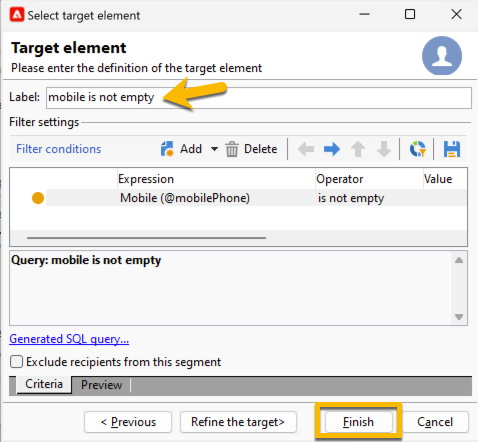

# SMS 게재 대상 선택 {#sms-audience}

대상자를 선택하기 전에 [여기에서 대상자에 대해 자세히 알아보세요](../../audiences/gs-audiences.md).

대부분의 경우 게재의 기본 대상은 Adobe Campaign 데이터베이스(기본 모드)에서 추출됩니다. 하지만 대상자를 외부 파일에 저장할 수도 있습니다. [이 섹션에서 자세히 알아보십시오](#external-audience).

## Adobe Campaign의 대상

게재 대상을 선택하려면 아래 단계를 따르십시오.

1. 게재 편집기에서 **[!UICONTROL To]** 링크를 클릭합니다. **[!UICONTROL Select target]** 창이 열립니다.

1. 대상자가 Adobe Campaign 데이터베이스에 저장되어 있으므로 **[!UICONTROL Main target]** 탭에서 **[!UICONTROL Defined in the database]** 옵션을 선택하십시오.

   {zoomable="yes"}

1. 드롭다운 목록에서 **[!UICONTROL Target mapping]**&#x200B;을(를) 선택합니다. Adobe Campaign 기본 대상 매핑은 **[!UICONTROL nms:recipient]** 스키마를 기반으로 하는 수신자입니다.

   다른 대상 매핑을 사용할 수 있으며, 일부는 특정 구성과 관련될 수 있습니다. 대상 매핑에 대한 자세한 내용은 [대상 매핑 작업](../../audiences/target-mappings.md)을 참조하세요.

1. 제한 필터를 정의하려면 **[!UICONTROL Add]** 단추를 클릭하십시오.

   그런 다음 적용할 필터링 유형을 선택할 수 있습니다.

   {zoomable="yes"}

   대상 유형을 사용하려면 해당 유형을 선택하고 **[!UICONTROL Next]** 단추를 클릭하십시오.

   기본적으로 제공되는 타겟 유형은 다음과 같습니다.

   * **[!UICONTROL Filtering conditions]**: 쿼리를 정의하고 결과를 표시할 수 있습니다.
   * **[!UICONTROL A list of recipients]**: 대상자를 포함하여 준비한 목록을 선택할 수 있습니다.
   * **[!UICONTROL A recipient]**: 테이블에서 받는 사람을 직접 선택할 수 있습니다.
   * **[!UICONTROL Recipients included in a folder]**: 탐색기 탐색 트리에서 폴더를 선택할 수 있습니다.
   * **[!UICONTROL Recipients of a delivery]**: 이전 게재의 대상을 선택할 수 있습니다.
   * **[!UICONTROL Recipients of deliveries belonging to a folder]**: 지정된 폴더에 있는 모든 게재의 대상을 선택할 수 있습니다.
   * **[!UICONTROL Subscribers of an information service]**: 이 옵션을 사용하면 만들어지는 게재에서 수신자를 타겟팅하기 위해 구독해야 하는 뉴스레터를 선택할 수 있습니다.
   * **[!UICONTROL User filters]**: 미리 정의된 필터를 사용할 수 있습니다.

   **[!UICONTROL Exclude recipients from this segment]** 옵션을 사용하면 정의된 대상 기준을 충족하지 않는 수신자를 타깃팅할 수 있습니다. 이 옵션을 사용하려면 적절한 상자를 선택한 다음 앞에서 정의한 대로 타겟팅을 적용하여 결과 프로필을 제외합니다.

1. 레이블 필드에 대상자의 이름을 입력하고 **[!UICONTROL Finish]** 단추를 클릭하여 대상자의 유효성을 검사하십시오.

   {zoomable="yes"}

   **[!UICONTROL Add]** 단추를 다시 클릭하면 필요한 만큼 대상 모집단을 추가할 수 있습니다. 레이블 뒤에 있는 십자선을 클릭하여 일부 기호를 삭제할 수도 있습니다.

## 외부 파일의 대상 {#external-audience}

Adobe Campaign을 사용하여 데이터베이스가 아닌 외부 파일에 있는 대상자에 대해 게재를 보낼 수 있습니다.

다음은 이에 대한 단계입니다.

1. 게재 편집기에서 **[!UICONTROL To]** 링크를 클릭합니다. **[!UICONTROL Select target]** 창이 열립니다.

1. **[!UICONTROL Defined in an external file]** 옵션을 선택합니다.

   {zoomable="yes"}

1. 기본적으로 수신자는 데이터베이스에서 가져옵니다. 이 경우 **[!UICONTROL Target mapping]**&#x200B;을(를) 선택해야 합니다. 대상 매핑에 대한 자세한 내용은 [대상 매핑 작업](../../audiences/target-mappings.md)을 참조하세요.

   그렇지 않으면 **[!UICONTROL Do not import the recipients into the database]**&#x200B;을(를) 선택할 수도 있습니다.

1. 파일을 가져올 때 **[!UICONTROL File format definition…]** 링크를 클릭하여 외부 파일을 선택하고 구성합니다.

1. 대상을 확인하려면 **[!UICONTROL Finish]** 단추를 클릭하세요.
