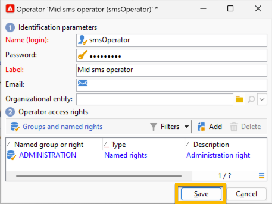
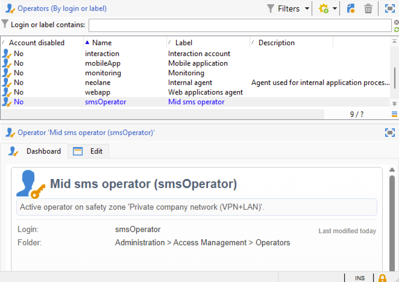
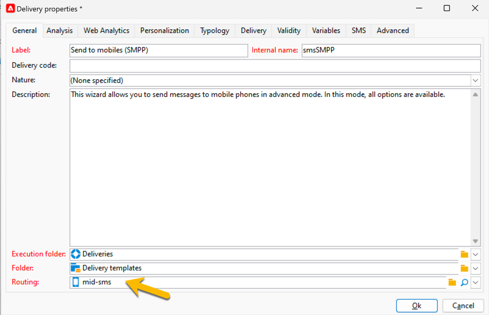

# 중간 소싱 인프라의 SMS {#sms-mid}

>[!IMPORTANT]
>
>이 설명서는 Adobe Campaign v8.7.2 이상에 대한 것입니다.
>
>이전 버전의 경우 [Campaign Classic v7 설명서](https://experienceleague.adobe.com/en/docs/campaign-classic/using/sending-messages/sending-messages-on-mobiles/sms-set-up/sms-set-up)를 참조하세요.

중간 소싱 인프라를 사용하여 SMS 게재를 전송하려면 다음이 필요합니다.

1. 중간 서버의 SMS 연산자. [여기에서 만드는 방법 알아보기](#sms-operator-mid)
1. 이전에 만든 연산자를 사용할 마케팅 서버의 SMS 외부 계정입니다. [여기에서 만드는 방법 알아보기](#sms-external-account)
1. 채널 및 중간 소싱 게재 모드를 지정하는 중간 서버의 SMPP 외부 계정입니다. [여기에서 만드는 방법 알아보기](#smpp-external-account-mid)
1. 외부 계정을 참조하여 전송 프로세스를 간소화하는 게재 템플릿입니다. [여기에서 만드는 방법 알아보기](#sms-delivery-template)

## 중간 서버에서 SMS 연산자 생성 {#sms-operator-mid}

먼저 마케팅 서버의 SMS 외부 계정에서 사용할 SMS 연산자를 중간 서버에서 만들어야 합니다.

SMS 연산자를 만들려면 아래 단계를 수행합니다.

1. **[!UICONTROL Administration]** > **[!UICONTROL Access management]** > **[!UICONTROL Operators]**&#x200B;에서 **[!UICONTROL New]**&#x200B;을(를) 클릭하고 열린 새 창에서 양식을 채우십시오.

   * **[!UICONTROL Name (login)]** 및 **[!UICONTROL Label]**&#x200B;은(는) 필수입니다.
   * 암호는 필수가 아니지만 보안을 위해 적극 권장합니다.

   이름(로그인)은 나중에 중간 서버에서 SMPP 외부 계정의 이름을 지정하는 데 사용됩니다.

   {zoomable="yes"}

1. **[!UICONTROL Groups and named rights]** 부분에서 **[!UICONTROL Add]** 단추를 클릭합니다.
새 창이 열리면 **[!UICONTROL Folder]** 목록에서 **[!UICONTROL Named rights]**&#x200B;을(를) 선택하고 오른쪽 목록에서 **[!UICONTROL ADMINISTRATION]**&#x200B;을(를) 선택합니다.

1. **[!UICONTROL Ok]** 단추를 클릭합니다.

   {zoomable="yes"}

1. **[!UICONTROL Save]** 단추를 클릭하여 SMS 연산자 만들기를 완료합니다.

   {zoomable="yes"}

이제 연산자 목록에서 확인할 수 있습니다.

{zoomable="yes"}

## 마케팅 서버에 SMS 외부 계정 만들기 {#sms-external-account}

중간 인프라에서는 다음과 같이 마케팅 서버에 SMS 외부 계정을 만들어야 합니다

>[!IMPORTANT]
>
>여러 외부 SMS 계정에 동일한 계정과 암호를 사용하면 계정 간에 충돌과 겹칠 수 있습니다. [SMS 문제 해결 페이지](smpp-connection.md#sms-troubleshooting)에 대해 자세히 알아보세요.

1. **[!UICONTROL Administration]** > **[!UICONTROL Platform]** > **[!UICONTROL External Accounts]**&#x200B;에서 **[!UICONTROL New]** 아이콘을 클릭합니다

   {zoomable="yes"}

1. 외부 계정의 **[!UICONTROL Label]** 및 **[!UICONTROL Internal name]**&#x200B;을(를) 설정합니다. 계정 유형을 **[!UICONTROL Routing]**(으)로 정의하고 **[!UICONTROL Enabled]** 상자를 선택한 다음 채널의 경우 **[!UICONTROL Mobile (SMS)]**&#x200B;을(를) 선택하고 게재 모드의 경우 **[!UICONTROL Mid-sourcing]**&#x200B;을(를) 선택합니다.

   {zoomable="yes"}

1. **[!UICONTROL Mid-sourcing]** 탭에서 이전에 중간 서버에서 만든 중간 소싱 서버 URL 및 SMS 연산자로 양식을 채웁니다.

   **[!UICONTROL Test the connection]** 단추를 클릭하여 연결을 확인합니다.

   {zoomable="yes"}

1. **[!UICONTROL Save]**&#x200B;를 클릭합니다.

## 중간 서버에서 SMPP 외부 계정 만들기 {#smpp-external-account-mid}

>[!IMPORTANT]
>
>여러 외부 SMS 계정에 동일한 계정과 암호를 사용하면 계정 간에 충돌과 겹칠 수 있습니다. [SMS 문제 해결 페이지](smpp-connection.md#sms-troubleshooting)를 참조하세요.

이제 목표는 중간 서버에서 SMPP 외부 계정을 설정하는 것입니다.

이렇게 하려면 아래 단계를 수행합니다.

1. 중간 서버의 **[!UICONTROL Administration]** > **[!UICONTROL Platform]** > **[!UICONTROL External Accounts]**&#x200B;에서 **[!UICONTROL New]** 아이콘을 클릭합니다

1. 외부 계정의 **[!UICONTROL Label]** 및 **[!UICONTROL Internal name]**&#x200B;을(를) 설정합니다.

   >[!WARNING]
   >
   >내부 이름을 할당할 때 지정된 명명 규칙을 따라야 합니다. `SMS Operator Name_Internal Name of the Marketing SMS external account`.
   >

   계정 유형을 **[!UICONTROL Routing]**(으)로 정의하고 **[!UICONTROL Enabled]** 상자를 선택한 다음 채널의 경우 **[!UICONTROL Mobile (SMS)]**&#x200B;을(를) 선택하고 게재 모드의 경우 **[!UICONTROL Bulk delivery]**을(를) 선택합니다.
   {zoomable="yes"}

1. **[!UICONTROL Mobile]** 탭에서 **[!UICONTROL Extended generic SMPP]**&#x200B;을(를) **[!UICONTROL Connector]** 드롭다운 목록에 유지합니다.

   기본적으로 **[!UICONTROL Send messages through a dedicated process]** 상자가 선택되어 있습니다.

   {zoomable="yes"}

   연결을 설정하려면 이 양식의 탭을 채워야 합니다. 자세한 내용은 [SMPP 외부 계정에 대해 자세히 알아보세요](smpp-external-account.md#smpp-connection-settings).

## 게재 템플릿 구성 {#sms-delivery-template}

SMS 게재를 쉽게 만들려면 모든 설정을 참조하는 SMS 게재 템플릿을 만드십시오.

마케팅 서버의 **[!UICONTROL Resources]** > **[!UICONTROL Templates]** > **[!UICONTROL Delivery templates]**&#x200B;에서 기존 모바일 게재 템플릿을 마우스 오른쪽 단추로 클릭하고 **[!UICONTROL Duplicate]**&#x200B;을(를) 선택합니다.

{zoomable="yes"}

템플릿의 **[!UICONTROL Label]** 및 **[!UICONTROL Internal name]**&#x200B;을(를) 쉽게 인식하도록 변경하고 **[!UICONTROL Properties]** 단추를 클릭하십시오.

{zoomable="yes"}

**[!UICONTROL General]** 탭의 **[!UICONTROL Routing]**&#x200B;에서 SMPP 외부 계정을 선택합니다.

{zoomable="yes"}

**[!UICONTROL SMS]** 탭에서 선택적 매개 변수를 템플릿에 추가할 수 있습니다.

{zoomable="yes"}

[이 SMS 탭 구성에 대해 자세히 알아보세요](sms-delivery-settings.md).