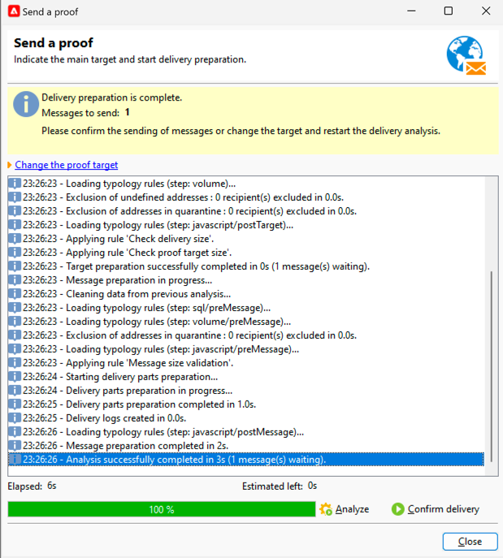

# SMS 게재 증명 보내기 {#sms-proof}

Adobe은 게재 유효성 검사 주기를 설정할 것을 적극 권장합니다. 대상자에게 콘텐츠를 보내기 전에 콘텐츠가 승인되었는지 확인하십시오.

SMS 게재에 대한 증명을 전송하여 유효성을 검사할 수 있습니다.

1. **[!UICONTROL Send a proof]** 단추를 클릭하면 창이 열립니다.

   {zoomable="yes"}

   증명을 보낼 수 있는 모드가 여러 개 있습니다.

   * **[!UICONTROL Definition of a specific proof target]**: 데이터베이스의 주소를 증명 대상으로 필터링하여 쿼리할 수 있습니다.
   * **[!UICONTROL Substitution of the address]**: 테스트 주소를 입력하고 대상 받는 사람 데이터를 사용하여 콘텐츠의 유효성을 검사할 수 있습니다. 대체 주소는 수동으로 입력하거나 드롭다운 목록에서 선택할 수 있습니다. 연결된 [열거형](../../config/enumerations.md)은(는) **[!UICONTROL Substitution address (rcpAddress)]**&#x200B;입니다.
기본적으로 대체는 임의로 수행되지만 **[!UICONTROL Detail]** 아이콘을 통해 기본 대상에서 특정 받는 사람을 선택할 수 있습니다.
   * **[!UICONTROL Seed addresses]**: 증명 대상이 될 시드 주소에 액세스할 수 있도록 해줍니다. 이러한 주소는 파일에서 가져오거나 수동으로 입력할 수 있습니다.
   * **[!UICONTROL Specific target and Seed addresses]**: 받는 사람의 시드 주소와 주소를 결합할 수 있습니다.

1. **[!UICONTROL Targeting mode]**&#x200B;을(를) 선택한 후 그에 따라 증명 주소를 추가하십시오.

   아래 예제에서 **[!UICONTROL Definition of a specific proof target]**&#x200B;을(를) 선택하고 받는 사람을 추가합니다.

   {zoomable="yes"}

1. **[!UICONTROL Analyze]** 단추를 클릭합니다.
Adobe Campaign은 증명 전송을 확인하기 전에 모든 제어를 수행합니다. 분석이 끝나면 **[!UICONTROL Confirm delivery]** 단추를 클릭할 수 있습니다.

   {zoomable="yes"}

1. SMS 게재 증명을 보내려면 **[!UICONTROL Confirm delivery]** 버튼을 클릭하세요.

이 단계에서 문제가 해결되면 앞으로 이동하여 [SMS 게재를 대상자에게 보내기](sms-audience.md)할 수 있습니다.
