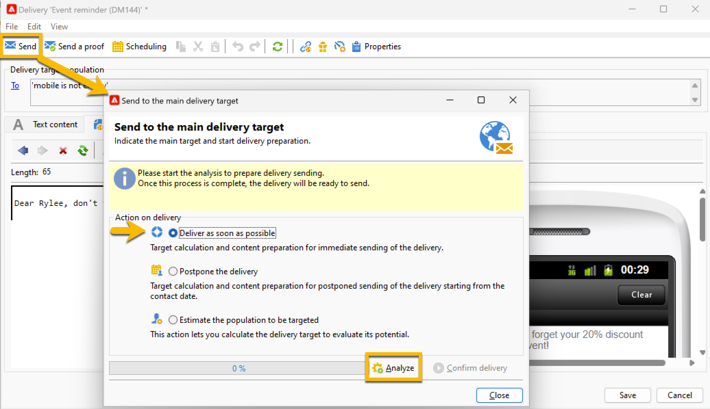
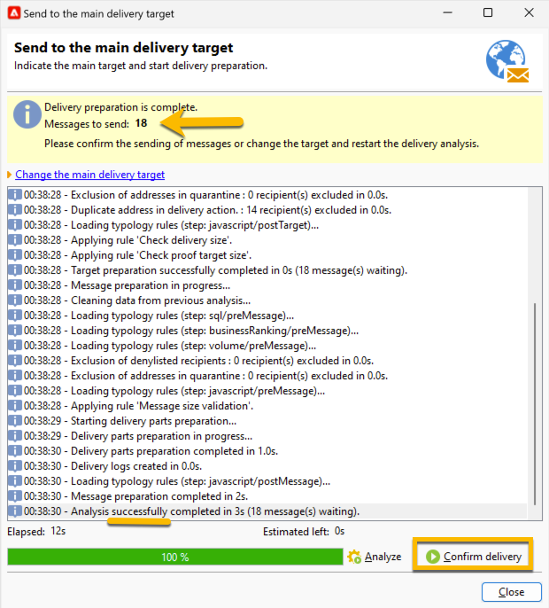

# 대상자에게 SMS 게재 보내기 {#sms-send-audience}

이제 SMS의 유효성을 검사하면 대상자에게 보낼 수 있습니다.

1. **[!UICONTROL Send]** 단추를 클릭합니다.
열려 있는 창에서 자신에게 맞는 작업을 선택합니다.

   아래 예제에서는 **[!UICONTROL Deliver it as soon as possible]**&#x200B;을(를) 선택하겠습니다. **[!UICONTROL Analyze]** 단추가 나타납니다. **[!UICONTROL Analyze]** 단추를 클릭합니다.

   {zoomable="yes"}

   Adobe Campaign은 증명 전송을 확인하기 전에 모든 제어를 수행합니다. 여러분은 실제 관객의 양을 보게 될 것입니다. 분석이 끝나면 **[!UICONTROL Confirm delivery]** 단추를 클릭할 수 있습니다.

   {zoomable="yes"}

1. 대상자에게 SMS 게재를 보내려면 **[!UICONTROL Confirm delivery]** 버튼을 클릭하세요.
