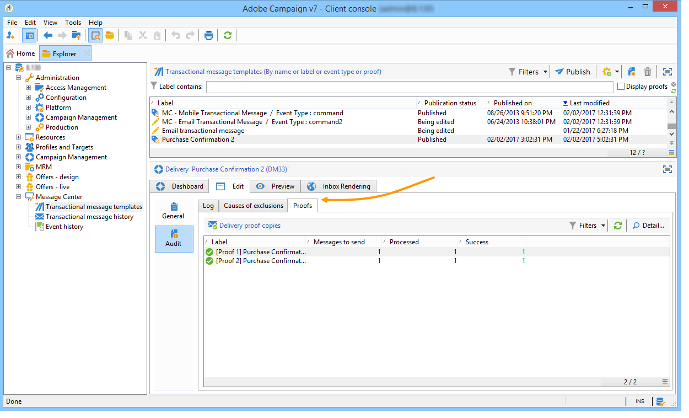
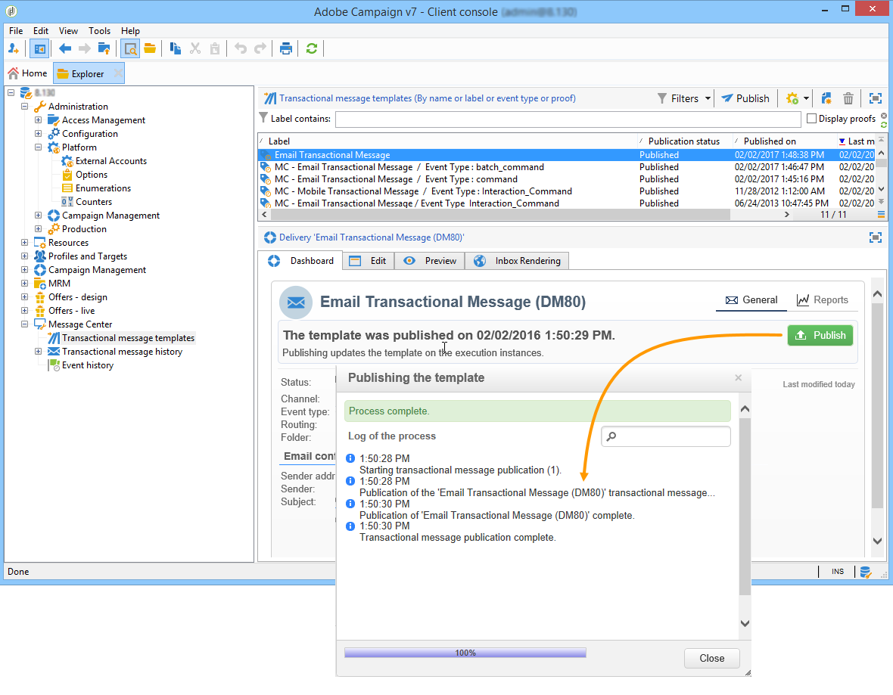
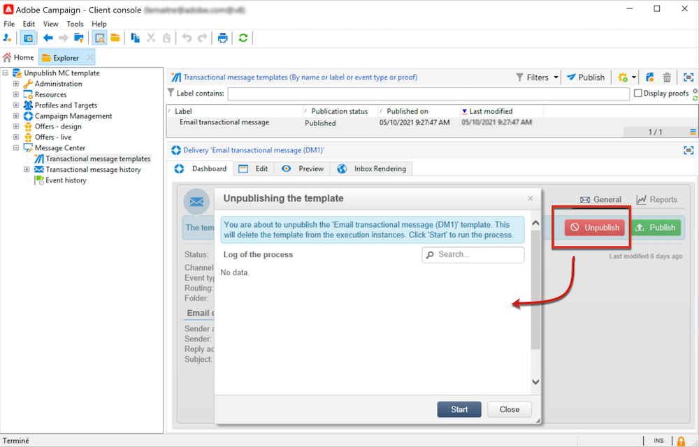

# 트랜잭션 메시지를 위한 템플릿 만들기 및 게시{#template-transactional-messages}

각 이벤트는 개인화된 메시지를 트리거할 수 있습니다. 이렇게 하려면 각 이벤트 유형과 일치하는 메시지 템플릿을 만들어야 합니다. 템플릿에는 트랜잭션 메시지를 개인화하는 데 필요한 정보가 포함되어 있습니다. 템플릿을 사용하여 메시지 미리 보기를 테스트하고 최종 대상에 전달하기 전에 시드 주소를 사용하여 증명을 보낼 수도 있습니다.

## 템플릿 만들기{#create-message-template}

메시지 템플릿을 만들려면 아래 단계를 수행하십시오.

1. Adobe Campaign 트리의 **[!UICONTROL Message Center >Transactional message templates]** 폴더로 이동합니다.
1. 트랜잭션 메시지 템플릿 목록에서 마우스 오른쪽 단추를 클릭하고 드롭다운 메뉴에서 **[!UICONTROL New]**&#x200B;을(를) 선택하거나 트랜잭션 메시지 템플릿 목록 위에 있는 **[!UICONTROL New]** 단추를 클릭합니다.

   

1. 게재 창에서 사용할 채널에 적합한 게재 템플릿을 선택합니다.

   

1. 필요한 경우 레이블을 변경합니다.
1. 보내려는 메시지와 일치하는 이벤트 유형을 선택합니다. Adobe Campaign에서 처리하도록 지정된 이벤트 유형은 미리 만들어야 합니다. [자세히 알아보기](#create-event-types)

   

   >[!CAUTION]
   >
   >이벤트 유형은 두 개 이상의 템플릿에 연결하면 안 됩니다.

1. 특성 및 설명을 입력한 다음 **[!UICONTROL Continue]**&#x200B;을(를) 클릭하여 메시지 본문을 만듭니다.

## 콘텐츠 만들기{#create-message-content}

트랜잭션 메시지 콘텐츠의 정의는 Adobe Campaign의 모든 게재와 동일합니다. 예를 들어 이메일 게재의 경우 HTML 또는 텍스트 형식으로 콘텐츠를 만들거나, 첨부 파일을 추가하거나, 게재 개체를 개인화할 수 있습니다. [자세히 알아보기](../start/create-message.md).

>[!CAUTION]
>
>메시지에 포함된 이미지는 공개적으로 액세스할 수 있어야 합니다. Adobe Campaign은 트랜잭션 메시지에 대한 이미지 업로드 메커니즘을 제공하지 않습니다.\
>JSSP 또는 webApp과 달리 `<%=`에는 기본 이스케이프가 없습니다.
>
>이벤트에서 오는 각 데이터를 제대로 이스케이프 처리해야 합니다. 이 이스케이프는 이 필드의 사용 방식에 따라 다릅니다. 예를 들어 URL 내에서 encodeURIComponent를 사용하십시오. HTML에 표시하려면 escapeXMLString을 사용할 수 있습니다.

메시지 콘텐츠를 정의한 후에는 이벤트 정보를 메시지 본문에 통합하고 개인화할 수 있습니다. 이벤트 정보는 개인화 태그 덕분에 텍스트 본문에 삽입됩니다.

* 모든 개인화 필드는 페이로드에서 가져옵니다.
* 트랜잭션 메시지에서 하나 또는 여러 개인화 블록을 참조할 수 있습니다. <!--The block content will be added to the delivery content during the publication to the execution instance.-->

개인화 태그를 이메일 메시지 본문에 삽입하려면 다음 단계를 적용합니다.

1. 메시지 템플릿에서 전자 메일 형식(HTML 또는 텍스트)과 일치하는 탭을 클릭합니다.
1. 메시지 본문을 입력합니다.
1. 텍스트 본문에서 **[!UICONTROL Real time events>Event XML]** 메뉴를 사용하여 태그를 삽입합니다.

   

1. **요소 이름** 구문을 사용하여 태그를 입력합니다.아래 표시된 것처럼 @**특성 이름**.

   

## 트랜잭션 메시지 템플릿 테스트 {#test-message-template}

### 시드 주소 추가{#add-seeds}

시드 주소를 사용하면 메시지를 보내기 전에 메시지 미리 보기를 표시하고, 증명을 보내고, 메시지 개인화를 테스트할 수 있습니다. 시드 주소는 게재에 연결되며 다른 게재에 사용할 수 없습니다.

1. 트랜잭션 메시지 템플릿에서 **[!UICONTROL Seed addresses]** 탭을 클릭한 다음 **[!UICONTROL Add]** 단추를 클릭합니다.

   

1. 나중에 쉽게 선택할 수 있도록 레이블을 할당한 다음 시드 주소(통신 채널에 따라 이메일 또는 휴대폰)를 입력합니다.

1. 외부 식별자 입력: 이 선택적 필드를 사용하면 비즈니스 키(고유 ID, 이름 + 이메일 등)를 입력할 수 있습니다. 이는 웹 사이트의 모든 애플리케이션에 공통적이며, 프로필을 식별하는 데 사용됩니다. 이 필드가 Adobe Campaign 마케팅 데이터베이스에도 있는 경우 데이터베이스의 프로필과 이벤트를 조정할 수 있습니다.

   

1. 테스트 데이터를 삽입합니다. [이 섹션](#personalization-data)을 참조하십시오.

   

1. **[!UICONTROL Ok]**&#x200B;을(를) 클릭하여 시드 주소 만들기를 확인합니다.

1. 필요한 수만큼 주소를 만들려면 이 프로세스를 반복합니다.

   

주소가 생성되면 미리보기 및 개인화에 액세스할 수 있습니다.

<!--

### Add personalization data{#personalization-data}

You can add data in the message template to test transactional message personalization. This will allow you to generate a preview or send a proof. If you install the **Deliverability** module, this data allows you to display a rendering of the messages for various desktop, web or mobile clients.

The purpose of this data is to test your messages before their final delivery. These messages do not coincide with actual data to be processed by Message Center.

However, the XML structure must be identical to that of the event stored in the execution instance, as shown below. 

This information enables you to personalize message content using personalization tags.

1. In the message template, click the **[!UICONTROL Seed addresses]** tab.
1. In the event content, enter the test information in XML format.

   
-->

### 트랜잭션 메시지 미리 보기{#transactional-message-preview}

시드 주소와 메시지 본문을 한 개 이상 만들면 메시지를 미리 보고 개인화를 확인할 수 있습니다.

1. 메시지 템플릿에서 **[!UICONTROL Preview]** 탭을 클릭한 다음 드롭다운 목록에서 **[!UICONTROL A seed address]**&#x200B;을(를) 선택합니다.

   

1. 이전에 만든 시드 주소를 선택하여 개인화된 메시지를 표시합니다.

   

### 증명 보내기 {#send-proof}

이전에 만든 시드 주소로 증명을 전송하여 메시지 게재를 테스트할 수 있습니다.

증명 보내기에는 게재의 프로세스와 동일한 프로세스가 포함됩니다.

[이 섹션](../send/preview-and-proof.md#proofs-send)에서 증명에 대해 자세히 알아보세요.

하지만 트랜잭션 메시지의 증명을 보내려면 다음 작업을 수행해야 합니다.

* 개인화 테스트 데이터를 사용하여 하나 이상의 [시드 주소](#add-seeds)를 만듭니다.
* 메시지 콘텐츠 만들기

증명을 보내려면:

1. 게재 창에서 **[!UICONTROL Send a proof]** 단추를 클릭합니다.
1. 게재 분석.
1. 오류를 수정하고 게재를 확인합니다.

   

1. 메시지가 시드 주소로 전달되었고 해당 콘텐츠가 구성을 준수하는지 확인합니다.

   

**[!UICONTROL Audit]** 탭을 통해 각 템플릿에서 증명에 액세스할 수 있습니다.

#### [!DNL Campaign Classic] v7에서 전환 {#transition-from-v7}

[Campaign Classic v7에서 전환](../start/v7-to-v8.md)하는 경우 모든 게재는 중간 소싱 서버를 거칩니다.

그러나 트랜잭션 메시지 템플릿을 만들 때 템플릿을 성공적으로 사용하는 데 필요한 라우팅은 **내부 전자 메일 게재**&#x200B;입니다. 이 라우팅으로 인해 증명을 보낼 수 없습니다.

따라서 트랜잭션 메시지 템플릿에 대한 증명을 보내려면 내부 전자 메일 게재에서 **중간 소싱 라우팅 계정**(으)로 라우팅을 변경해야 합니다.

증명을 보낸 후에는 트랜잭션 메시지 템플릿을 게시하기 전에 다시 내부 이메일 게재로 라우팅을 변경해야 합니다.

## 템플릿 Publish {#publish-message-template}

만든 메시지 템플릿 <!-- on the control instance-->이(가) 완료되면 게시할 수 있으며, 이를 통해 실시간 및 일괄 처리 이벤트에 연결된 메시지를 보낼 수 있습니다.

<!--This process will also publish it on all execution instances.

NOTE: When publishing transactional message templates, typology rules are also automatically published on the execution instances.

Publication lets you automatically create two message templates on the execution instances, which will allow you to send messages linked to real-time and batch events.-->

>[!CAUTION]
>
>템플릿을 변경할 때마다 다시 게시하여 트랜잭션 메시지 게재 중에 이러한 변경 사항을 적용해야 합니다.

1. 트리의 **[!UICONTROL Message Center > Transactional message templates]** 폴더로 이동합니다.
1. 게시할 템플릿을 선택하십시오<!--on your execution instances-->.
1. **[!UICONTROL Publish]**&#x200B;를 클릭합니다.

   

게시가 완료되면 일괄 처리에 적용할 메시지 템플릿과 실시간 유형 이벤트가 모두 **[!UICONTROL Administration > Production > Message Center Execution> Default > Transactional message templates]** 폴더에 만들어집니다.

템플릿이 게시되면 해당 이벤트가 트리거되면 Adobe Campaign<!--execution instance-->이(가) 이벤트를 받고 트랜잭션 템플릿에 연결하고 각 받는 사람에게 해당 트랜잭션 메시지를 보냅니다.

<!--
>[!NOTE]
>
>If you replace an existing field of the transactional message template, such as the sender address, with an empty value, the corresponding field on the execution instance(s) will not be updated once the transactional message is published again. It will still contain the previous value.
>
>However, if you add a non-empty value, the corresponding field will be updated as usual after the next publication.
-->

## 템플릿 게시 취소

메시지 템플릿이 <!--on the execution instances-->에 게시되면 게시를 취소할 수 있습니다.

* 실제로 해당 이벤트가 트리거된 경우에도 게시된 템플릿을 호출할 수 있습니다. 메시지 템플릿을 더 이상 사용하지 않는 경우에는 게시를 취소하는 것이 좋습니다. 이는 실수로 원치 않는 트랜잭션 메시지를 보내는 것을 방지하기 위해서입니다.

  예를 들어 크리스마스 캠페인에만 사용하는 메시지 템플릿을 게시했습니다. 크리스마스 기간이 끝난 후에 게시 취소하고 내년에 다시 게시할 수도 있습니다.

* 또한 **[!UICONTROL Published]** 상태의 트랜잭션 메시지 템플릿은 삭제할 수 없습니다. 먼저 게시를 취소해야 합니다.

트랜잭션 메시지 템플릿의 게시를 취소하려면 아래 단계를 따르십시오.

1. **[!UICONTROL Message Center > Transactional message templates]** 폴더를 찾습니다.
1. 게시를 취소할 템플릿을 선택합니다.
1. **[!UICONTROL Unpublish]**&#x200B;를 클릭합니다.
1. **[!UICONTROL Start]**&#x200B;를 클릭합니다.

트랜잭션 메시지 템플릿 상태가 **[!UICONTROL Published]**&#x200B;에서 **[!UICONTROL Being edited]**(으)로 다시 변경됩니다.

게시 취소가 완료되면:

* 일괄 처리 및 실시간 유형 이벤트에 적용된 메시지 템플릿이 모두 삭제됩니다<!-- from each execution instance-->.

  **[!UICONTROL Administration > Production > Message Center Execution > Default > Transactional message templates]** 폴더에 더 이상 나타나지 않습니다.

* 템플릿이 게시 취소되면 <!-- from the control instance-->을(를) 삭제할 수 있습니다.

  이렇게 하려면 목록에서 선택한 다음 화면 오른쪽 상단의 **[!UICONTROL Delete]** 단추를 클릭합니다.
