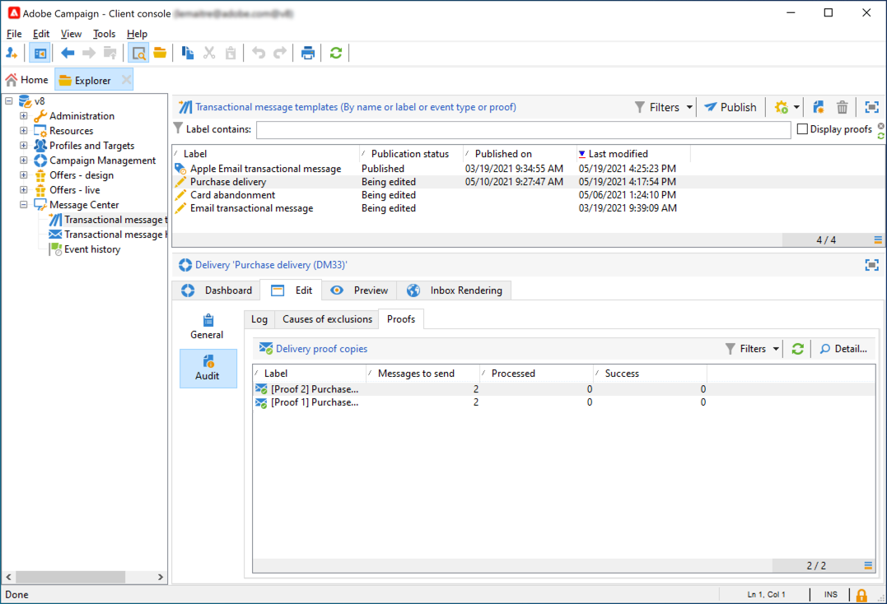
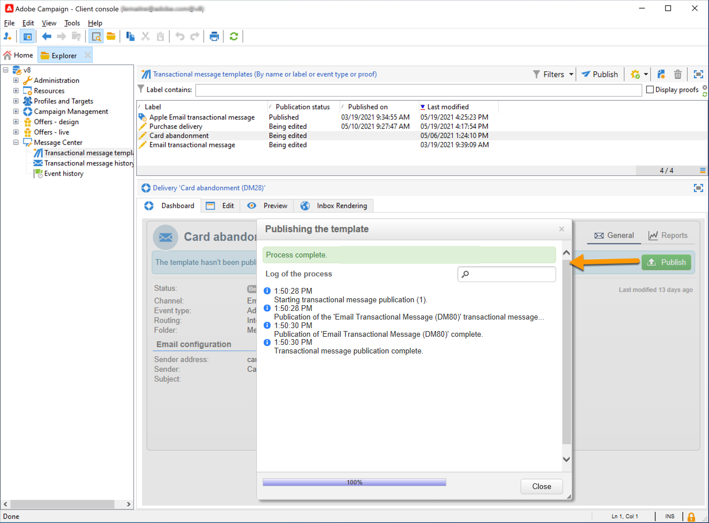

# 트랜잭션 메시지 시작{#send-transactional-messages}

트랜잭션 메시지(메시지 센터)는 트리거 메시지를 관리하기 위해 설계된 캠페인 모듈입니다. 이러한 알림은 정보 시스템에서 트리거되는 이벤트에서 생성되며 다음을 수행할 수 있습니다. 송장, 주문 확인, 배송 확인, 암호 변경, 제품 비가용성 알림, 계정 명세서, 웹 사이트 계정 생성 등

  관리 Cloud Services 사용자로, [연락처 Adobe](../start/campaign-faq.md#support){target="_blank"} campaign 트랜잭션 메시지를 환경에 구성하려면 다음을 수행하십시오.

트랜잭션 메시지는 보내는 데 사용됩니다.

* 예를 들어 주문 확인 또는 암호 재설정과 같은 알림
* 고객 작업에 대한 개별 실시간 응답
* 홍보되지 않는 콘텐츠

트랜잭션 메시지 설정은 [이 섹션](../config/transactional-msg-settings.md).

트랜잭션 메시지 아키텍처 이해 [이 페이지](../architecture/architecture.md#transac-msg-archi).

## 트랜잭션 메시지 작동 원리 {#transactional-messaging-operating-principle}

Adobe Campaign 트랜잭션 메시지 모듈은 개인화된 트랜잭션 메시지로 변경할 이벤트를 반환하는 정보 시스템에 통합됩니다. 이러한 메시지는 개별적으로 또는 이메일, SMS 또는 푸시 알림을 통해 일괄적으로 전송할 수 있습니다.

예를 들어 고객이 제품을 구입할 수 있는 웹 사이트가 있는 회사를 생각해 보십시오.

Adobe Campaign을 사용하면 장바구니에 제품을 추가한 고객에게 알림 이메일을 보낼 수 있습니다. 구매(캠페인 이벤트를 트리거하는 외부 이벤트)를 완료하지 않고 웹 사이트를 떠나면 장바구니 중단 이메일을 자동으로 보냅니다(트랜잭션 메시지 게재).

이 작업을 수행하는 주요 단계는 아래에 자세히 설명되어 있습니다.

1. [이벤트 유형 만들기](#create-event-types).
1. [메시지 템플릿 만들기 및 디자인](#create-message-template). 이 단계 동안 이벤트를 메시지에 연결해야 합니다.
1. [메시지 테스트](#test-message-template).
1. [메시지 템플릿을 게시합니다](#publish-message-template).

트랜잭션 메시지 템플릿을 디자인하고 게시하면 해당 이벤트가 트리거되는 경우 PushEvent 및 PushEvents를 통해 관련 데이터가 Campaign으로 전송됩니다 [SOAP 메서드](../send/event-description.md)타겟팅된 수신자에게 게재를 전송합니다.

## 이벤트 유형 만들기 {#create-event-types}

각 이벤트를 개인화된 메시지로 변경할 수 있도록 먼저 다음을 만들어야 합니다 **이벤트 유형**.

When [메시지 템플릿 만들기](#create-message-template)을 지정하면 전송할 메시지와 일치하는 이벤트 유형을 선택합니다.

>[!CAUTION]
>
>이벤트 유형을 메시지 템플릿에서 사용하기 전에 만들어야 합니다.

Adobe Campaign에서 처리할 이벤트 유형을 만들려면 아래 단계를 수행하십시오.

1. 다음 위치로 이동합니다. **[!UICONTROL Administration > Platform > Enumerations]** 캠페인 탐색기의 폴더.
1. 을(를) 선택합니다 **[!UICONTROL Event type]** 목록의 열거형입니다.
1. 클릭 **[!UICONTROL Add]** 열거형 값을 만들려면 주문 확인, 암호 변경, 주문 전달 변경 등이 가능합니다.

   

   >[!CAUTION]
   >
   >각 이벤트 유형은 **[!UICONTROL Event type]** 열거형.

1. 항목별 목록 값이 만들어지면 작성이 유효하도록 인스턴스에 로그오프했다가 다시 로그온합니다.

>[!NOTE]
>
>의 열거형에 대해 자세히 알아보기 [이 페이지](../../v8/config/ui-settings.md#enumerations).

## 트랜잭션 메시지 템플릿 정의 {#create-message-template}

각 이벤트는 개인화된 메시지를 트리거할 수 있습니다. 이 경우 각 이벤트 유형과 일치하는 메시지 템플릿을 만들어야 합니다. 템플릿에는 트랜잭션 메시지를 개인화하는 데 필요한 정보가 포함되어 있습니다. 템플릿을 사용하여 최종 타겟에 게재하기 전에 메시지 미리 보기를 테스트하고 시드 주소를 사용하여 증명을 전송할 수도 있습니다.

### 템플릿 만들기

메시지 템플릿을 만들려면 아래 단계를 수행하십시오.

1. 로 이동합니다. **[!UICONTROL Message Center >Transactional message templates]** Adobe Campaign 트리의 폴더.
1. 트랜잭션 메시지 템플릿 목록에서 마우스 오른쪽 단추를 클릭하고 을(를) 선택합니다 **[!UICONTROL New]** 드롭다운 메뉴에서 **[!UICONTROL New]** 트랜잭션 메시지 템플릿 목록 위의 단추.

   

1. 게재 창에서 사용할 채널에 적합한 게재 템플릿을 선택합니다.

   

1. 필요한 경우 레이블을 변경합니다.
1. 전송할 메시지와 일치하는 이벤트 유형을 선택합니다. Adobe Campaign에서 처리하도록 지정된 이벤트 유형은 미리 만들어야 합니다. [자세히 알아보기](#create-event-types)

   

   >[!CAUTION]
   >
   >이벤트 유형은 두 개 이상의 템플릿에 연결할 수 없습니다.

1. 특성과 설명을 입력한 다음 **[!UICONTROL Continue]** 메시지 본문을 만들려면

### 컨텐츠 만들기{#create-message-content}

트랜잭션 메시지 콘텐츠의 정의는 Adobe Campaign의 모든 게재와 동일합니다. 예를 들어 이메일 게재의 경우 HTML 또는 텍스트 형식으로 콘텐츠를 만들거나 첨부 파일을 추가하거나 게재 개체를 개인화할 수 있습니다. [자세히 알아보기](../start/create-message.md)

>[!CAUTION]
>
>메시지에 포함된 이미지는 공개적으로 액세스할 수 있어야 합니다. Adobe Campaign은 트랜잭션 메시지를 위한 이미지 업로드 메커니즘을 제공하지 않습니다.\
>JSSP 또는 webApp과는 달리 `<%=` 기본 이스케이프가 없습니다.
>
>이벤트에서 들어오는 각 데이터를 제대로 이스케이프 처리해야 합니다. 이스케이프는 이 필드를 사용하는 방식에 따라 다릅니다. 예를 들어 URL 내에서 encodeURIComponent를 사용하십시오. HTML에 표시하려면 escapeXMLString을 사용할 수 있습니다.

메시지 콘텐츠를 정의하고 나면 이벤트 정보를 메시지 본문에 통합하여 개인화할 수 있습니다. 개인화 태그 덕분에 텍스트 본문에 이벤트 정보가 삽입됩니다.

* 페이로드에서 모든 개인화 필드를 가져옵니다.
* 트랜잭션 메시지에서 하나 또는 여러 개의 개인화 블록을 참조할 수 있습니다. <!--The block content will be added to the delivery content during the publication to the execution instance.-->

이메일 메시지 본문에 개인화 태그를 삽입하려면 다음 단계를 적용합니다.

1. 메시지 템플릿에서 이메일 형식(HTML 또는 텍스트)과 일치하는 탭을 클릭합니다.
1. 메시지 본문을 입력합니다.
1. 텍스트 본문에 **[!UICONTROL Real time events>Event XML]** 메뉴 아래의 제품에서 사용할 수 있습니다.

   

1. 다음 구문을 사용하여 태그를 채웁니다. **요소 이름**.@**속성 이름** 아래와 같이 표시됩니다.

   

## 트랜잭션 메시지 템플릿 테스트 {#test-message-template}

### 시드 주소 추가{#add-seeds}

시드 주소를 사용하면 메시지를 보내기 전에 메시지 미리 보기를 표시하고, 증명을 보내고, 메시지 개인화를 테스트할 수 있습니다. 시드 주소는 게재에 연결되므로 다른 게재에 사용할 수 없습니다.

1. 트랜잭션 메시지 템플릿에서 **[!UICONTROL Seed addresses]** 탭을 클릭한 다음 **[!UICONTROL Add]** 버튼을 클릭합니다.

   

1. 나중에 쉽게 선택할 수 있도록 레이블을 지정한 다음 시드 주소(통신 채널에 따라 이메일 또는 휴대폰)를 입력합니다.

1. 외부 식별자를 입력합니다. 이 선택적 필드를 사용하면 비즈니스 키(고유 ID, 이름 + 이메일 등)를 입력할 수 있습니다. 이는 프로필을 식별하는 데 사용되는 웹 사이트의 모든 애플리케이션에서 일반적으로 사용됩니다. 이 필드가 Adobe Campaign 마케팅 데이터베이스에 있으면 데이터베이스의 프로필로 이벤트를 조정할 수 있습니다.

   

1. 테스트 데이터를 삽입합니다. [이 섹션](#personalization-data)을 참조하십시오.

   

1. 클릭 **[!UICONTROL Ok]** 를 클릭하여 시드 주소 만들기를 확인합니다.

1. 프로세스를 반복하여 필요한 수만큼 주소를 만듭니다.

   

주소가 만들어지면 미리 보기 및 개인화에 액세스할 수 있습니다.

<!--

### Add personalization data{#personalization-data}

You can add data in the message template to test transactional message personalization. This will allow you to generate a preview or send a proof. If you install the **Deliverability** module, this data allows you to display a rendering of the messages for various desktop, web or mobile clients.

The purpose of this data is to test your messages before their final delivery. These messages do not coincide with actual data to be processed by Message Center.

However, the XML structure must be identical to that of the event stored in the execution instance, as shown below. 

This information enables you to personalize message content using personalization tags.

1. In the message template, click the **[!UICONTROL Seed addresses]** tab.
1. In the event content, enter the test information in XML format.

   
-->

### 트랜잭션 메시지 미리 보기{#transactional-message-preview}

하나 이상의 시드 주소와 메시지 본문을 생성했으면 메시지를 미리 보고 개인화를 확인할 수 있습니다.

1. 메시지 템플릿에서 **[!UICONTROL Preview]** 탭을 선택하고 **[!UICONTROL A seed address]** 를 클릭합니다.

   

1. 이전에 만든 시드 주소를 선택하여 개인화된 메시지를 표시합니다.

   

### 증명 보내기

이전에 만든 시드 주소로 증명을 보내 메시지 전달을 테스트할 수 있습니다.

증명 전송에는 게재와 동일한 프로세스가 포함됩니다. 에서 증명에 대해 자세히 알아보십시오 [이 섹션](../send/preview-and-proof.md).

그러나 트랜잭션 메시지의 증명을 보내려면 다음 작업을 수행해야 합니다.

* 하나 이상 만들기 [시드 주소](#add-seeds) 개인화 테스트 데이터 사용
* 메시지 콘텐츠 만들기

증명을 보내려면

1. 을(를) 클릭합니다. **[!UICONTROL Send a proof]** 버튼을 클릭합니다.
1. 게재를 분석합니다.
1. 오류를 수정하고 게재를 확인합니다.

   

1. 메시지가 시드 주소에 전달되었고 콘텐츠가 구성을 준수하는지 확인합니다.

   

를 통해 각 템플릿에서 증명에 액세스할 수 있습니다 **[!UICONTROL Audit]** 탭.

## 템플릿 게시 {#publish-message-template}

메시지 템플릿을 만들 때<!-- on the control instance--> 완료되면 게시할 수 있습니다. 이 게시를 사용하면 실시간 및 배치 이벤트에 연결된 메시지를 보낼 수 있습니다.

<!--This process will also publish it on all execution instances.

NOTE: When publishing transactional message templates, typology rules are also automatically published on the execution instances.

Publication lets you automatically create two message templates on the execution instances, which will allow you to send messages linked to real-time and batch events.-->

>[!CAUTION]
>
>템플릿을 변경할 때마다 트랜잭션 메시지 게재 중에 이러한 변경 사항이 적용되도록 다시 게시해야 합니다.

1. 로 이동합니다. **[!UICONTROL Message Center > Transactional message templates]** 트리의 폴더.
1. 게시할 템플릿을 선택합니다<!--on your execution instances-->.
1. **[!UICONTROL Publish]**&#x200B;를 클릭합니다.

   

게시가 완료되면, 일괄 처리에 적용할 메시지 템플릿과 실시간 유형 이벤트는 모두 **[!UICONTROL Administration > Production > Message Center Execution> Default > Transactional message templates]** 폴더를 입력합니다.

템플릿이 게시되면 해당 이벤트가 트리거되는 경우 Adobe Campaign<!--execution instance--> 은(는) 이벤트를 수신하고 트랜잭션 템플릿에 연결하고 각 수신자에게 해당 트랜잭션 메시지를 보냅니다.

<!--
>[!NOTE]
>
>If you replace an existing field of the transactional message template, such as the sender address, with an empty value, the corresponding field on the execution instance(s) will not be updated once the transactional message is published again. It will still contain the previous value.
>
>However, if you add a non-empty value, the corresponding field will be updated as usual after the next publication.
-->

## 템플릿 게시 취소

메시지 템플릿이 게시되면 <!--on the execution instances-->, 게시 취소할 수 있습니다.

* 실제로, 게시된 템플릿은 해당 이벤트가 트리거되는 경우 여전히 호출할 수 있습니다. 더 이상 메시지 템플릿을 사용하지 않는 경우 게시를 취소하는 것이 좋습니다. 실수로 원치 않는 트랜잭션 메시지를 보내지 않기 위한 것입니다.

   예를 들어, 크리스마스 캠페인에만 사용하는 메시지 템플릿을 게시했습니다. 크리스마스 기간이 끝난 후에 게시를 취소하고, 내년에 다시 게시할 수 있습니다.

* 또한 **[!UICONTROL Published]** 상태. 먼저 게시 취소해야 합니다.

트랜잭션 메시지 템플릿 게시를 취소하려면 아래 단계를 따르십시오.

1. 다음 위치로 이동합니다. **[!UICONTROL Message Center > Transactional message templates]** 폴더를 입력합니다.
1. 게시를 취소할 템플릿을 선택합니다.
1. **[!UICONTROL Unpublish]**&#x200B;를 클릭합니다.
1. **[!UICONTROL Start]**&#x200B;를 클릭합니다.

트랜잭션 메시지 템플릿 상태가 **[!UICONTROL Published]** to **[!UICONTROL Being edited]**.

게시 취소가 완료되면

* 두 메시지 템플릿(배치 및 실시간 유형 이벤트에 적용됨)이 모두 삭제됩니다<!-- from each execution instance-->.

   그러면 더 이상 **[!UICONTROL Administration > Production > Message Center Execution > Default > Transactional message templates]** 폴더를 입력합니다.

* 템플릿의 게시를 취소하면 삭제할 수 있습니다<!-- from the control instance-->.

   이렇게 하려면 목록에서 해당 항목을 선택하고 **[!UICONTROL Delete]** 화면 오른쪽 상단의 단추.
