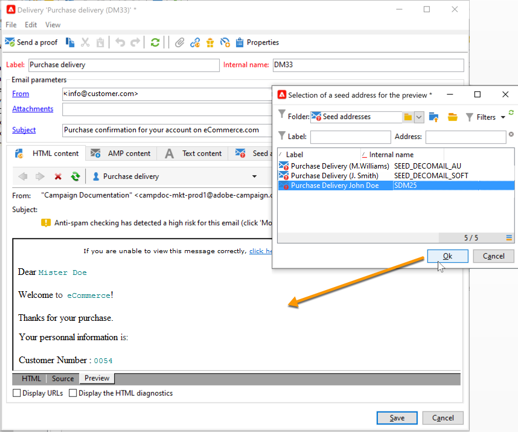
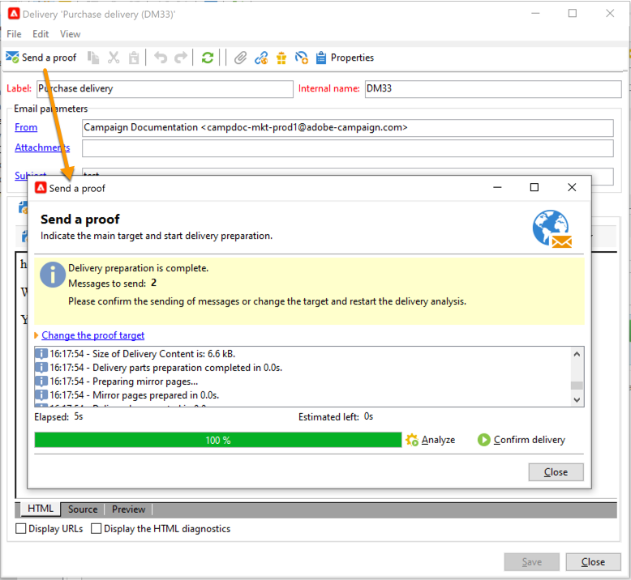

# 트랜잭션 메시지 시작하기{#send-transactional-messages}

트랜잭션 메시지(메시지 센터)는 트리거 메시지를 관리하기 위해 고안된 캠페인 모듈입니다. 이러한 메시지는 정보 시스템에서 트리거된 이벤트에서 생성되며, 다음을 수행할 수 있습니다.예를 들어 송장, 주문 확인, 배송 확인, 암호 변경, 제품 사용 불능 통지, 계정 명세서 또는 웹사이트 계정 생성 등의 내용이 있습니다.

:speech_bal풍선:관리 Cloud Services 사용자는 [Adobe](../start/support.md#support)에 연락하여 사용자 환경에서 캠페인 트랜잭션 메시지를 설치하고 구성합니다.

트랜잭션 메시지는 다음에 사용됩니다.

* 알림(예: 주문 확인 또는 암호 재설정)
* 고객 행동에 대한 개별 실시간 응답을 보냅니다.
* 홍보하지 않는 컨텐츠

: 전구:트랜잭션 메시지 설정은 [이 섹션](../config/transactional-msg-settings.md)에 자세히 설명되어 있습니다.

: 전구:[이 페이지](../dev/architecture.md)에서 트랜잭션 메시징 아키텍처를 이해합니다.

>[!CAUTION]
>
>트랜잭션 메시징에는 특정 라이선스가 필요합니다. 사용권 계약을 확인하십시오.

## 트랜잭션 메시지 템플릿 정의

각 이벤트는 개인화된 메시지를 트리거할 수 있습니다. 이를 수행하려면 각 이벤트 유형과 일치하도록 메시지 템플릿을 만들어야 합니다. 템플릿에는 트랜잭션 메시지를 개인화하는 데 필요한 정보가 포함되어 있습니다. 또한 템플릿을 사용하여 최종 타겟으로 전달하기 전에 시드 주소를 사용하여 메시지 미리 보기를 테스트하고 교정을 전송할 수 있습니다.

### 템플릿 만들기

메시지 템플릿을 만들려면 아래 단계를 수행하십시오.

1. Adobe Campaign 트리의 **[!UICONTROL Message Center >Transactional message templates]** 폴더로 이동합니다.
1. 트랜잭션 메시지 템플릿 목록에서 드롭다운 메뉴에서 **[!UICONTROL New]**&#x200B;을 마우스 오른쪽 단추로 클릭하고 선택하거나 트랜잭션 메시지 템플릿 목록 위의 **[!UICONTROL New]** 단추를 클릭합니다.

   

1. 배달 창에서 사용할 채널에 적합한 배달 템플릿을 선택합니다.

   

1. 필요한 경우 레이블을 변경합니다.
1. 보내려는 메시지와 일치하는 이벤트 유형을 선택합니다.

   

   Adobe Campaign에서 처리할 이벤트 유형은 Adobe으로 제어 인스턴스에서 만들어야 합니다.

   >[!NOTE]
   >
   >이벤트 유형은 두 개 이상의 템플릿에 링크되어서는 안 됩니다.

1. 자연과 설명을 입력한 다음 **[!UICONTROL Continue]**&#x200B;을 클릭하여 메시지 본문을 만듭니다. [메시지 내용 만들기](#create-message-content)를 참조하십시오.

   

### 내용{#create-message-content} 만들기

트랜잭션 메시지 컨텐츠의 정의는 Adobe Campaign의 모든 게재에 대한 정의와 동일합니다. 예를 들어 이메일 전달의 경우 HTML 또는 텍스트 형식의 컨텐츠를 만들거나 첨부 파일을 추가하거나 전달 개체를 개인화할 수 있습니다. 이 작업에 대한 자세한 정보는 [이 섹션](../start/create-message.md)을 참조하십시오.

>[!CAUTION]
>
>메시지에 포함된 이미지는 공개적으로 액세스할 수 있어야 합니다. Adobe Campaign은 트랜잭션 메시지에 대한 이미지 업로드 메커니즘을 제공하지 않습니다.\
>JSSP 또는 webApp에서와 달리 `<%=`에는 기본 이스케이프가 없습니다.
>
>이벤트에서 나오는 각 데이터를 제대로 escape해야 합니다. 이 탈출은 이 필드를 사용하는 방법에 따라 달라집니다. 예를 들어 URL 내에서 encodeURIComponent를 사용하십시오. HTML에 표시하려면 escapeXMLString을 사용할 수 있습니다.

메시지 컨텐츠를 정의한 후에는 이벤트 정보를 메시지 본문에 통합하고 개인화할 수 있습니다. 개인화 태그 덕분에 이벤트 정보가 텍스트 본문에 삽입됩니다.

* 모든 개인화 필드는 페이로드에서 가져옵니다.
* 트랜잭션 메시지에서 하나 또는 여러 개인화 블록을 참조할 수 있습니다. 게시 중에 실행 인스턴스에 블록 컨텐츠가 게재 컨텐트에 추가됩니다.

이메일 메시지 본문에 개인화 태그를 삽입하려면 다음 단계를 수행하십시오.

1. 메시지 템플릿에서 이메일 형식(HTML 또는 텍스트)과 일치하는 탭을 클릭합니다.
1. 메시지 본문을 입력합니다.
1. 텍스트 본문에 **[!UICONTROL Real time events>Event XML]** 메뉴를 사용하여 태그를 삽입합니다.

   

1. 다음 구문을 사용하여 태그를 채웁니다.**요소 이름**.@**특성 이름**&#x200B;에 표시됩니다.

   

### 시드 주소 추가{#add-seeds}

시드 주소를 사용하면 메시지를 보내기 전에 메시지의 미리 보기를 표시하고, 입증을 보내고, 메시지 개인화를 테스트할 수 있습니다. 시드 주소는 게재와 연결되어 있으므로 다른 배달에는 사용할 수 없습니다.

1. 트랜잭션 메시지 템플릿에서 **[!UICONTROL Seed addresses]** 탭을 클릭합니다.

   

1. 나중에 쉽게 선택할 수 있도록 레이블을 할당합니다.

   

1. 시드 주소(통신 채널에 따라 이메일 또는 휴대폰)를 입력합니다.

   

1. 외부 식별자를 입력합니다.이 선택 필드는 비즈니스 키(고유 ID, 이름 + 이메일 등)를 입력할 수 있습니다. 프로파일을 식별하는 데 사용되는 웹 사이트의 모든 애플리케이션에서 일반적으로 사용됩니다. 이 필드가 Adobe Campaign 마케팅 데이터베이스에도 있을 경우, 이벤트를 데이터베이스의 프로필과 대사할 수 있습니다.

   

1. 테스트 데이터를 삽입합니다. [이 섹션](#personalization-data)을 참조하십시오.

   

1. **[!UICONTROL Add other seed addresses]** 링크를 클릭한 다음 **[!UICONTROL Add]** 단추를 클릭합니다.

   

1. 이 과정을 반복하여 필요한 수만큼 주소를 만듭니다.

   

주소가 만들어지면 미리 보기와 개인화에 액세스할 수 있습니다.

### 개인화 데이터 추가{#personalization-data}

메시지 템플릿에 데이터를 추가하여 트랜잭션 메시지 개인화를 테스트할 수 있습니다. 그러면 미리 보기를 생성하거나 증명을 보낼 수 있습니다. **Deliverability** 모듈을 설치하면 이 데이터를 통해 다양한 데스크탑, 웹 또는 모바일 클라이언트에 대한 메시지의 렌더링을 표시할 수 있습니다.

이 데이터의 목적은 메시지를 최종 전달하기 전에 테스트하는 것입니다. 이러한 메시지는 메시지 센터에서 처리할 실제 데이터와 일치하지 않습니다. 그러나 XML 구조는 아래와 같이 실행 인스턴스에 저장된 이벤트와 동일해야 합니다.

이 정보를 통해 개인화 태그를 사용하여 메시지 컨텐츠를 개인화할 수 있습니다.

1. 메시지 템플릿에서 **[!UICONTROL Seed addresses]** 탭을 클릭합니다.
1. 이벤트 내용에서 테스트 정보를 XML 형식으로 입력합니다.

   

### 트랜잭션 메시지 보기{#transactional-message-preview}

하나 이상의 시드 주소와 메시지 본문을 만든 후 메시지를 미리 보고 개인화를 확인할 수 있습니다.

1. 메시지 템플릿에서 **[!UICONTROL Preview]** 탭을 클릭합니다.

   

1. 드롭다운 목록에서 **[!UICONTROL A seed address]**&#x200B;을 선택합니다.

   

1. 개인화된 메시지를 표시하려면 이전에 만든 시드 주소를 선택합니다.

   

### 증명 보내기

이전에 만든 시드 주소로 증명을 보내 메시지 배달을 테스트할 수 있습니다.

증명 보내기는 전달과 동일한 프로세스를 포함합니다.

:arrow_upper_right:[Campaign Classic 설명서]((https://experienceleague.adobe.com/docs/campaign-classic/using/sending-messages/key-steps-when-creating-a-delivery/steps-validating-the-delivery.html))에서 교정쇄에 대한 자세한 내용을 살펴보십시오.

그러나 트랜잭션 메시지의 증거를 전송하려면 다음 작업을 수행해야 합니다.

* 개인화 테스트 데이터로 하나 이상의 [시드 주소](#add-seeds)을 만듭니다.
* 메시지 내용 만들기

증거를 보내려면:

1. 배달 창에서 **[!UICONTROL Send a proof]** 단추를 클릭합니다.
1. 배달 내용을 분석합니다.
1. 오류를 수정하고 배달을 확인합니다.

   

1. 메시지가 시드 주소로 배달되었고 내용이 구성을 준수하는지 확인합니다.

   

교정쇄는 **[!UICONTROL Audit]** 탭을 통해 각 템플릿에서 액세스할 수 있습니다.

### 템플릿 게시

제어 인스턴스에서 만든 메시지 템플릿이 완료되면 게시할 수 있습니다. 이 프로세스에서는 모든 실행 인스턴스에도 게시됩니다.

>[!NOTE]
>
>트랜잭션 메시지 템플릿을 게시할 때 유형 규칙도 실행 인스턴스에도 자동으로 게시됩니다.

[게시]를 사용하면 실행 인스턴스에 두 개의 메시지 템플릿을 자동으로 만들 수 있으며, 이를 통해 실시간 및 일괄 처리 이벤트에 연결된 메시지를 보낼 수 있습니다.

>[!CAUTION]
>
>템플릿을 변경할 때마다 트랜잭션 메시지 배달 중에 이러한 변경 사항이 적용되도록 템플릿을 다시 게시해야 합니다.

1. 제어 인스턴스에서 트리의 **[!UICONTROL Message Center > Transactional message templates]** 폴더로 이동합니다.
1. 실행 인스턴스에 게시할 템플릿을 선택합니다.
1. **[!UICONTROL Publish]**&#x200B;을(를) 클릭합니다.

   

게시를 완료하면 일괄 처리에 적용할 메시지 템플릿과 실시간 유형 이벤트가 모두 **[!UICONTROL Administration > Production > Message Center Execution> Default > Transactional message templates]** 폴더의 프로덕션 인스턴스 트리에 생성됩니다.

템플릿이 게시되면 해당 이벤트가 트리거되면 실행 인스턴스가 이벤트를 수신하고 이를 거래 템플릿에 연결하여 각 수신자에게 해당 트랜잭션 메시지를 전송합니다.

>[!NOTE]
>
>보낸 사람 주소와 같은 트랜잭션 메시지 템플릿의 기존 필드를 빈 값으로 바꾸면 트랜잭션 메시지가 다시 게시되면 실행 인스턴스의 해당 필드가 업데이트되지 않습니다. 이전 값이 여전히 포함됩니다.
>
>그러나 비어 있지 않은 값을 추가하는 경우 다음 게시 후 해당 필드가 평소대로 업데이트됩니다.

### 템플릿 게시 취소

실행 인스턴스에 메시지 템플릿이 게시되면 게시 취소할 수 있습니다.

* 실제로, 해당 이벤트가 트리거된 경우에도 게시된 템플릿을 여전히 호출할 수 있습니다.더 이상 메시지 템플릿을 사용하지 않는 경우 게시 취소하는 것이 좋습니다. 실수로 원치 않는 트랜잭션 메시지를 보내지 않기 위한 것입니다.

   예를 들어, 크리스마스 캠페인에만 사용하는 메시지 템플릿을 게시했습니다. 크리스마스 기간이 끝난 후에 게시 취소하고, 내년에 다시 게시하십시오.

* 또한 **[!UICONTROL Published]** 상태인 트랜잭션 메시지 템플릿은 삭제할 수 없습니다. 먼저 게시 취소해야 합니다.

트랜잭션 메시지 템플릿을 게시 취소하려면 아래 절차를 따르십시오.

1. 제어 인스턴스에서 트리의 **[!UICONTROL Message Center > Transactional message templates]** 폴더로 이동합니다.
1. 게시를 취소할 템플릿을 선택합니다.
1. **[!UICONTROL Unpublish]**&#x200B;을(를) 클릭합니다.
1. **[!UICONTROL Start]**&#x200B;을(를) 클릭합니다.

트랜잭션 메시지 템플릿 상태가 **[!UICONTROL Published]**&#x200B;에서 **[!UICONTROL Being edited]**(으)로 다시 변경됩니다.

게시 취소가 완료되면 다음을 수행합니다.

* 두 메시지 템플릿(일괄 처리 및 실시간 유형 이벤트에 적용)은 모두 각 실행 인스턴스에서 삭제됩니다.

   더 이상 **[!UICONTROL Administration > Production > Message Center Execution > Default > Transactional message templates]** 폴더에 표시되지 않습니다.

* 템플릿 게시를 취소하면 제어 인스턴스에서 삭제할 수 있습니다.

   이렇게 하려면 목록에서 선택하고 화면 오른쪽 상단에 있는 **[!UICONTROL Delete]** 단추를 클릭합니다.
