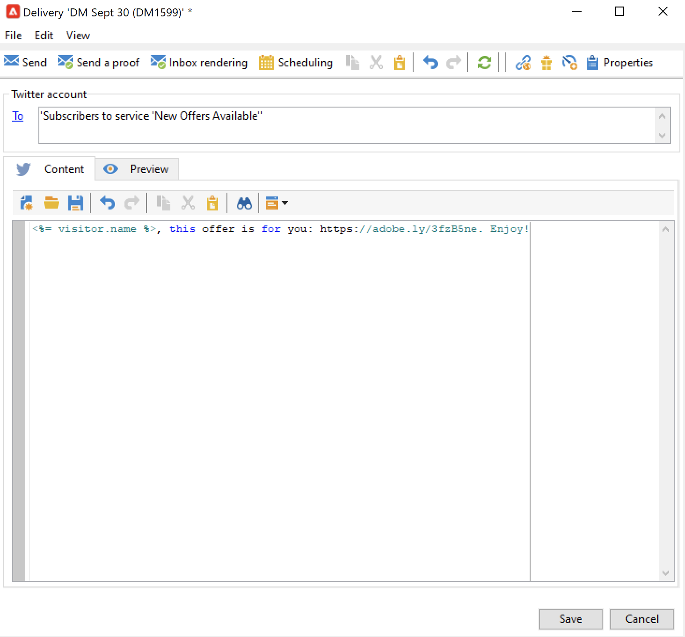
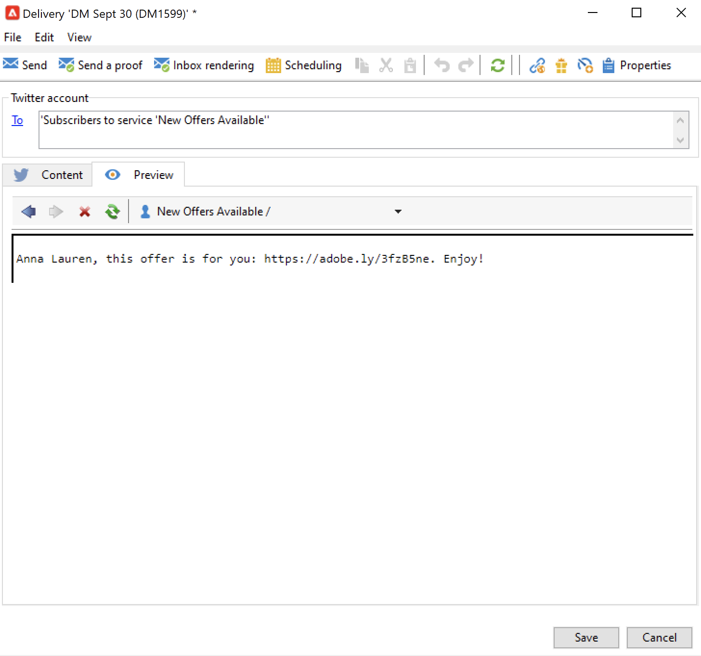

# Adobe Campaign을 사용하여 Twitter에 메시지 게시 {#post-tw-messages}

Adobe Campaign과 **소셜 마케팅** twitter을 통해 고객 및 잠재 고객과 상호 작용할 수 있는 모듈입니다.

통합이 구성되면 다음을 수행할 수 있습니다.

* twitter 시 메시지 보내기: Adobe Campaign을 사용하면 팔로워에게 직접 메시지를 보낼 수 있습니다.
* 게시물 트윗: Adobe Campaign을 사용하여 Twitter 계정에 트윗을 게시합니다.
* 새 연락처 수집: Adobe Campaign은 프로필 데이터를 자동으로 복구하여 타겟팅 캠페인을 수행하고, 가능한 경우 크로스 채널 전략을 구현할 수 있습니다. 이 작업을 수행하려면 사용자 동의가 필요합니다.

twitter 계정을 Adobe Campaign과 통합하는 구성 단계는 [이 페이지](../connect/ac-tw.md).

## twitter 게시물 만들기 및 게시 {#publish-on-tw}

아래 절차에 따라 Twitter 계정에 메시지를 게시하십시오.

1. twitter 게재 만들기

   을(를) 기반으로 새 게재를 만듭니다. **[!UICONTROL Tweet (twitter)]** 게재 템플릿.

   

1. 기본 대상 선택

   트윗을 전송할 계정을 선택합니다.

   

   1. **[!UICONTROL To]** 링크를 클릭합니다.
   1. **[!UICONTROL Add]** 버튼을 클릭합니다.
   1. **[!UICONTROL A Twitter account]**&#x200B;을(를) 선택합니다.
   1. 에서 **[!UICONTROL Folder]** 필드에서 Twitter 계정이 포함된 서비스 폴더를 선택합니다. 그런 다음 트윗을 보낼 Twitter 계정을 선택합니다.

1. 증명 대상 선택

   다음 **[!UICONTROL Target of the proofs]** 탭에서는 최종 게재 전에 테스트 게재에 사용할 Twitter 계정을 정의할 수 있습니다.

   에 자세히 설명되어 있습니다. [구성 단계](../connect/ac-tw.md#tw-test-account)를 채울 때는 증명 보내기에 전용 테스트 Twitter 계정을 만들어야 합니다.

   >[!NOTE]
   >
   >모든 게재에 대해 동일한 Twitter 테스트 계정을 사용하는 경우, **[!UICONTROL Tweet]** 게재 템플릿, 을 통해 액세스 **[!UICONTROL Resources > Templates > Delivery templates]** 노드 아래에 있어야 합니다. 그런 다음 증명 타겟을 새로 게재할 때마다 기본적으로 입력됩니다.

1. 게시물의 콘텐츠를 정의합니다

   게시물의 내용을 **[!UICONTROL Content]** 탭.

   

   >[!CAUTION]
   >
   >twitter에 게시할 때 제한 사항이 적용됩니다.
   >
   >* 메시지는 140자를 초과할 수 없습니다.
   >* HTML 형식은 지원되지 않습니다.

1. 게시물 미리 보기

   찾아보기 **[!UICONTROL Preview]** 탭을 클릭하여 게시물의 렌더링을 확인합니다.

   

   1. 을(를) 클릭합니다. **[!UICONTROL Preview]** 탭.
   1. 을(를) 클릭합니다. **[!UICONTROL Test personalization]** 드롭다운 메뉴를 선택하고 **[!UICONTROL Service]**.
   1. 에서 **[!UICONTROL Folder]** 필드에서 Twitter 계정이 포함된 서비스 폴더를 선택합니다.

1. 증명 보내기

   트윗을 게시하기 전에 게시 증명을 보내 유효성 검사를 해야 합니다. 그런 다음 개인 Twitter 테스트 페이지에서 발행물의 정확한 렌더링을 가져올 수 있습니다.

1. 메시지 게시

   1. 컨텐츠가 승인되면 **[!UICONTROL Send]** 버튼을 클릭합니다.
   1. 선택 **[!UICONTROL Deliver as soon as possible]** 을 클릭하고 **[!UICONTROL Analyze]** 버튼을 클릭합니다.
   1. 분석이 완료되면 결과를 확인합니다.
   1. 클릭 **[!UICONTROL Confirm delivery]**&#x200B;를 클릭한 다음 **[!UICONTROL Yes]**.

## 팔로워에게 직접 메시지 보내기 {#direct-tw-messages}

다음 **[!UICONTROL Synchronize Twitter accounts]** 기술 워크플로우는 직접 메시지를 보낼 수 있도록 Twitter 팔로워의 목록을 복구합니다. [자세히 알아보기](../connect/ac-tw.md#synchro-tw-accounts)

팔로워에게 직접 메시지를 보내려면 아래 단계를 따르십시오.

1. 을(를) 기반으로 Twitter 게재를 만듭니다 **[!UICONTROL Tweet (Direct Message)]** 기본 제공 게재 템플릿.

1. 기본 대상 선택

   

   1. 을(를) 선택합니다 **[!UICONTROL To]** 링크 및 **[!UICONTROL Add]** 버튼을 클릭합니다.

   1. 타겟팅 유형 선택

      * 선택 **[!UICONTROL Twitter subscribers]** 모든 팔로워에게 직접 메시지를 보냅니다.

      * 선택 **[!UICONTROL Filter conditions]** 쿼리를 정의하고 결과를 보려면 에서 필터를 만드는 방법을 알아봅니다. [이 섹션](../audiences/create-filters.md#advanced-filters).

1. 에서 증명 대상을 선택합니다 **[!UICONTROL Target of the proofs]** 탭: 이 계정은 직접 메시지를 담은 증명을 받게 됩니다.

   에 자세히 설명되어 있습니다. [구성 단계](../connect/ac-tw.md#tw-test-account)를 채울 때는 증명 보내기에 전용 테스트 Twitter 계정을 만들어야 합니다.

   >[!NOTE]
   >
   >모든 직접 메시지 증명을 동일한 Twitter 계정으로 보내려면 **[!UICONTROL Tweet (Direct Message)]** 게재 템플릿, 을 통해 액세스 **[!UICONTROL Resources > Templates > Delivery templates]** 노드 아래에 있어야 합니다.

1. 메시지의 내용을 **[!UICONTROL Content]** 탭.

   

   개인화 필드는 이메일 게재와 동일한 방법으로 사용할 수 있습니다. 예를 들어 메시지 본문에 팔로워 이름을 추가할 수 있습니다. 추가 정보 [이 섹션](../start/create-message.md#personalization).

1. 메시지 미리 보기

   찾아보기 **[!UICONTROL Preview]** 탭을 클릭하여 게시물의 렌더링을 확인합니다.

   

   1. 을(를) 클릭합니다. **[!UICONTROL Preview]** 탭.
   1. 을(를) 클릭합니다. **[!UICONTROL Test personalization]** 드롭다운 메뉴를 선택하고 **[!UICONTROL Visitor Subscription]**.
   1. 미리 보기를 테스트할 Twitter 계정을 선택합니다.

1. 증명 보내기

   메시지를 보내기 전에 테스트 계정에 증명을 보내 유효성 검사를 확인하십시오. 그런 다음 개인 Twitter 계정에서 메시지의 정확한 렌더링을 받고 콘텐츠 및 개인화를 확인할 수 있습니다.

    [게재의 유효성을 검사하는 주요 단계를 알아봅니다](https://experienceleague.adobe.com/docs/campaign-classic/using/sending-messages/key-steps-when-creating-a-delivery/steps-validating-the-delivery.html?lang=ko){target=&quot;_blank&quot;}

1. 직접 메시지 보내기

   1. 컨텐츠가 승인되면 **[!UICONTROL Send]** 버튼을 클릭합니다.
   1. 선택 **[!UICONTROL Deliver as soon as possible]** 을 클릭하고 **[!UICONTROL Analyze]** 버튼을 클릭합니다.
   1. 분석이 완료되면 결과를 확인합니다.
   1. 클릭 **[!UICONTROL Confirm delivery]**&#x200B;를 클릭한 다음 **[!UICONTROL Yes]**.

>[!CAUTION]
>
>하루에 250개 이상의 직접 메시지를 보낼 수 없습니다. 이 임계값을 초과하지 않도록, 여러분은 파도로 전달할 수 있습니다. 자세한 내용은 [Campaign Classic v7 설명서](https://experienceleague.adobe.com/docs/campaign-classic/using/sending-messages/key-steps-when-creating-a-delivery/steps-sending-the-delivery.html?lang=en#sending-using-multiple-waves){target=&quot;_blank&quot;}를 참조하십시오.

## 추적 데이터 액세스 {#tw-tracking}

기본 제공 **[!UICONTROL Tweet]** 게재 템플릿, 추적은 기본적으로 활성화되어 있습니다.

추적 데이터는 게재 보고서와 **[!UICONTROL Edit > Tracking]** 게재 및 서비스의 탭입니다.

추적 구성은 이메일 게재와 동일합니다. 자세한 내용은 [Campaign Classic v7 설명서](https://experienceleague.adobe.com/docs/campaign-classic/using/sending-messages/monitoring-deliveries/about-delivery-monitoring.html?lang=ko)를 참조하십시오{target=&quot;_blank&quot;}.

