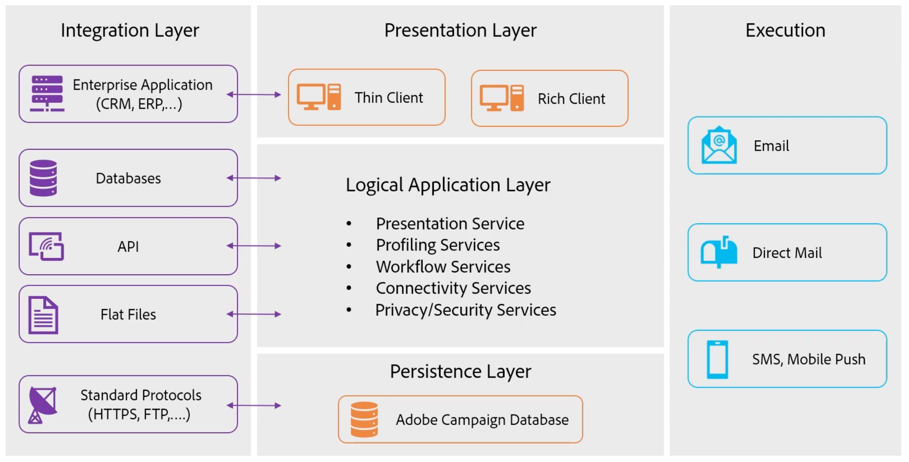

# Campaign 구성 요소 및 프로세스 이해 {#components-and-processes}

Adobe Campaign은 이메일, 모바일, 소셜 및 오프라인 캠페인을 자동화하는 크로스 채널 마케팅 솔루션입니다. Adobe Campaign은 고객 데이터와 프로필에 액세스할 수 있는 중앙 집중식 공간을 제공합니다. Adobe Campaign을 사용하면 고객에 대한 일관된 경험을 오케스트레이션하고, 채널 전반에서 마케팅을 설계, 실행 및 개인화하는 동시에 모든 장치와 접점에서 고객 경험을 향상할 수 있습니다. Adobe Campaign을 사용하면 시각적 드래그 앤 드롭 워크플로 인터페이스를 통해 여러 데이터 소스를 관리하고, 대상 세그먼트를 정의하며, 여러 단계의 크로스 채널 캠페인을 계획 및 실행할 수 있습니다.

Campaign의 주요 기능에 대한 자세한 내용은 [이 페이지](../start/get-started.md)에서 알아보세요.

## 캠페인 구성 요소 {#ac-components}

Adobe Campaign 구성 요소 및 글로벌 아키텍처는 아래에 설명되어 있습니다.

### 프레젠테이션 계층{#presentation-layer}

리치 클라이언트, 씬 클라이언트 또는 API 통합을 통해 Adobe Campaign에 액세스할 수 있습니다.

* 리치 클라이언트

  Campaign 리치 클라이언트는 SOAP 및 HTTP와 같은 표준 인터넷 프로토콜을 통해 Adobe Campaign 애플리케이션 서버와 통신하는 기본 애플리케이션입니다. [Campaign 클라이언트 콘솔에 대해 자세히 알아보기](../start/connect.md).

* 씬 클라이언트

  Adobe Campaign 웹 액세스 기능을 사용하면 HTML 사용자 인터페이스를 통해 웹 브라우저에서 일부 Campaign 기능에 액세스할 수 있습니다. 이 웹 인터페이스를 사용하여 보고서 액세스, 메시지 제어 및 검증, 모니터링 대시보드 액세스 등이 가능합니다.  [Campaign 웹 액세스에 대해 자세히 알아보기](../start/connect.md).

* API를 사용하는 외부 애플리케이션

  경우에 따라 SOAP 프로토콜을 통해 노출된 웹 서비스 API를 사용하여 외부 애플리케이션에서 시스템을 호출할 수 있습니다. [Campaign API에 대해 자세히 알아보기](../dev/api.md).

### 지속성 계층{#persistance-layer}

Campaign 데이터베이스는 지속성 계층으로 사용되며 Adobe Campaign에서 관리하는 거의 모든 정보와 데이터를 포함합니다. 여기에는 기능 데이터(예: 프로필, 구독, 콘텐츠), 기술 데이터(예: 게재 작업 및 로그), 추적 로그 및 작업 데이터(구매, 리드)가 포함됩니다.

대부분의 Adobe Campaign 구성 요소는 작업을 수행하기 위해 데이터베이스에 액세스해야 하므로(리디렉션 모듈 제외) 데이터베이스의 신뢰성이 가장 중요합니다.

### 논리적 애플리케이션 계층{#logical-app-layer}

Campaign 논리적 애플리케이션 계층은 복잡한 비즈니스 요구를 충족하도록 쉽게 구성할 수 있습니다. Campaign을 다양한 애플리케이션이 포함된 단일 플랫폼으로 사용하여 개방적이고 확장 가능한 아키텍처를 만들 수 있습니다. 각 Campaign 인스턴스는 애플리케이션 계층의 프로세스 모음이며, 일부는 공유되고 일부는 전용입니다.

## Campaign 관리 클라우드 서비스{#ac-managed-services}

Adobe Campaign v8이 Managed Service로 배포됩니다. 사용자 인터페이스, 실행 관리 엔진, Campaign 데이터베이스를 비롯한 Adobe Campaign의 모든 구성 요소는 이메일 실행, 미러 페이지, 추적 서버, 외부 웹 구성 요소(예: 구독 취소 페이지/환경 설정 센터 및 랜딩 페이지)를 포함하여 Adobe에서 완전히 호스팅됩니다.

## 캠페인 프로세스

Campaign Web 서버는 Campaign Web 프로세스에 대한 액세스를 제어합니다. JavaScript는 핵심 제품 기능 및 사용자 지정에 사용되는 서버측 언어입니다. Tomcat은 백엔드 엔진이며 웹 프로세스의 일부로 Campaign 제품에 포함되어 있습니다. 예를 들어 JavaScript는 JSP 또는 JSSP 페이지에서 다이내믹 콘텐츠를 렌더링하는 데 사용됩니다.

Campaign 클라이언트 콘솔은 HTTP를 통한 SOAP XML을 사용하여 웹 서버에 연결합니다. 웹 서버는 보안 계층을 제공하고 JavaScript를 사용하여 요청을 애플리케이션 계층에 전달하며 Campaign 내부 프로세스는 SQL을 사용하여 데이터베이스에 대한 액세스를 처리합니다.

<!--The overall communication between Campaign processes are described in the following standalone deployment diagram: all Campaign components are installed in the same machine.

 -->

사용자는 HTTP를 사용하여 Campaign 애플리케이션 서버에 연결합니다. 모든 데이터와 정보는 Campaign 데이터베이스에서 관리됩니다. Campaign 개발자가 구성을 변경하는 경우 해당 변경 사항이 데이터베이스에 저장됩니다. 마케터가 새 캠페인을 만들 경우 이 새 캠페인과 관련된 모든 정보 및 데이터도 데이터베이스에서 관리됩니다. 마케터가 캠페인을 실행하면 이메일 게재가 SMTP 서버를 통해 Campaign 서버의 프로필로 전송됩니다. 프로필이 이메일을 여는 등 이메일 게재와 상호 작용할 때 해당 추적 데이터는 추적 서버로 다시 전송됩니다.

[Campaign 프로세스에 대해 자세히 알아보기](../architecture/general-architecture.md#dev-env).
