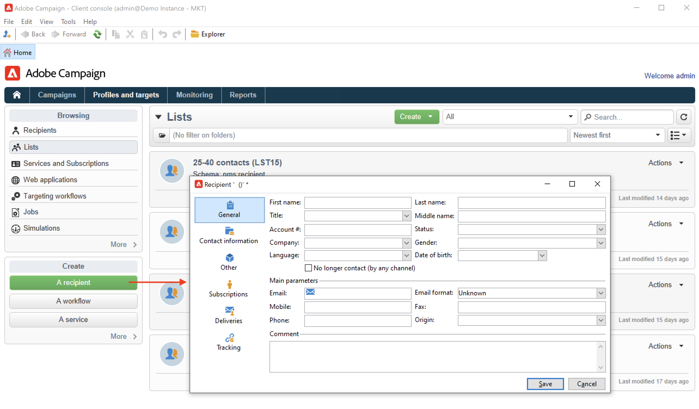

# Campaign 사용자 인터페이스 검색

## Campaign UI 액세스{#ui-access}

Campaign 작업 영역은 [클라이언트 콘솔](../architecture/general-architecture.md)을 통해 사용할 수 있습니다.

에서 Campaign 클라이언트 콘솔 설치 및 구성 방법을 알아봅니다. [이 섹션](../start/connect.md).

웹 브라우저를 사용하여 Campaign에 액세스할 수도 있습니다. 이 컨텍스트에서는 Campaign 기능의 하위 세트만 사용할 수 있습니다. [자세히 알아보기](#web-browser)

## UI 찾아보기{#ui-browse}

Campaign에 연결되면 홈 페이지에 액세스합니다. 기능에 액세스할 링크를 찾습니다. UI에서 사용할 수 있는 기능 집합은 선택 사항 및 권한에 따라 다릅니다.

홈 페이지의 중앙 섹션에서 링크를 사용하여 Campaign 도움말 자료, 커뮤니티 및 지원 웹 사이트에 액세스합니다.

상단 섹션의 탭을 사용하여 Campaign 주요 기능을 찾아봅니다.

>[!NOTE]
>
>액세스할 수 있는 핵심 기능 목록은 사용 권한 및 구현에 따라 다릅니다.

각 기능에 대해 **[!UICONTROL Browsing]** 섹션을 참조하십시오. 다음 **[!UICONTROL More]** 링크를 통해 다른 모든 구성 요소에 액세스할 수 있습니다.

예를 들어 **[!UICONTROL Profiles and targets]** 탭에서 수신자 목록, 구독 서비스, 기존 타깃팅 워크플로우 및 이러한 모든 구성 요소를 만드는 단축키에 액세스할 수 있습니다.

화면에서 요소를 선택하면 컨텐츠를 쉽게 찾을 수 있도록 새 탭에 로드됩니다.

## 요소 만들기 {#create-an-element}

에서 바로 가기 사용 **[!UICONTROL Create]** 섹션 을 클릭하여 새 요소를 추가합니다. 를 사용할 수도 있습니다 **[!UICONTROL Create]** 현재 목록에 새 요소를 추가하려면 목록 위에 단추를 누릅니다.

예를 들어 게재 페이지에서 **[!UICONTROL Create]** 새 게재를 만드는 단추입니다.

## 웹 브라우저 사용 {#web-browser}

웹 브라우저를 통해 Campaign 기능의 하위 세트에 액세스할 수도 있습니다.

웹 액세스 인터페이스는 콘솔 인터페이스와 유사합니다. 브라우저에서 콘솔과 동일한 탐색 및 표시 기능을 사용할 수 있지만 캠페인에 대해서는 축소된 작업 집합만 수행할 수 있습니다. 예를 들어 캠페인을 보고 취소할 수 있지만 캠페인을 수정할 수는 없습니다.

 [Campaign 웹 액세스에 대해 자세히 알아보기](../start/connect.md#web-access).

## Campaign Explorer 액세스 {#ac-explorer-ui}

모든 Adobe Campaign 기능 및 설정에 액세스하려면 Campaign 탐색기를 탐색합니다.

이 작업공간을 사용하면 탐색기 트리에 액세스하여 모든 기능과 옵션을 검색할 수 있습니다.

왼쪽 섹션에는 Campaign Explorer 트리가 표시되고 권한에 따라 인스턴스의 모든 구성 요소 및 설정을 찾을 수 있습니다.

상단 섹션에는 현재 폴더의 레코드 목록이 표시됩니다. 이러한 목록은 사용자 지정이 가능합니다. [자세히 알아보기](../config/ui-settings.md)

아래 섹션에는 선택한 레코드의 세부 정보가 표시됩니다.

## 언어{#languages}

Campaign v8 사용자 인터페이스 제공 언어:

* 영어(영국)
* 영어(미국)
* 프랑스어
* 독일어
* 일본어

언어는 설치 프로세스 중에 선택할 수 있습니다.

>[!CAUTION]
>
>인스턴스를 만든 후에는 언어를 변경할 수 없습니다.

언어는 날짜 및 시간 형식에 영향을 줍니다.

미국 영어 및 영국 영어 간의 주요 차이점은 다음과 같습니다.

<table> 
 <thead> 
  <tr> 
   <th> 형식  </th> 
   <th> 영어(미국)  </th> 
   <th> 영어(영어)  </th> 
  </tr> 
 </thead> 
 <tbody> 
  <tr> 
   <td> 날짜  </td> 
   <td> 주는 일요일에 시작됩니다  </td> 
   <td> 주는 월요일에 시작됩니다  </td> 
  </tr> 
  <tr> 
   <td> 짧은 날짜  </td> 
   <td> 
%2M/%2D/%4Y

<strong>ex: 09/25/2018</strong>
 </td> 
   <td> 
%2D/%2M/%4Y

<strong>ex: 25/09/2018</strong>
 </td> 
  </tr> 
  <tr> 
   <td> 짧은 날짜(시간 포함)  </td> 
   <td> 
%2M/%2D/%4Y %I:%2N:%2S %P

<strong>ex: 09/25/2018 10:47:오후 25시</strong>
 </td> 
   <td> 
%2D/%2M/%4Y %2H:%2N:%2S

<strong>ex: 25/09/2018 22:47:25년</strong>
 </td> 
  </tr> 
 </tbody> 
</table>
