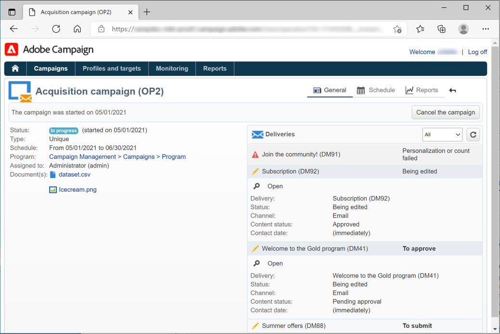

# 클라이언트 콘솔을 사용하여 Campaign에 연결{#gs-ac-connect}

클라이언트 콘솔을 사용하여 Campaign에 연결하려면 먼저 설치하고 구성해야 합니다.

시작하기 전에 다음을 수행해야 합니다.

* 에서 Adobe Campaign과의 시스템 및 도구 호환성 확인 [호환성 매트릭스](compatibility-matrix.md)
* Campaign 서버 URL 가져오기
* Adobe ID을 만들거나 회사에서 사용자 자격 증명을 가져옵니다.
* 시스템에 Microsoft Edge Webview2 런타임을 설치합니다. [자세히 알아보기](#webview)

>[!NOTE]
>
>웹 브라우저를 사용하여 Campaign 웹 사용자 인터페이스에 연결할 수도 있습니다. 에서 새로운 Campaign 웹 사용자 인터페이스에 대해 자세히 알아보십시오. [이 설명서](https://experienceleague.adobe.com/docs/campaign-web/v8/campaign-web-home.html?lang=ko){target="_blank"}.

## 클라이언트 콘솔 설치{#download-ac-console}

### Microsoft Edge Webview2 런타임 {#webview}

Campaign Classic 8.4 빌드 버전에서 클라이언트 콘솔을 설치하려면 Microsoft Edge Webview 2 런타임을 설치해야 합니다.

Web View는 기본적으로 Windows 11 운영 체제의 일부로 설치됩니다. 시스템에 아직 없는 경우 Campaign 클라이언트 콘솔 설치 프로그램이에서 다운로드하라는 메시지가 표시됩니다. [Microsoft 개발자 웹 사이트](http://www.adobe.com/go/acc-ms-webview2-runtime-download_kr){target="_blank"}. Microsoft에서 해당 지원이 더 이상 사용되지 않으므로 다운로드 링크가 Internet Explorer 11 브라우저에서 작동하지 않습니다. 다른 브라우저를 사용하여 링크에 액세스해야 합니다.

### 콘솔 다운로드{#install-ac-console}

Campaign을 처음 사용하는 경우 클라이언트 콘솔을 다운로드하여 설치해야 합니다.

클라이언트 콘솔을 다운로드하는 데 두 가지 옵션을 사용할 수 있습니다.

1. Campaign 관리자로서 Adobe에 연결 [소프트웨어 배포](https://experience.adobe.com/#/downloads/content/software-distribution/ko/campaign.html){target="_blank"}.

1. Campaign 관리자는 최종 사용자를 위해 클라이언트 콘솔을 배포하고 전용 URL을 통해 사용할 수 있도록 합니다.

클라이언트 콘솔 설치 프로그램이 다운로드되면 로컬 시스템에 설치합니다.

클라이언트 콘솔 언어를 설치한 후에는 변경할 수 없습니다.

## 연결 만들기{#create-your-connection}

클라이언트 콘솔이 설치되면 아래 단계에 따라 애플리케이션 서버에 대한 연결을 만듭니다.

1. 콘솔을 시작하고 오른쪽 모서리에서 링크를 찾아 연결 구성 화면에 액세스합니다.

1. 클릭 **[!UICONTROL Add > Connection]** 및 Adobe Campaign 애플리케이션 서버의 레이블과 URL을 입력합니다.

1. URL을 통해 Adobe Campaign 애플리케이션 서버에 대한 연결을 지정합니다. 컴퓨터의 DNS, 별칭 또는 IP 주소를 사용합니다.

   예를 들어 [`https://<machine>.<domain>.com`](https://myserver.adobe.com) url을 입력합니다.

1. 옵션을 선택합니다. **[!UICONTROL Connect with an Adobe ID]**.

1. 클릭 **[!UICONTROL Ok]** 설정을 저장합니다.

예를 들어 테스트, 스테이지 및 프로덕션 환경에 연결하는 데 필요한 만큼 연결을 추가할 수 있습니다.

>[!NOTE]
>
>다음 **[!UICONTROL Add]** 버튼을 사용하여 다음을 만들 수 있습니다. **[!UICONTROL folders]** 모든 연결을 구성합니다. 각 연결을 폴더로 끌어다 놓기만 하면 됩니다.

## Adobe Campaign에 로그온 {#logon-to-ac}

Campaign 사용자는 IMS(Identity Management System) Adobe을 통해 Adobe ID을 사용하여 Adobe Campaign 콘솔에 연결합니다. 모든 Adobe 솔루션에 동일한 ID를 사용할 수 있습니다. 다른 솔루션과 함께 Adobe Campaign을 사용할 때 연결이 저장됩니다. 에서 Adobe IMS에 대해 자세히 알아보기 [이 페이지](https://helpx.adobe.com/kr/enterprise/using/identity.html){target="_blank"}.

인스턴스에 로그온하려면 아래 단계를 수행합니다.

1. 콘솔을 시작하고 오른쪽 모서리에서 링크를 찾아 연결 구성 화면에 액세스합니다.

   

1. 로그인해야 하는 Campaign 인스턴스를 선택합니다.

1. **[!UICONTROL Ok]**&#x200B;를 클릭합니다.

그런 다음 Adobe ID으로 Campaign에 로그인할 수 있습니다.

>[!NOTE]
>
>Microsoft Edge Webview2는 프록시 자격 증명을 저장하지 않으므로 콘솔에서 첫 번째 연결 시 두 번 인증하도록 요청할 수 있습니다.

## 클라이언트 콘솔 업그레이드{#upgrade-ac-console}

시스템이 최신 릴리스로 업그레이드되면 클라이언트 콘솔을 동일한 버전으로 업데이트해야 합니다. 이는 모범 사례이며 일부 릴리스의 경우 이 업그레이드는 필수입니다. 이 경우 다음에서 언급됩니다. [릴리스 정보](release-notes.md).

관리 Cloud Service 사용자는 Adobe에서 클라이언트 콘솔을 배포합니다. 업그레이드된 환경에 연결하면 팝업 창에서 최신 클라이언트 콘솔 버전을 다운로드하라는 메시지가 표시됩니다. 이 업그레이드를 수락하고 요청에 따라 클라이언트 콘솔을 업데이트해야 합니다.

>[!CAUTION]
>
>Adobe은 이 옵션을 종료하는 것을 권장합니다. **[!UICONTROL No longer ask this question]** 새 버전의 콘솔을 사용할 수 있을 때 알림을 받으려면 선택을 해제했습니다. 이 옵션을 선택하면 콘솔 업그레이드가 필요하다는 메시지가 사용자에게 표시되지 않습니다.
>

## 사용자에게 액세스 권한 부여{#grant-access}

Adobe Campaign을 사용하면 다양한 연산자에 할당된 권한을 정의하고 관리할 수 있습니다.

Campaign 관리자는 운영자를 만들고 사용자와 해당 자격 증명을 공유할 책임이 있습니다.

에서 사용자 및 사용자 권한을 정의하는 방법에 대해 자세히 알아보기 [이 섹션](gs-permissions.md).

## 웹 브라우저로 Campaign 액세스 {#connect-web-ac}

### Web 사용자 인터페이스 {#connect-web-ui}

이번 릴리스부터 중앙 Adobe Experience Cloud 환경을 통해 사용할 수 있는 새로운 **Campaign Web 사용자 인터페이스**&#x200B;에 액세스할 수 있습니다. Experience Cloud는 Adobe의 디지털 마케팅 애플리케이션, 제품 및 서비스 통합 제품군입니다. 직관적인 인터페이스에서 클라우드 애플리케이션, 제품 기능, 서비스에 빠르게 액세스할 수 있습니다. 

[이 페이지에서](campaign-ui.md#ac-web-ui) Adobe Experience Cloud에 연결하여 Adobe Campaign Web 인터페이스에 액세스하는 방법을 알아보십시오.

[Adobe Campaign 웹 사용자 인터페이스 설명서](https://experienceleague.adobe.com/ko/docs/campaign-web/v8/campaign-web-home){target="_blank"}에서 자세히 알아보십시오.

### 웹 액세스 {#web-access}

HTML 사용자 인터페이스(보고, 게재 승인, 인스턴스 모니터링 등)를 사용하여 웹 브라우저를 통해 애플리케이션의 특정 부분에 액세스할 수 있습니다.

웹 액세스는 콘솔과 유사하지만 기능 세트가 감소된 인터페이스를 제공합니다.

예를 들어 주어진 연산자의 경우 캠페인이 콘솔에 다음 옵션과 함께 표시됩니다.

반면 웹 액세스에서는 옵션이 주로 다음 보기를 활성화합니다.

웹 액세스는 유효성 검사 프로세스에서도 사용됩니다. 운영자는 승인 요청 이메일을 클릭하고 웹 브라우저를 통해 Campaign에 연결하여 게재 콘텐츠 또는 예산을 확인하거나 거부할 수 있습니다.

웹에서 캠페인 인스턴스에 액세스하려면 URL은 다음과 같습니다.  `https://<your adobe campaign server>:<port number>/view/home`.
