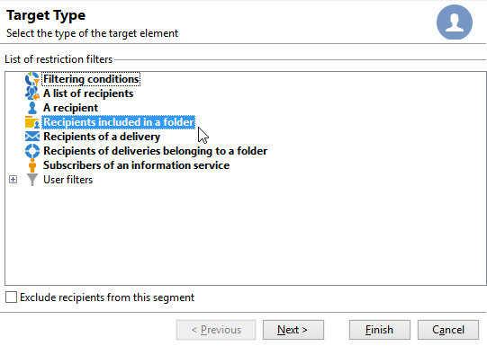

# 첫 번째 게재 만들기 {#create-a-msg}

이 페이지에서는 일회성 단일 게재를 만드는 방법을 배웁니다. 다른 유형의 게재를 만들어 사용 사례를 해결할 수 있습니다. [이 페이지](gs-message.md)에서 다양한 유형의 게재와 게재를 만드는 방법에 대해 자세히 알아보세요.

일회성 게재를 만드는 주요 단계는 다음과 같습니다.

1. **새 게재를 만듭니다**. [자세히 알아보기](#create-the-delivery)

1. **게재 콘텐츠 정의**. [자세히 알아보기](#content-of-the-delivery)

1. **대상 모집단 선택**. [자세히 알아보기](#target-population)

그런 다음 메시지를 준비, 테스트, 전송 및 모니터링할 수 있습니다.

>[!NOTE]
>
>이 섹션에서 설명하는 단계에서는 외부 게재의 경우를 제외하고 모든 대상 수신자 및 해당 프로필이 데이터베이스에 저장되어 있다고 가정합니다. [외부 수신자 선택](#selecting-external-recipients)을 참조하십시오.

## 게재 만들기 {#create-the-delivery}

게재를 만들려면 다음 단계를 수행합니다.

1. 게재 목록 위에 있는 **[!UICONTROL Create]**&#x200B;을(를) 클릭합니다. 새 게재를 만들 때 게재 채널을 선택해야 합니다. 이렇게 하려면 **[!UICONTROL Delivery template]** 필드의 드롭다운 목록에서 적절한 게재 템플릿을 선택합니다.

   

   DM, 이메일, 전화, 모바일 채널(SMS), X(Twitter) 등 설치한 각 채널에 기본 제공 템플릿이 제공됩니다. 목록에서 사용할 수 있는 채널은 사용권 계약에 따라 다릅니다.

   필요에 따라 특정 매개 변수를 사전 구성하기 위해 새 게재 템플릿을 만들 수 있습니다. 템플릿에 대한 자세한 정보는 [이 섹션](../send/create-templates.md)을 참조하세요.

1. **[!UICONTROL Label]** 필드에 게재 이름을 입력하십시오.

   (선택 사항) 게재 코드를 게재에 지정할 수도 있습니다. 게재 이름 및 해당 코드는 게재 목록에 표시되지만 수신자에게는 노출되지 않습니다.

1. (선택 사항) **[!UICONTROL Description]** 필드에 설명을 추가합니다.
1. (선택 사항) 관련 필드에서 게재 특성을 선택합니다. 이 정보는 게재 추적에 유용합니다. 게재 목록에서 이 기준을 기반으로 필터링하거나 이 선택 기준을 사용하여 쿼리를 작성할 수 있습니다.
1. **[!UICONTROL Continue]**&#x200B;을(를) 클릭하여 이 정보를 확인하고 메시지 구성 창을 표시합니다.

## 게재 콘텐츠 정의 {#content-of-the-delivery}

게재 콘텐츠를 구성할 준비가 되었습니다. 게재 콘텐츠 정의는 각 채널에 따라 다릅니다. 자세한 내용은 전용 섹션 을 참조하십시오.

* [이메일 콘텐츠 정의](../send/email.md)
* [SMS 콘텐츠 정의](../send/sms/sms-content.md)
* [DM 콘텐츠 정의](../send/direct-mail.md)
* [푸시 알림 콘텐츠 차단](../send/push.md)

## 타겟 대상자 정의 {#target-population}

각 게재에 대해 여러 유형의 타겟 대상을 정의할 수 있습니다.

* **주 대상**: 메시지를 받는 프로필입니다. [자세히 알아보기](#select-the-main-target)
* **증명 대상**: 증명 메시지를 받는 프로필. 증명은 메시지를 주요 타겟에게 보내기 전에 테스트하기 위해 사용할 수 있는 메시지입니다. [자세히 알아보기](#select-the-proof-target)

또한 마케팅 캠페인의 컨텍스트에서 다음을 추가할 수 있습니다.

* **시드 주소**: 받는 사람 중 게재 대상은 아니지만 게재를 받는 사람. [자세히 알아보기](../audiences/test-profiles.md)
* **컨트롤 그룹**: 게재를 받지 못하는 모집단으로, 동작 및 캠페인 영향을 추적하는 데 사용됩니다. [자세히 알아보기](../../automation/campaigns/marketing-campaign-target.md#add-a-control-group).

### 게재의 기본 수신자 선택 {#select-the-main-target}

대부분의 경우 기본 대상은 Adobe Campaign 데이터베이스(기본 모드)에서 추출됩니다. 그러나 수신자는 [외부 파일](#selecting-external-recipients)에도 저장할 수 있습니다.

게재 수신자를 선택하려면 아래 단계를 따르십시오.

1. 게재 편집기에서 **[!UICONTROL To]**&#x200B;을(를) 선택합니다.
1. 수신자가 데이터베이스에 저장되어 있는 경우 첫 번째 옵션을 선택합니다.

   {zoomable="yes"}

1. **[!UICONTROL Target mapping]** 드롭다운 목록에서 [대상 매핑](../audiences/target-mappings.md)을(를) 선택하십시오.
1. 제한 필터를 정의하려면 **[!UICONTROL Add]** 단추를 클릭하십시오.

   {width="60%" align="left" zoomable="yes"}

   필터 유형을 선택하고 **[!UICONTROL Next]**&#x200B;을(를) 클릭하여 조건을 정의합니다. **[!UICONTROL Preview]** 탭에서 필터링된 수신자를 표시할 수 있습니다. 대상 유형에 따라 **[!UICONTROL Refine target]** 단추를 사용하여 여러 타깃팅 기준을 결합할 수 있습니다.

   다음 타겟 유형을 사용할 수 있습니다.

   * **[!UICONTROL Filtering conditions]**: 쿼리를 정의하고 결과를 표시하려면 이 옵션을 사용하십시오. [이 섹션](../../automation/workflow/query.md)에서 쿼리를 디자인하는 방법을 알아보세요.
   * **[!UICONTROL A list of recipients]**: 프로필 목록을 대상으로 지정하려면 이 옵션을 사용하십시오. [이 섹션](../audiences/create-audiences.md)의 목록에 대해 자세히 알아보세요.
   * **[!UICONTROL A recipient]**: 데이터베이스에서 특정 프로필을 선택하려면 이 옵션을 사용합니다.
   * **[!UICONTROL Recipients included in a folder]**: 특정 폴더에 포함된 모든 프로필을 타겟팅하려면 이 옵션을 사용합니다.
   * **[!UICONTROL Recipients of a delivery]**: 이 옵션을 사용하여 게재 수신자로부터 대상을 빌드합니다. 그런 다음 목록에서 게재를 선택해야 합니다.

     

   * **[!UICONTROL Delivery recipients belonging to a folder]**: 이 옵션을 사용하여 특정 폴더에 포함된 수신자 게재에서 대상을 빌드합니다.

     

     드롭다운 목록에서 선택하여 수신자의 동작을 필터링할 수 있습니다.

     

     >[!NOTE]
     >
     >**[!UICONTROL Include sub-folders]** 옵션을 사용하면 선택한 노드 아래의 트리 구조에 있는 폴더에 포함된 게재를 타겟팅할 수도 있습니다.

   * **[!UICONTROL Subscribers of an information service]** : 이 옵션을 사용하면 만들어지는 게재에서 수신자를 타겟팅해야 하는 뉴스레터를 선택할 수 있습니다.

     

   * **[!UICONTROL User filters]**: 이 옵션을 사용하면 미리 구성된 필터에 액세스하여 데이터베이스의 프로필에 대한 필터링 기준으로 사용할 수 있습니다. 미리 구성된 필터는 [이 섹션](../audiences/create-filters.md#default-filters)에 있습니다.
   * **[!UICONTROL Exclude recipients from this segment]** 옵션을 사용하면 정의된 대상 기준을 충족하지 않는 수신자를 타깃팅할 수 있습니다. 이 옵션을 사용하려면 적절한 상자를 선택한 다음 앞에서 정의한 대로 타겟팅을 적용하여 결과 프로필을 제외합니다.

1. **[!UICONTROL Label]** 필드에 이 타깃팅의 이름을 입력하십시오. 기본적으로 레이블은 첫 번째 타겟팅 기준의 레이블입니다. 필터링 기준을 결합할 때는 명시적 이름을 사용하는 것이 좋습니다.
1. **[!UICONTROL Finish]**&#x200B;을(를) 클릭하여 타깃팅 옵션의 유효성을 검사합니다.

   정의된 타겟팅 기준은 기본 타겟 구성 탭의 중앙 섹션에 요약되어 있습니다. 조건을 클릭하여 해당 콘텐츠를 봅니다(구성 및 미리 보기). 기준을 삭제하려면 레이블 뒤에 있는 십자선을 클릭합니다.

   

#### 외부 수신자 선택 {#selecting-external-recipients}

데이터베이스에 저장되지 않고 외부 파일에 있는 프로필에 메시지를 보낼 수 있습니다. 예를 들어 텍스트 파일에서 가져온 수신자에게 게재를 보내려면 다음 단계를 수행합니다.

1. **[!UICONTROL To]** 링크를 클릭하여 게재 수신자를 선택합니다.
1. **[!UICONTROL Defined in an external file]** 옵션을 선택하십시오.
1. 수신자가 포함된 파일을 선택합니다.
1. 받는 사람을 가져올 때 **[!UICONTROL File format definition...]** 링크를 클릭하여 외부 파일을 선택하고 구성합니다.

   데이터 가져오기에 대한 자세한 내용은 [Campaign Classic v7 설명서](https://experienceleague.adobe.com/en/docs/campaign-classic/using/getting-started/importing-and-exporting-data/generic-imports-exports/executing-import-jobs#step-2---source-file-selection){target="_blank"}를 참조하세요.

1. **[!UICONTROL Finish]**&#x200B;을(를) 클릭하고 게재를 표준 게재로 구성합니다.

>[!CAUTION]
>
>이메일 게재를 위한 메시지의 콘텐츠를 정의할 때 미러 페이지에 대한 링크를 포함하지 마십시오. 이 게재 모드에서는 생성할 수 없습니다.

#### 제외 설정 정의 {#define-exclusion-settings}

게재 대상을 정의할 때 **[!UICONTROL Exclusions]** 탭을 사용하여 메시지 수를 제한합니다. 기본 매개 변수를 사용하는 것이 좋지만 필요에 따라 설정을 조정할 수 있습니다. 그러나 이러한 옵션은 오용과 오류를 방지하기 위해 전문가 사용자만 변경해야 합니다.

특정 수의 연속 오류에 도달했거나 품질 등급이 이 창에 지정된 임계값 미만인 주소는 제외하도록 선택할 수 있습니다. 데이터가 반환되지 않은 비적격 주소를 승인할지 여부도 선택할 수 있습니다.

기본 구성을 수정하려면 **[!UICONTROL Edit...]** 링크를 클릭하십시오.

다음 옵션을 사용할 수 있습니다.

* **[!UICONTROL Exclude duplicate addresses during delivery]**: 이 옵션은 기본적으로 활성화되어 있으며 배달하는 동안 중복 이메일 주소를 제거합니다. 적용되는 전략은 Adobe Campaign 사용 방법과 데이터베이스의 데이터 유형에 따라 달라질 수 있습니다. 각 게재 템플릿에 대해 옵션 값을 구성할 수 있습니다.
* **[!UICONTROL Exclude recipients who no longer want to be contacted]**(즉, 이메일 주소가 차단 목록에 추가하다에 있는 수신자(&#39;옵트아웃&#39;)). 이 옵션은 e-마케팅의 직업 윤리를 준수하기 위해 선택된 상태로 유지되어야 합니다.
* **[!UICONTROL Exclude quarantined recipients]**: 이 옵션을 사용하면 격리된 주소가 있는 모든 프로필을 대상에서 제외할 수 있습니다. 이 옵션은 계속 선택하는 것이 좋습니다. [이 섹션](../send/quarantines.md)에서 격리 관리에 대해 자세히 알아보세요.
* **[!UICONTROL Limit delivery]**&#x200B;을(를) 지정한 메시지 수만큼 보냅니다. 이 옵션을 사용하면 전송할 최대 메시지 수를 입력할 수 있습니다. 타겟 대상이 표시된 메시지 수를 초과하면 타겟에 무작위 선택이 적용됩니다. 모든 메시지를 보내려면 이 값을 &#39;0&#39;으로 유지합니다.
* **[!UICONTROL Keep duplicate records (same identifier)]**: 이 옵션을 사용하면 여러 타겟팅 기준을 충족하는 수신자에게 여러 게재를 보낼 수 있습니다.

### 증명 메시지 수신자 선택 {#select-the-proof-target}

이메일 게재의 경우 증명을 전송하여 메시지 콘텐츠를 확인할 수 있습니다. 증명을 보내면 옵트아웃 링크, 미러 페이지 및 기타 링크를 확인하고, 메시지의 유효성을 검사하고, 이미지가 표시되는지 확인하고, 가능한 오류를 감지하는 등의 작업을 수행할 수 있습니다. 다른 장치에서 디자인과 렌더링을 확인할 수도 있습니다.

증명은 메시지를 주요 대상에게 보내기 전에 테스트할 수 있는 특정 메시지입니다. 증명 수신자는 메시지 승인(렌더링, 콘텐츠, 개인화 설정, 구성)을 담당합니다.

증명 수신자 및 전송에 대한 자세한 내용은 [이 섹션](../send/preview-and-proof.md#send-proofs)을 참조하세요.

 [비디오에서 이 기능 살펴보기](#seeds-and-proofs-video)

#### 튜토리얼 비디오 {#seeds-and-proofs-video}

이 비디오에서는 기존 이메일에 시드 및 증명을 추가하는 방법과 이를 보내는 방법을 알아봅니다.

>[!VIDEO](https://video.tv.adobe.com/v/333404?quality=12)

추가 Campaign Classic 방법 비디오를 [여기](https://experienceleague.adobe.com/docs/campaign-classic-learn/tutorials/overview.html?lang=ko)에서 사용할 수 있습니다.

## 게재 준비 및 유효성 검사 {#validate-the-delivery}

게재를 만들고 구성한 경우 기본 타겟에게 보내기 전에 먼저 게재의 유효성을 검사해야 합니다.

방법은 다음과 같습니다.

1. **게재 분석**: 이 단계에서는 전달할 메시지를 준비할 수 있습니다. [자세히 알아보기](../send/delivery-analysis.md).

1. **증명 보내기**: 이 단계에서는 콘텐츠, URL, 개인화 등을 제어할 수 있습니다. [자세히 알아보기](../send/preview-and-proof.md).

>[!IMPORTANT]
>
>위의 두 단계는 메시지 콘텐츠를 수정할 때마다 실행해야 합니다.

## 게재 구성 및 보내기 {#configuring-and-sending-the-delivery}

게재 매개 변수에 액세스하여 더 많은 설정을 구성하고 메시지를 보내는 방법을 정의합니다. 게재 우선 순위를 정의하고, 전송 예약된 일괄 처리를 설정하고, 다시 시도 설정을 변경하고, 게재 전송을 테스트할 수 있습니다. 이 구성이 완료되면 전송을 확인할 수 있습니다. 그런 다음 메시지는 즉시 또는 게재 일정에 따라 전송됩니다.

[이 페이지](../send/configure-and-send.md)에서 게재 설정을 구성하는 방법을 알아보세요.
