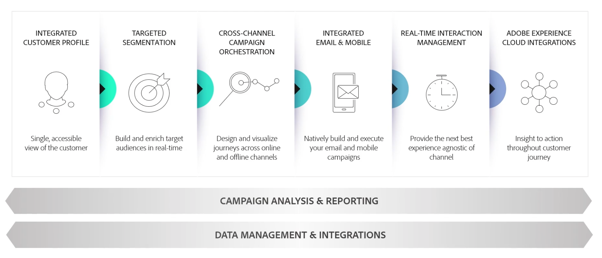

# Adobe Campaign 시작{#gs-ac-v8}

Adobe Campaign은 크로스 채널 고객 경험을 디자인할 수 있는 플랫폼과 더불어 시각적 캠페인 오케스트레이션, 실시간 상호 작용 관리, 크로스 채널을 실행할 수 있는 환경을 제공합니다.

Adobe Campaign v8은 이메일, 푸시 알림, SMS, 다이렉트 메일 등 다양한 마케팅 채널을 위해 구축된 차세대 캠페인 도구입니다. 완벽한 캠페인을 제작 및 큐레이션하는 데 도움이 되는 강력한 ETL 및 데이터 관리 기능을 제공합니다. 오케스트레이션 엔진은 배치 기반 여정을 핵심으로 집중하는 풍부한 멀티 터치 마케팅 프로그램을 제공합니다. 또한 암호 재설정, 주문 확인, 전자 수신 등 커뮤니케이션의 전반을 포함하는 페이로드를 기반으로, 마케팅 팀이 사전 정의된 메시지를 모든 IT 시스템에서 전송할 수 있도록 지원하는 확장 가능한 실시간 메시징 서버도 제공합니다.

Adobe Campaign v8은 인프라, 보안, 전달성 및 모니터링 기능이 상당히 개선되었습니다. 서비스와 사전 감독 및 시기적절한 변경을 결합한 **관리 클라우드 서비스**&#x200B;로 제공됩니다. [이 페이지에서](whats-new.md#acms-desc) Campaign Managed Cloud Services에 대해 자세히 알아보십시오.

Campaign을 사용하여 다음과 같은 작업을 수행할 수 있습니다.

* 고객에 대한 접근성 높은 단일 관점을 통한 개인화 및 참여 **촉진**
* 이메일, 모바일, 온라인 및 오프라인 채널을 고객 여정에 **통합**
* 의미 있고 시의적절한 메시지 및 오퍼 게재 **자동화**

>[!AVAILABILITY]
>
>페이지에 언급된 경우를 제외하고 Adobe Campaign(콘솔) 설명서는 Campaign Classic v7 및 Campaign v8에 적용됩니다.
>
>설명서 내의 특정 참조는 이전 브랜딩을 계속 참조할 수 있지만 현재 제공에 여전히 적용할 수 있습니다.

## Integrated Customer Profile {#integrated-customer-profile}

프로필은 중앙의 강력한 클라우드 데이터베이스에서 관리됩니다. 프로필을 가져오고 이 데이터베이스를 빌드하는 데 사용할 수 있는 메커니즘은 웹 양식을 통한 온라인 수집, 텍스트 파일 수동 또는 자동 가져오기, 회사 데이터베이스 또는 기타 정보 시스템을 사용한 복제와 같이 다양합니다. Adobe Campaign을 사용하면 마케팅 기록, 구매 정보, 환경 설정, CRM 데이터 및 관련 PII 데이터를 통합 뷰에 통합하여 분석하고 조치를 취할 수 있습니다.

Adobe Campaign에서 수신자는 게재(전자 메일, SMS 등)를 보낼 타겟팅된 기본 프로필입니다. 데이터베이스에 저장된 수신자 데이터 덕분에 주어진 게재를 받을 대상을 필터링하고 게재 콘텐츠에 개인화 데이터를 추가할 수 있습니다. 데이터베이스에 다른 유형의 프로필이 있습니다. 다양한 용도로 디자인되어 있습니다. 예를 들어 최종 대상으로 전송되기 전에 시드 프로필을 테스트하여 게재를 테스트합니다.

프로필 관리에 대한 기본 사항은 [이 섹션](audiences.md)에 설명되어 있습니다.

Campaign에 프로필을 추가하는 방법은 [이 섹션](import.md)에서 알아보십시오.

## 타기팅된 세분화 {#targeted-segmentation}

Adobe Campaign은 고도로 타기팅되고 차별화된 오퍼를 만들 수 있는 강력하고 사용자 친화적인 세분화 및 타기팅 기능을 제공합니다. 설명 분석 기능을 사용하면 마케팅 캠페인의 업스트림 및 다운스트림에 대한 정보를 분석할 수 있으며 필터 관리 및 그래픽 쿼리 편집기 기능을 사용하면 구독자 모집단을 필터링하고 기준을 제한 없이 대상 그룹을 샘플링하거나 만들 수 있습니다.

고급 데이터 관리 기능은 데이터 처리 기능을 확장합니다. 데이터 마트에서 모델링되지 않은 데이터를 포함하여 타겟팅 프로세스를 단순화하고 최적화합니다.

[이 섹션](audiences.md)에서 세분화와 대상자를 만드는 방법을 알아봅니다.

## 크로스 채널 캠페인 오케스트레이션 {#cross-channel-campaign-orchestration}

Adobe Campaign을 사용하면 타기팅되고 개인화된 캠페인을 이메일, DM, SMS, 푸시 알림과 같은 다양한 채널에 디자인 및 오케스트레이션 할 수 있습니다. 단일 인터페이스는 모든 캠페인 및 커뮤니케이션을 일정 계획, 오케스트레이션, 구성, 개인화, 자동화, 실행 및 측정하는 데 필요한 모든 기능을 제공합니다.

[이 섹션](campaigns.md)에서 캠페인을 디자인, 예약 및 실행하는 방법을 알아보십시오.

## 워크플로 {#wf-gsv8}

Adobe Campaign은 세그먼테이션, 캠페인 실행, 파일 처리 등 복잡한 프로세스를 디자인할 수 있는 포괄적인 그래픽 환경을 제공합니다. 예를 들어 워크플로를 통해 서버에서 파일을 다운로드하고 압축을 해제한 다음 Adobe Campaign 데이터베이스에 포함된 레코드를 가져올 수 있습니다.

또한, 워크플로에는 작업을 할당하거나 사용자가 수행한 작업을 승인하도록 하여 사용자를 포함할 수 있습니다. 즉, 메시지를 보내기 전에 하나 이상의 사용자에게 컨텐츠를 작업하거나 대상을 지정하고 교정쇄를 승인할 작업을 지정할 수 있습니다.

워크플로는 다음과 같이 서로 다른 컨텍스트에서 사용할 수 있습니다.

* 대상자를 관리하거나 메시지를 보내기 위해 타기팅할 수 있습니다.
* ETL(데이터 관리)을 통해 데이터를 조작할 수 있습니다.
* 데이터를 Campaign 데이터베이스로 가져옵니다.
* 데이터베이스 정리, 추적 정보 복구 등의 기술 프로세스

[이 섹션](../config/workflows.md)에서 워크플로를 디자인하고 실행하는 방법을 알아보십시오.

## 보고 및 분석 {#analysis-and-reporting}

Adobe Campaign을 사용하면 데이터와 프로필을 단계적으로 강화하여 고객의 동작을 모니터링하고 해석할 수 있습니다. 보고 및 분석 도구를 사용하면 각각의 새로운 캠페인을 활용할 수 있고, 마케팅 이니셔티브를 더 잘 타기팅할 수 있으며, 마케팅 활동의 영향과 투자 수익률을 최적화할 수 있습니다.

Adobe Campaign에서는 강력한 기본 보고 템플릿 외에도 게재, 캠페인, 사용자 또는 세그먼트 수준에 대한 사용자 정의 보고서를 만들 수 있습니다. 추가적인 데이터 시각화 및 분석을 위해 설명 분석을 수행하거나 ROI를 요약하거나 데이터를 Adobe Analytics 및 기타 솔루션으로 내보냅니다.

캠페인 보고 기능을 사용하면 동적 보고서를 쉽게 만들 수 있습니다. 드래그 앤 드롭 변수를 사용하여 보고서를 사용자 정의하고 캠페인의 성공을 분석할 수 있습니다. 쿼리 및 계산의 복잡성에 따라 데이터를 목록 보기로 집계하거나 마케팅 분석 보고서를 쉽게 생성할 수 있는 형식으로 액세스할 수 있습니다.

[이 섹션](../reporting/gs-reporting.md)에서 보고서 및 추적 기능에 대해 자세히 알아보십시오.

## Adobe Experience Cloud 통합 {#adobe-experience-cloud-integrations}

Adobe Campaign의 게재 기능 및 고급 캠페인 관리 기능과 사용자 경험을 개인화할 수 있도록 만들어진 솔루션 세트를 결합할 수 있습니다. 예를 들어 Adobe Experience Manager, Adobe Analytics, Adobe Target 또는 Adobe Experience Cloud 트리거를 사용할 수 있습니다.

[이 섹션](../connect/integration.md)에서 Adobe 서비스 및 솔루션과 통합하는 방법을 알아보십시오.

## Campaign 기능에 대한 자세한 정보 {#core-capabilities-and-add-ons}

Adobe Campaign은 요구 사항과 아키텍처에 따라 대화형 마케팅 기능을 구현하고 최적화하는 데 도움이 되는 기능의 집합을 제공합니다. 일부는 핵심 기능이며 일부는 패키지 설치 및 구성에 따라 다릅니다. 자세한 제품 설명은 [Adobe Campaign v8 제품 설명](https://helpx.adobe.com/kr/legal/product-descriptions/adobe-campaign-managed-cloud-services.html)에 나와 있습니다.

Campaign Classic에 대해 이미 잘 알고 계신가요? [이 페이지](v7-to-v8.md)에서 Campaign Classic과 Campaign v8 간의 주요 차이점을 알아봅니다.

**참조 항목**

* [Campaign 작업 영역](campaign-ui.md)
* [Campaign v8 호환성 표](compatibility-matrix.md)
* [Campaign에 연결](connect.md)
* [FAQ](campaign-faq.md)
