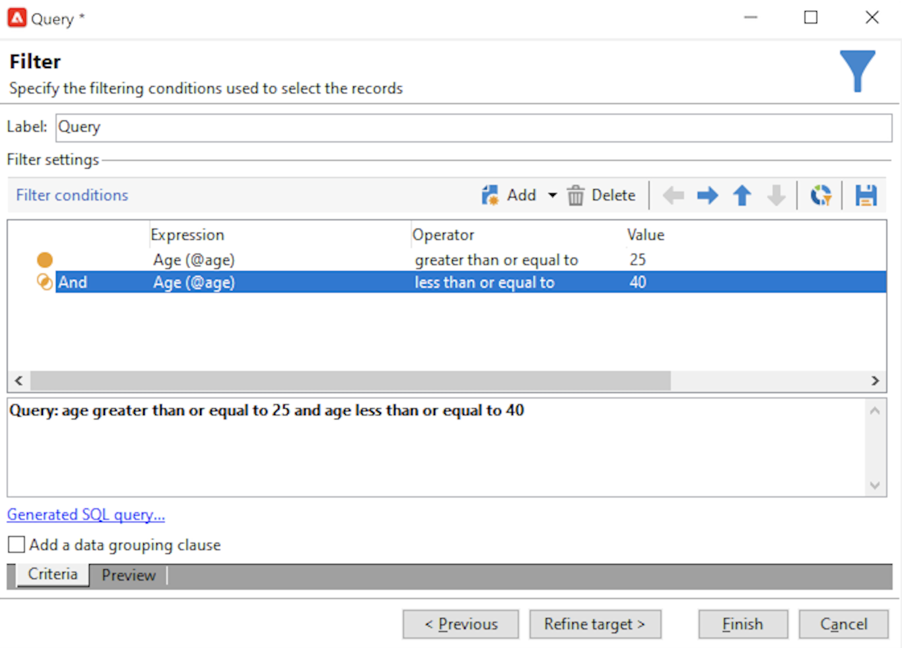

# Campaign 데이터베이스 쿼리

쿼리 도구는 애플리케이션의 다양한 수준에서 사용할 수 있으며, 대상 모집단, 고객을 세그먼트화하고 추적 로그를 추출 및 필터링하고 필터를 만드는 데 사용할 수 있습니다.

**[!UICONTROL Tools > Generic query editor...]** 메뉴에서 액세스할 수 있는 전용 길잡이(일반 쿼리 편집기)를 제공합니다. 이 편집기를 사용하면 데이터베이스 쿼리에서 정보를 추출, 구성, 그룹화 및 정렬할 수 있습니다. 예를 들어 지정된 기간 동안 뉴스레터 링크를 n번 이상 클릭한 수신자를 검색할 수 있습니다.

일반 쿼리 편집기는 모든 쿼리 기능을 중앙 집중화합니다. 제한 필터를 만들고 저장하여 타겟팅 워크플로우의 쿼리 상자와 같은 다른 컨텍스트에서 재사용할 수 있습니다.

쿼리를 만드는 단계는 [이 페이지의 &#x200B;](design-queries.md)에 자세히 설명되어 있습니다.

<!--
Contexts to use the query editor iin Campaign are listed below:

|Usage|Example|
|  ---  |  ---  |
|**Define a Query activity in a workflow**: Define the criteria to query Campaign database in a workflow. [Learn how to configure the Query activity](../../automation/workflow/query.md)|{width="200" align="center" zoomable="yes"}|
|**Define audiences**: Specify the population you want to target in your messages, and effortlessly create new audiences tailored to your needs. [Learn how to build audiences](../start/create-message.md#define-the-target-audience)|{width="200" align="center" zoomable="yes"}|
|**Define audiences**: Specify the population you want to target in your messages or workflows, and effortlessly create new audiences tailored to your needs. [Learn how to build audiences](../audiences/create-audiences.md)|{width="200" align="center" zoomable="yes"}|
|**Customize workflow activities**: Apply rules within workflow activities, such as **Split** and **Reconciliation**, to align with your specific requirements. [Learn more about workflow activities](../../automation/workflow/activities.md)|{width="200" align="center" zoomable="yes"}|
|**Predefined filters**: Create predefined filters that serve as shortcuts during various filtering operations, whether you're working with data lists or forming the audience for a delivery. [Learn how to work with predefined filters](../get-started/predefined-filters.md)|{width="200" align="center" zoomable="yes"}|
|**Filter reports data**: Add rules to filter the data displayed in reports. [Learn how to work with reports](../reporting/gs-reports.md)|{width="200" align="center" zoomable="yes"}|
|**Customize lists**: Create custom rules to filter the data displayed in lists such as recipients or deliveries lists. [Learn how to filter lists](../get-started/list-filters.md#list-built-in-filters)|{width="200" align="center" zoomable="yes"}|
|**Build conditional content**: Make email content dynamic by creating conditions that define which content should be displayed to different recipients, ensuring personalized and relevant messaging. [Learn how to build conditional content](../personalization/conditions.md)|{width="200" align="center" zoomable="yes"}|
-->

**관련 항목**

* [워크플로우 쿼리 활동](../../automation/workflow/query.md)
* [수신자 테이블 쿼리](../../automation/workflow/querying-recipient-table.md)
* [필터링 조건](filter-conditions.md)