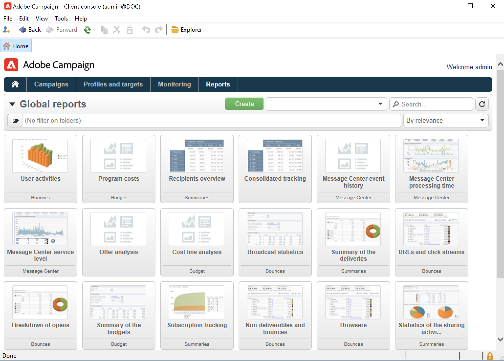

# 지표 및 보고서

## 보고 시작{#gs-ac-reports}

Adobe Campaign은 이 페이지에 나열된 보고 도구 세트를 제공합니다.

* **기본 제공 보고서**

   Adobe Campaign에는 게재, 캠페인, 플랫폼 활동, 선택적 기능 등에 대한 보고서가 포함되어 있습니다. 이러한 보고서는 관련 있는 다양한 기능을 통해 사용할 수 있습니다. 그것들은 여러분의 특정한 요구에 맞게 조정할 수 있습니다.

   **보고서** 탭을 사용하여 이러한 보고서에 액세스합니다.

   

   [!DNL :arrow_upper_right:] 캠페인 기본 제공 보고서는  [Campaign Classic v7 설명서](https://experienceleague.adobe.com/docs/campaign-classic/using/reporting/accessing-built-in-reports/about-campaign-built-in-reports.html){target=&quot;_blank&quot;}에 나와 있습니다

* **설명 데이터 분석**

   Adobe Campaign은 데이터베이스의 데이터에 대한 통계를 생성하기 위한 시각적 도구를 제공합니다. 전용 도우미를 사용하여 설명 분석 보고서를 만들고 필요에 따라 컨텐츠와 레이아웃을 조정할 수 있습니다.

   **[!UICONTROL Tools > Descriptive analysis...]** 메뉴를 사용하여 새 보고서를 만듭니다.

   

   [!DNL :arrow_upper_right:] 캠페인 설명 분석 보고는  [Campaign Classic v7 설명서](https://experienceleague.adobe.com/docs/campaign-classic/using/reporting/analyzing-populations/about-descriptive-analysis.html){target=&quot;_blank&quot;}에 나와 있습니다

* **개인화된 보고서**

   Adobe Campaign을 사용하여 데이터베이스의 데이터에 대한 보고서를 만듭니다. 생성된 후에는 적절한 컨텍스트에서 액세스할 수 있도록 합니다.

   [!DNL :arrow_upper_right:] 보고서를 만드는 단계는  [Campaign Classic v7 설명서](https://experienceleague.adobe.com/docs/campaign-classic/using/reporting/creating-new-reports/about-reports-creation-in-campaign.html){target=&quot;_blank&quot;}에 자세히 설명되어 있습니다. 개인화된 보고서 생성은 고급 사용자에게 예약됩니다.

* **큐브**

   데이터를 분석 및 측정하고, 통계를 계산하며, 큐브를 사용하여 보고서 작성 및 계산을 간소화 및 최적화합니다.  데이터베이스 탐색 및 분석 기능을 확장하고 최종 사용자가 보고서 및 테이블을 쉽게 구성할 수 있습니다. 보고서 또는 표를 만들 때 계산, 측정 단위 및 통계를 처리할 때 기존(완전히 구성된) 큐브를 선택하기만 하면 됩니다.

   

   쿼리, 계산 및 볼륨의 복잡성에 따라 이러한 보고서에서 분석된 데이터를 쿼리를 통해 수집하고 목록(데이터 관리 유형 워크플로우)이나 큐브(Marketing Analytics 사용)에서 미리 집계할 수 있습니다. 피벗 테이블 또는 그룹 목록의 형태로 표시됩니다.

   [!DNL :arrow_upper_right:]  [Campaign Classic v7 설명서](https://experienceleague.adobe.com/docs/campaign-classic/using/reporting/designing-reports-with-cubes/about-cubes.html){target=&quot;_blank&quot;}에서 큐브를 만드는 방법을 알아봅니다

Adobe Campaign 보고서는 Campaign Classic v7보다 최적화되어 있으며 더 나은 확장 기능을 제공합니다. 큐브에 대한 기존 제한 사항은 적용되지 않습니다.

