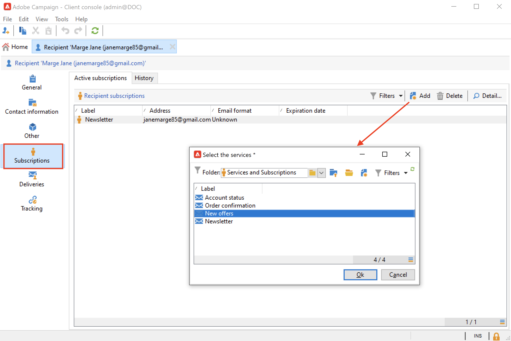

# 구독 및 구독 취소 관리 {#optin-optout}

Adobe Campaign을 사용하여 뉴스레터와 같은 정보 서비스를 만들고 모니터링하고 이러한 서비스에 대한 구독/구독 취소를 관리할 수 있습니다. 예를 들어 특정 제품 카테고리, 테마 또는 웹 사이트 영역에 대한 전문가 뉴스레터, 다양한 유형의 경고 메시지 구독 및 실시간 알림과 같은 여러 서비스를 동시에 정의할 수 있습니다.

[Campaign Classic v7 설명서](https://experienceleague.adobe.com/docs/campaign-classic/using/sending-messages/subscriptions-and-referrals/managing-subscriptions.html){target="_blank"}에서 정보 서비스를 만들고, 뉴스레터를 보내고, 옵트인 및 옵트아웃을 관리하는 방법을 알아봅니다

프로필의 서비스 가입(옵트인)을 위해 사용할 수 있는 옵션은 다음과 같습니다.

* 받는 사람 프로필에 서비스를 수동으로 추가합니다. 이렇게 하려면 해당 프로필의 **[!UICONTROL Subscriptions]** 탭에서 **[!UICONTROL Add]**&#x200B;을(를) 클릭하고 관련 정보 서비스를 선택합니다.

  

  자세한 내용은 [Campaign Classic v7 설명서](https://experienceleague.adobe.com/docs/campaign-classic/using/getting-started/profile-management/editing-a-profile.html#deliveries-tab){target="_blank"}를 참조하세요

* 수신자 집합을 서비스에 자동으로 구독합니다. 수신자 목록은 필터링 작업, 그룹, 폴더, 가져오기 또는 직접 수동 선택에서 가져올 수 있습니다. 이러한 수신자를 구독하려면 프로필을 선택하고 마우스 오른쪽 단추를 클릭합니다. **[!UICONTROL Actions > Subscribe selection to a service...]**&#x200B;을(를) 선택합니다.

  

  관련 서비스를 선택하고 작업을 시작합니다.

  

  자세한 내용은 [Campaign Classic v7 설명서](https://experienceleague.adobe.com/docs/campaign-classic/using/getting-started/profile-management/editing-a-profile.html#deliveries-tab){target="_blank"}를 참조하세요

* 수신자를 가져와 정보 서비스에 자동으로 가입합니다. 이렇게 하려면 가져오기 마법사의 마지막 단계에서 관련 서비스를 선택합니다.

  자세한 내용은 [Campaign Classic v7 설명서](https://experienceleague.adobe.com/docs/campaign-classic/using/getting-started/importing-and-exporting-data/generic-imports-exports/executing-import-jobs.html#step-5---additional-step-when-importing-recipients){target="_blank"}를 참조하세요.

* 수신자가 서비스에 가입할 수 있도록 웹 양식을 사용하십시오.

  

  Campaign에는 옵트인을 관리할 수 있는 기본 웹 양식이 포함되어 있습니다. 개인화하고 프로필 데이터를 매핑할 수 있습니다.

  

  자세한 내용은 [Campaign Classic v7 설명서](https://experienceleague.adobe.com/docs/campaign-classic/using/designing-content/web-forms/use-cases--web-forms.html#create-a-subscription--form-with-double-opt-in){target="_blank"}를 참조하세요.

* 타깃팅 워크플로우를 만들고 **[!UICONTROL Subscription service]** 활동을 사용합니다.

  

  자세한 내용은 [이 페이지](https://experienceleague.adobe.com/docs/campaign/automation/workflows/wf-activities/targeting-activities/subscription-services.html){target="_blank"}를 참조하세요.

서비스에서 프로필 구독을 취소(옵트아웃)하려면 사용 가능한 옵션은 다음과 같습니다.

**수동 구독 취소**

* 개인화된 구독 취소 링크 또는 웹 양식
* 정보 서비스의 수동 삭제
* 특정 구독 서비스에서 수신자 수동 삭제

**자동 구독 취소**

* 정보 서비스의 기간 제한을 지정하십시오. 유효 기간이 만료되면 수신자는 자동으로 구독 취소됩니다. 이 기간은 서비스 속성의 편집 탭에 지정됩니다. 일 단위로 표시됩니다.
* 모집단에 대한 구독 취소 워크플로우를 설정합니다.

자세한 내용은 [Campaign Classic v7 설명서](https://experienceleague.adobe.com/docs/campaign-classic/using/sending-messages/subscriptions-and-referrals/managing-subscriptions.html#unsubscribing-a-recipient-from-a-service){target="_blank"}를 참조하세요.

>[!CAUTION]
>
>[엔터프라이즈(FFDA) 배포](../architecture/enterprise-deployment.md)의 컨텍스트에서 구독 및 구독 취소는 **비동기** 프로세스입니다. 옵트인 및 옵트아웃 요청은 한 시간마다 처리됩니다. [자세히 알아보기](../architecture/new-apis.md#sub-apis)

<!--
You can also enable your delivery recipients to forward messages to a friend. To do this, insert the relevant links into your delivery. You may then track this sharing process as well as the number of visits to the concerned pages. 

For more on this capability, refer to [Campaign Classic v7 documentation](https://experienceleague.adobe.com/docs/campaign-classic/using/sending-messages/subscriptions-and-referrals/viral-and-social-marketing.html#viral-marketing--forward-to-a-friend){target="_blank"}
-->
