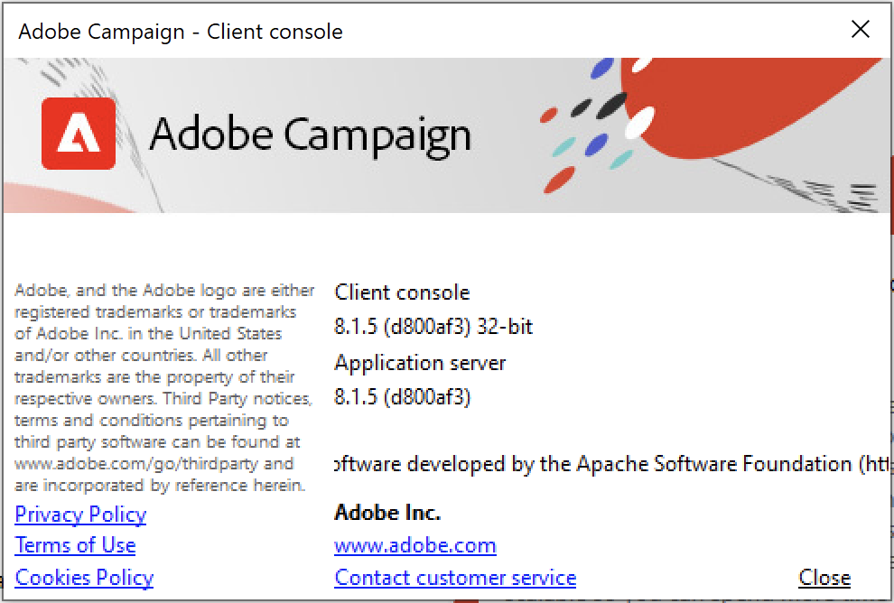

# 버전 및 업그레이드 {#upgrades}

Adobe Campaign은 정기적으로 업데이트됩니다. 이러한 정기 업데이트 빈도는 최신 업데이트를 직접 경험해 보고 사용 환경을 안전하게 지키며 Adobe 제품 경험을 향상시키는 것을 목표로 합니다. Adobe는 모든 고객에게 최신 버전으로 업그레이드할 것을 강력히 권장합니다. 

Adobe는 새 버전이 나올 때마다 Managed Cloud Services 사용자의 인스턴스를 업그레이드합니다. Adobe 담당자가 사용자에게 문의하여 환경을 업그레이드합니다. Campaign 클라이언트 콘솔은 **Campaign 서버와 동일한 버전으로 업그레이드**&#x200B;되어야 합니다. [이 페이지](../start/connect.md#upgrade-ac-console)에서 클라이언트 콘솔을 업그레이드하는 방법을 알아보십시오.

또한 고객은 [호환성 매트릭스](compatibility-matrix.md)에 나열된 최신 지원 버전의 시스템을 사용하고 있는지 확인하십시오.

## Campaign 버전 {#versions}

Adobe Campaign은 Campaign 인프라의 성능, 보안, 논리 및 유용성을 향상시키는 제품 버전을 정기적으로 릴리스합니다.

이러한 업그레이드는 다음과 같을 수 있습니다.

* **주요 버전에서 다른 버전으로**(예: v7에서 v8로) 업그레이드합니다. 이러한 업그레이드는 새로운 기능, 개선 사항, 호환성 및 보안 업데이트 및 수정 사항을 제공합니다.
* **작은 버전에서 다른 버전으로**(예: v8.5에서 v8.6으로) 작은 업그레이드입니다. 이러한 업그레이드는 개선 사항, 호환성 및 보안 업데이트 및 수정 사항을 제공합니다.
* 패치 버전에서 다른 버전으로 **패치 업그레이드**(예: v8.5.1에서 v8.5.2로) 이러한 업그레이드는 보안 업데이트 및 수정 사항을 제공합니다.

각 새 버전에 대한 자세한 내용은 [릴리스 정보](release-notes.md)에서 확인할 수 있습니다.

Adobe 안정적인 구성을 위해서는 모든 Campaign 서버에 **정확히 동일한 버전**&#x200B;을 설치하는 것이 좋습니다. 또한 [릴리스 정보](release-notes.md)에서 별도로 언급되지 않는 한, 클라이언트 콘솔은 서버 인스턴스와 **정확히 동일한 버전**&#x200B;에 있어야 합니다. [이 페이지에서](../start/connect.md#upgrade-ac-console) 클라이언트 콘솔을 업그레이드하는 방법을 알아보십시오.

## Campaign 업그레이드 {#ac-upgrades}

Campaign Managed Services 고객은 새 Campaign 버전을 사용할 수 있게 되면 추가 조치 없이 Adobe으로 인프라가 업그레이드됩니다.

고객은 [호환성 매트릭스](compatibility-matrix.md)에 나열된 시스템의 지원되는 최신 버전을 사용하고 있는지 확인해야 합니다.

## FAQ(자주 묻는 질문) {#upgrades-faq}

### 내 Campaign 버전을 확인하는 방법 {#version}

Campaign 버전을 확인하려면 클라이언트 콘솔에서 **도움말 > 정보...** 메뉴에 액세스합니다.

확인할 수 있는 정보:

* 클라이언트 콘솔 및 응용 프로그램 서버의 **버전** 번호입니다. 위의 샘플에서 버전은 클라이언트 콘솔과 애플리케이션 서버 모두 8.1.5입니다.
* 괄호 사이에 있는 SHA 번호.
* Adobe 고객 지원 센터 연락을 위한 링크.
* Adobe 개인정보 처리방침, 사용 약관 및 쿠키 정책 보기.

### 새 버전의 릴리스에 대한 정보는 어떻게 얻을 수 있습니까? {#upgrades-0}

새 버전 및 변경 사항이 [릴리스 정보](release-notes.md)에 나열됩니다. 새 버전을 사용할 수 있게 되면 Adobe 담당자가 연락하여 환경을 업그레이드합니다.

새로운 Experience Cloud 솔루션 릴리스 및 해당 콘텐츠에 대한 정보를 받으려면 [Adobe 우선 순위 제품 업데이트](https://www.adobe.com/kr/subscription/priority-product-update.html){target="_blank"} 커뮤니케이션에 가입하십시오.

[Campaign 커뮤니티](https://experienceleaguecommunities.adobe.com/t5/custom/page/page-id/Community-TopicsPage?profile.language=ko&style=all&amp;sort=date&amp;order=desc&amp;filters=adobe-campaign-classic-community&amp;topic=Campaign+v8){target="_blank"}를 방문하여 릴리스 업데이트에 대한 정보를 받을 수도 있습니다.

### 조직에 업그레이드가 필요한 이유는 무엇입니까? {#upgrades-1}

인프라를 최신 버전으로 업그레이드하면 업데이트된 성능 기술을 사용할 수 있을 뿐만 아니라 취약점으로부터 계정을 안전하게 보호할 수 있습니다.

일반적으로 최신 버전으로 업그레이드하면 다음과 같은 이점이 있습니다.

* 향상된 보안

  보안에는 지속적인 집중과 사전 예방적 유지 관리가 필요합니다. 보안 위험은 어디에나 존재하며 무시할 수 없습니다. Campaign을 업그레이드할 때마다 보안이 향상됩니다. 이러한 업그레이드는 모든 Campaign 인스턴스 및 클라이언트 콘솔에 적용되어야 합니다. 기술의 조합은 Adobe Campaign이 가치를 제공하기 위해 함께 작동하도록 하는 데 사용됩니다. 이러한 모든 기술을 최신 상태로 유지해야 합니까?

* 향상된 지원

  대부분의 중요한 문제는 실제로 업그레이드를 통해 해결되며 예방할 수 있습니다. 정기적인 업그레이드는 이러한 문제를 해결하여 당면 과제를 줄이고 효율성을 높이는 데 도움이 됩니다. 고객 지원 볼륨이 감소하여 신속한 해결이 가능하며 업그레이드와 관련이 없는 다른 문제에 더욱 집중할 수 있습니다.

* 유지 관리 및 안정성 향상

  Adobe Campaign 팀은 시간이 지남에 따라 제품의 안정성과 성능을 향상시키고 알려진 문제를 수정하는 방법을 확인합니다. 업그레이드를 통해 이러한 향상된 기능으로 인스턴스를 최신 상태로 유지할 수 있으며 Campaign 인스턴스 내에서 급격한 증가 및/또는 복잡성을 겪고 있는 조직에서 경험하는 일반적인 문제를 해결할 수 있습니다.Campaign을 지원하는 기술 스택에 대한 향상된 기능은 조직의 마케팅 팀과 IT 팀 모두에서 확인할 수 있습니다.

### 업그레이드의 프로세스와 타임라인은 무엇입니까? {#upgrades-2}

v8 고객의 경우, 계정을 새 버전으로 업그레이드할 필요가 있다고 판단되면 Adobe이 즉시 알려드립니다.

Adobe 팀이 이 여정을 통해 조직을 이끌고 안내합니다. 전담 고객 지원 담당자, 제품 관리자, 엔지니어 및 TechOps 전문가, 제품 컨설턴트로 구성된 팀이 상주하여 원활한 고객 경험을 제공합니다.
