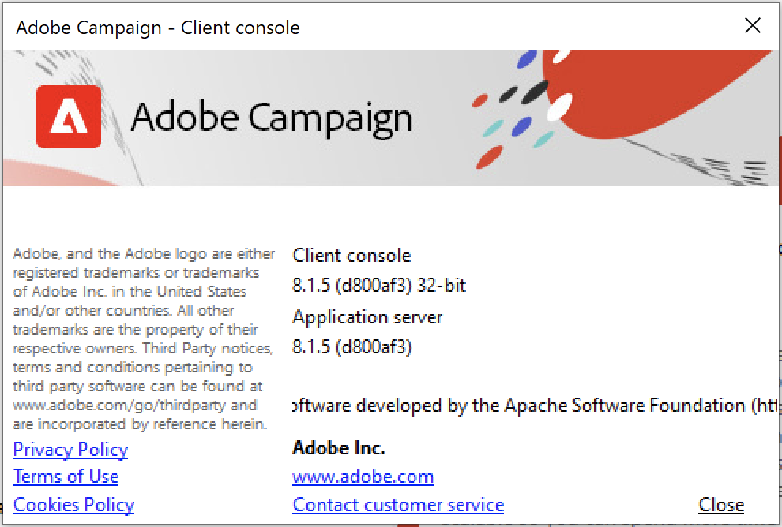

# 버전 및 업그레이드 {#upgrades}

Adobe Campaign v8은 **관리 클라우드 서비스** 솔루션으로만 제공됩니다. Adobe은 모든 서버측 업그레이드를 관리하고 수행합니다. v8에는 온-프레미스 또는 하이브리드 배포가 없으며, 직접 예약하거나 수행할 수 있는 서버 업그레이드가 없습니다.

Adobe Campaign은 정기적으로 업데이트됩니다. 이러한 정기적인 업데이트 빈도는 고객의 최신 정보를 확보하고 환경을 안전하게 유지하며 제품 사용 환경을 개선하는 데 목적이 있습니다.

Managed Cloud Services 사용자는

* Campaign 서버 인스턴스는 Adobe에 의해 모든 새 버전으로 업그레이드되며 자동으로 별도의 조치 없이도 업그레이드됩니다.
* 업그레이드 전 Adobe 담당자가 연락하여 환경에 영향을 줄 수 있습니다.
* **클라이언트 콘솔은 현재 상태를 유지하는 구성 요소입니다.** Campaign 서버와 동일한 버전으로 업그레이드해야 합니다. [이 페이지](../start/connect.md#upgrade-ac-console)에서 클라이언트 콘솔을 업그레이드하는 방법을 알아보십시오.

또한 고객은 [호환성 매트릭스](compatibility-matrix.md)에 나열된 최신 지원 버전의 시스템을 사용하고 있는지 확인하십시오.

>[!IMPORTANT]
>
>Adobe은 취약점을 최대한 신속하게 해결하기 위해 사전 통지 없이 언제든지 호스팅 환경에 중요한 보안 패치를 적용할 수 있는 권한을 보유합니다. 이러한 패치는 서비스 중단 없이 배포됩니다. 중요한 취약점을 해결하는 것이 사전 알림보다 우선합니다.

## Campaign 버전 {#versions}

Adobe Campaign은 Campaign 인프라의 성능, 보안, 논리 및 유용성을 향상시키는 제품 버전을 정기적으로 릴리스합니다.

이러한 업그레이드는 다음과 같을 수 있습니다.

* **주요 버전에서 다른 버전으로**(예: v7에서 v8로) 업그레이드합니다. 이러한 업그레이드는 새로운 기능, 개선 사항, 호환성 및 보안 업데이트 및 수정 사항을 제공합니다.
* **작은 버전에서 다른 버전으로**(예: v8.5에서 v8.6으로) 작은 업그레이드입니다. 이러한 업그레이드는 개선 사항, 호환성 및 보안 업데이트 및 수정 사항을 제공합니다.
* 패치 버전에서 다른 버전으로 **패치 업그레이드**(예: v8.5.1에서 v8.5.2로) 이러한 업그레이드는 보안 업데이트 및 수정 사항을 제공합니다.

각 새 버전에 대한 자세한 내용은 [릴리스 정보](release-notes.md)에서 확인할 수 있습니다. 보안 관련 수정 사항은 각 릴리스의 릴리스 정보 내에서 호출됩니다. [새 버전의 릴리스에 대한 정보를 어떻게 알 수 있습니까?](#upgrades-0) 아래요.

Adobe에서는 안정적인 구성을 위해 모든 Campaign 서버에 **정확히 동일한 버전**&#x200B;을 설치할 것을 권장합니다. 또한 [릴리스 정보](release-notes.md)에서 별도로 언급되지 않는 한, 클라이언트 콘솔은 서버 인스턴스와 **정확히 동일한 버전**&#x200B;에 있어야 합니다. [이 페이지에서](../start/connect.md#upgrade-ac-console) 클라이언트 콘솔을 업그레이드하는 방법을 알아보십시오.

## 클라이언트 콘솔을 최신 상태로 유지 {#ac-upgrades}

Campaign Managed Services 고객의 경우, 새로운 Campaign 버전을 사용할 수 있게 되면 추가적인 조치 없이 Adobe에 의해 서버 인프라가 업그레이드됩니다.

서버 업그레이드는 자동으로 수행되므로 동시에 업데이트되지 않으면 **클라이언트 콘솔**&#x200B;에서 공백이 나타날 수 있습니다. 콘솔 버전이 서버 버전과 일치하지 않는 경우

* 콘솔을 업데이트할 때까지 Campaign 인스턴스에 연결할 수 있는 기능을 잃을 수 있습니다.
* 서버 자체가 최신 버전이더라도 서버가 이미 이동한 버전에서 제공된 수정 사항 및 보안 업데이트로 인해 콘솔의 이점이 중지됩니다.

이를 방지하려면 새 버전에 대한 알림을 받는 즉시 클라이언트 콘솔을 업그레이드하십시오. [클라이언트 콘솔을 업그레이드](../start/connect.md#upgrade-ac-console)하는 방법에 대해 알아봅니다.

또한 고객은 [호환성 매트릭스](compatibility-matrix.md)에 나열된 지원되는 최신 버전의 시스템을 사용하고 있는지 확인해야 합니다.

## 자주 묻는 질문 {#upgrades-faq}

### 내 Campaign 버전을 확인하는 방법 {#version}

Campaign 버전을 확인하려면 클라이언트 콘솔에서 **도움말 > 정보...** 메뉴에 액세스합니다.

확인할 수 있는 정보:

* 클라이언트 콘솔 및 응용 프로그램 서버의 **버전** 번호입니다. 위의 샘플에서 버전은 클라이언트 콘솔과 애플리케이션 서버 모두 8.1.5입니다.
* 괄호 사이에 있는 SHA 번호.
* Adobe 고객 지원 센터 연락을 위한 링크.
* Adobe 개인정보 처리방침, 사용 약관 및 쿠키 정책 보기.

>[!NOTE]
>
>클라이언트 콘솔에 대해 표시된 버전이 응용 프로그램 서버에 대해 표시된 버전과 일치하지 않으면 [클라이언트 콘솔을 최신 상태로 유지](#ac-upgrades)에 설명된 대로 콘솔을 업그레이드하십시오.

### 새 버전의 릴리스에 대한 정보는 어떻게 얻을 수 있습니까? {#upgrades-0}

보안 수정 사항을 포함한 새 버전 및 변경 사항이 [릴리스 정보](release-notes.md)에 나열됩니다. 새 버전을 사용할 수 있게 되면 Adobe 담당자가 연락하여 서버 환경을 업그레이드합니다. 클라이언트 콘솔을 별도로 업그레이드해야 합니다([클라이언트 콘솔을 최신 상태로 유지](#ac-upgrades) 참조).

새로운 Experience Cloud 솔루션 릴리스 및 해당 콘텐츠에 대한 정보를 받으려면 [Adobe 우선 순위 제품 업데이트](https://www.adobe.com/kr/subscription/priority-product-update.html){target="_blank"} 커뮤니케이션에 가입하십시오.

[Campaign 커뮤니티](https://experienceleaguecommunities.adobe.com/t5/custom/page/page-id/Community-TopicsPage?style=all&sort=date&order=desc&filters=adobe-campaign-classic-community&topic=Campaign+v8){target="_blank"}를 방문하여 릴리스 업데이트에 대한 정보를 받을 수도 있습니다.

### 조직에 업그레이드가 필요한 이유는 무엇입니까? {#upgrades-1}

업그레이드를 통해 취약성으로부터 계정을 안전하게 보호할 수 있으며 최신 성능 기술을 사용할 수 있습니다.

일반적으로 최신 버전으로 업그레이드하면 다음과 같은 이점이 있습니다.

* **향상된 보안**

  보안에는 지속적인 집중과 사전 예방적인 유지 관리가 필요합니다. 보안 위험은 어디에나 존재하며 무시할 수 없습니다. Campaign을 업그레이드할 때마다 보안이 향상됩니다. 기술의 조합은 Adobe Campaign을 지원하기 위해 함께 작동하며 모든 기술을 최신 상태로 유지해야 합니다. Adobe은 이러한 업데이트를 서버에 자동으로 적용합니다. 클라이언트 콘솔을 단계적으로 업그레이드하면 동일한 보호 기능이 서버에 확장됩니다.

* **향상된 지원**

  대부분의 중요한 문제는 업그레이드를 통해 해결되며 모두 피할 수 있습니다. 주기적인 업그레이드는 직면한 문제를 줄이고 효율성을 높이는 데 도움이 됩니다. 고객 지원 볼륨이 감소하여 신속한 해결이 가능하며 업그레이드와 관련이 없는 문제에 더욱 집중할 수 있습니다.

* **유지 관리 및 안정성 향상**

  Adobe Campaign 팀은 시간이 지남에 따라 제품의 안정성과 성능을 향상시키고 알려진 문제를 수정하는 방법을 확인합니다. 업그레이드를 통해 이러한 향상된 기능으로 인스턴스를 최신 상태로 유지할 수 있으며 Campaign 인스턴스 내에서 급격한 증가 및/또는 복잡성을 겪고 있는 조직에서 경험하는 일반적인 문제를 해결할 수 있습니다. Campaign을 구동하는 기술 스택 개선은 조직의 마케팅 팀과 IT 팀 모두에서 확인할 수 있습니다.

* **연결 상태 유지**

  클라이언트 콘솔은 동일한 버전을 실행하는 서버와만 안정적으로 통신할 수 있습니다. 서버를 업그레이드할 때마다 콘솔을 최신 상태로 유지하면 이 연결이 유지되고 그에 수반되는 보안 및 수정 사항이 그대로 유지됩니다.

### 업그레이드의 프로세스와 타임라인은 무엇입니까? {#upgrades-2}

v8 고객의 경우 Adobe이 서버 업그레이드를 완벽하게 관리합니다.

1. 새 버전을 사용할 수 있거나 계정을 새 버전으로 이동할 필요가 있다고 판단되면 Adobe 담당자가 알려줍니다.
1. Adobe은 서버 인프라를 업그레이드하므로 이 단계에서는 별도의 작업이 필요하지 않습니다.
1. 사용자 측에서는 일치하는 클라이언트 콘솔을 업그레이드하고 [호환성 매트릭스](compatibility-matrix.md)의 시스템을 확인하는 작업만 필요합니다. [클라이언트 콘솔을 최신 상태로 유지](#ac-upgrades)를 참조하십시오.

전담 고객 지원 담당자, 제품 관리자, 엔지니어, TechOps 전문가 및 제품 컨설턴트로 구성된 팀이 상주하여 원활한 고객 경험을 제공합니다.

>[!NOTE]
>
>중요한 보안 패치는 이 알림 주기를 벗어난 호스팅 환경에 적용될 수 있습니다. 이 페이지 상단의 참고 사항을 참조하십시오.
