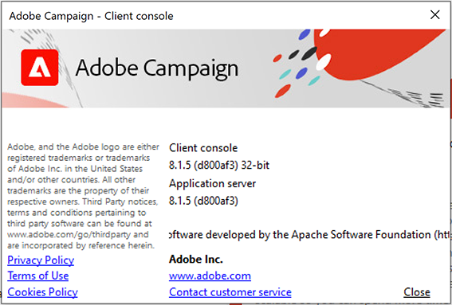

# 버전 및 업그레이드 {#upgrades}

## Campaign 버전 {#versions}

Adobe Campaign은 Campaign 인프라의 성능, 보안, 논리 및 유용성을 향상시키는 제품 버전을 정기적으로 릴리스합니다.

이러한 업그레이드는 다음과 같을 수 있습니다.

* **주요 업그레이드**: v7에서 v8과 같은 주요 버전에서 다른 버전으로 마이그레이션하는 작업. 이러한 업그레이드는 새로운 기능, 개선 사항, 호환성 및 보안 업데이트 및 수정 사항을 제공합니다.
* **소규모 업그레이드**&#x200B;는 부 버전에서 다른 버전으로(예: v8.5에서 v8.6으로) 변환됩니다. 이러한 업그레이드는 개선 사항, 호환성 및 보안 업데이트 및 수정 사항을 제공합니다.
* **패치 업그레이드**: 패치 버전에서 다른 버전으로(예: v8.5.1부터 v8.5.2까지). 이러한 업그레이드는 보안 업데이트 및 수정 사항을 제공합니다.

각 새 버전에 대한 자세한 내용은 [릴리스 정보](release-notes.md).

안정적인 구성을 위해서는 Adobe에서 설치하는 것이 좋습니다 **정확히 동일한 버전** 모든 Campaign 서버에서. 또한,에서 별도로 언급되지 않는 한 [릴리스 정보](release-notes.md), 클라이언트 콘솔은 켜져 있어야 합니다. **정확히 동일한 버전** 을 서버 인스턴스로 사용합니다. 클라이언트 콘솔을 업그레이드하는 방법 알아보기 [이 페이지에서](../start/connect.md#upgrade-ac-console).

Campaign Managed Services 고객은 새 Campaign 버전을 사용할 수 있게 되면 추가 조치 없이 Adobe으로 인프라가 업그레이드됩니다.

고객은 다음에 나열된 지원되는 최신 버전의 시스템을 사용하고 있는지 확인해야 합니다. [호환성 매트릭스](compatibility-matrix.md).

## FAQ(자주 묻는 질문) {#upgrades-faq}

### 내 Campaign 버전을 확인하는 방법 {#version}

Campaign 버전을 확인하려면 **도움말 > 정보...** 클라이언트 콘솔의 메뉴입니다.

확인할 수 있는 정보:

* 다음 **버전** 클라이언트 콘솔 및 애플리케이션 서버의 번호입니다. 위의 샘플에서 버전은 클라이언트 콘솔과 애플리케이션 서버 모두 8.1.5입니다.
* 괄호 사이에 있는 SHA 번호.
* Adobe 고객 지원 센터 연락을 위한 링크.
* Adobe 개인정보 처리방침, 사용 약관 및 쿠키 정책 보기.

### 새 버전의 릴리스에 대한 정보는 어떻게 얻을 수 있습니까? {#upgrades-0}

새 버전 및 해당 버전이 가져오는 변경 사항이에 나열되어 있습니다. [릴리스 정보](release-notes.md). 새 버전을 사용할 수 있게 되면 Adobe이 사용자에게 연락하여 환경을 업그레이드합니다.

새로운 Experience Cloud 솔루션 릴리스에 대한 정보를 받으려면 [Adobe 우선 순위 제품 업데이트](https://www.adobe.com/kr/subscription/priority-product-update.html){target="_blank"}.

다음을 방문하실 수도 있습니다. [캠페인 커뮤니티](https://experienceleaguecommunities.adobe.com/t5/custom/page/page-id/Community-TopicsPage?style=all&amp;sort=date&amp;order=desc&amp;filters=adobe-campaign-classic-community&amp;topic=Campaign+v8){target="_blank"} 릴리스 업데이트에 대한 정보를 받습니다.

### 내 조직에 이 업그레이드가 필요한 이유는 무엇인가요? {#upgrades-1}

인프라를 최신 버전으로 업그레이드하면 업데이트된 성능 기술을 사용할 수 있을 뿐만 아니라 취약점으로부터 계정을 안전하게 보호할 수 있습니다.

일반적으로 최신 버전으로 업그레이드하면 다음과 같은 이점이 있습니다.

* 향상된 보안

  보안에는 지속적인 집중과 사전 예방적 유지 관리가 필요합니다. 보안 위험은 어디에나 존재하며 무시할 수 없습니다. Campaign을 업그레이드할 때마다 보안이 향상됩니다. 이러한 업그레이드는 모든 Campaign 인스턴스 및 클라이언트 콘솔에 적용되어야 합니다. 기술의 조합은 Adobe Campaign이 가치를 제공하기 위해 함께 작동하도록 하는 데 사용됩니다. 이러한 모든 기술을 최신 상태로 유지해야 합니까?

* 향상된 지원

  대부분의 중요한 문제는 실제로 업그레이드를 통해 해결되며 예방할 수 있습니다. 정기적인 업그레이드는 이러한 문제를 해결하여 당면 과제를 줄이고 효율성을 높이는 데 도움이 됩니다. 고객 지원 볼륨이 감소하여 신속한 해결이 가능하며 업그레이드와 관련이 없는 다른 문제에 더욱 집중할 수 있습니다.

* 유지 관리 및 안정성 향상

  Adobe Campaign 팀은 시간이 지남에 따라 제품의 안정성과 성능을 향상시키고 알려진 문제를 수정하는 방법을 확인합니다. 업그레이드를 통해 이러한 향상된 기능으로 인스턴스를 최신 상태로 유지할 수 있으며 Campaign 인스턴스 내에서 급격한 증가 및/또는 복잡성을 겪고 있는 조직에서 경험하는 일반적인 문제를 해결할 수 있습니다.Campaign을 지원하는 기술 스택에 대한 향상된 기능은 조직의 마케팅 팀과 IT 팀 모두에서 확인할 수 있습니다.

### 이 업그레이드의 과정과 일정은 어떻게 되나요? {#upgrades-2}

v8 고객의 경우, 계정을 새 버전으로 업그레이드할 필요가 있다고 판단되면 Adobe이 즉시 알려드립니다.

Adobe 팀이 이 여정을 통해 조직을 이끌고 안내합니다. 전담 고객 지원 담당자, 제품 관리자, 엔지니어 및 TechOps 전문가, 제품 컨설턴트로 이루어진 팀이 사용자를 지원하여 원활한 고객 경험을 제공합니다.

